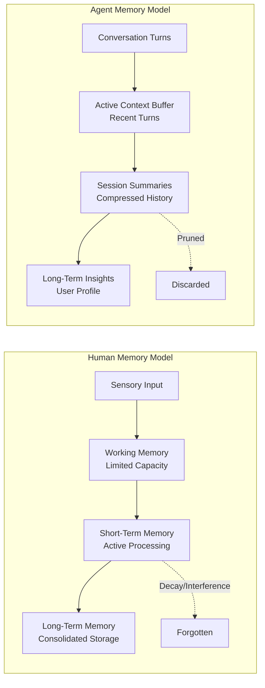
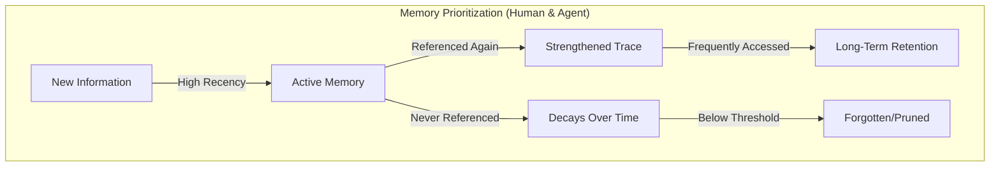
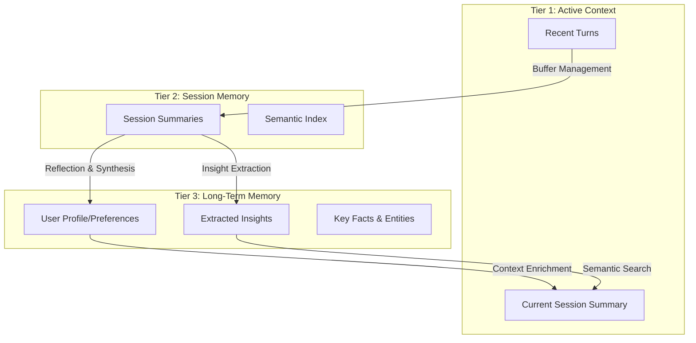
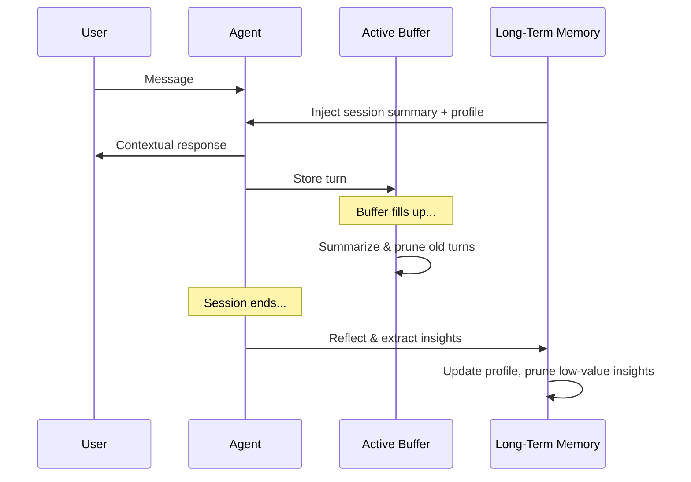
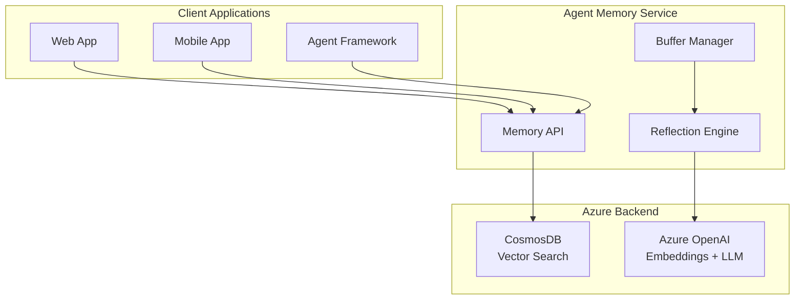

# Effective Long-Term Memory for AI Agents: Lessons from Human Cognition

AI agents are transforming how businesses interact with customers—from financial advisors that remember your investment goals to healthcare assistants that track your medical history. But there's a fundamental challenge: **how do you build an agent that truly remembers?**

Not just remembers what you said five minutes ago, but remembers that you mentioned your daughter's wedding six months back, that you shifted from conservative to aggressive investing after your promotion, and that you prefer concise explanations over lengthy tutorials.

This post explores how insights from human cognitive science can guide the design of effective agent memory systems. We'll walk through a tiered memory architecture inspired by how our own brains process, consolidate, and—crucially—forget information. Finally, we'll introduce a solution accelerator that implements these concepts for Azure, with seamless integration into the Microsoft Agent Framework.

---

## 1. Why Agent Memory Matters

The promise of AI agents extends far beyond single-turn question answering. In enterprise applications, agents are increasingly expected to:

**Personalize interactions.** A shopping assistant that remembers you prefer sustainable brands and size medium. A learning platform that knows you struggle with calculus but excel at geometry. A customer service agent that recalls your previous tickets without asking you to repeat yourself.

**Make context-aware recommendations.** Not just "customers like you also bought X," but "based on the hiking boots you bought last month and your upcoming trip to Colorado that you mentioned, you might want to consider these trail guides."

**Maintain continuity across sessions.** When a user returns after days, weeks, or months, the agent should pick up where things left off—acknowledging past conversations, remembering decisions made, and building on established context.

**Handle long-running conversations gracefully.** A customer support session that stretches to 50 exchanges. A tutoring conversation that works through a complex problem step by step. A sales consultation that explores multiple options before reaching a decision. These conversations can easily exceed context limits if every turn is kept verbatim—yet losing early context means losing important information.

But here's the challenge: **context windows are finite and expensive.** Every token you send to an LLM costs money and counts against limits. Stuffing entire conversation histories into prompts quickly becomes impractical. Yet without memory, every conversation starts from zero.

Effective agent memory enables **personalized, context-aware, and cost-efficient interactions**. It's the difference between an agent that feels like a knowledgeable partner and one that feels like a stranger you meet for the first time, every time.

---

## 2. The Challenge: Context Window Limitations

Large language models have revolutionized what's possible in conversational AI, but they come with a fundamental constraint: the context window. Whether it's 8K, 32K, or 128K tokens, there's always a limit—and every token has a cost.

### Naive Approaches That Fail at Scale

**Stuffing entire conversation history** works fine for short interactions, but problems emerge in two scenarios:

*Multi-session users*: A customer with 50 sessions of conversation history might have hundreds of thousands of tokens. The costs explode, latency increases, and you eventually hit hard limits.

*Long single sessions*: Even within a single conversation, a detailed troubleshooting session or exploratory consultation can easily reach 30, 50, or 100 exchanges. Including every turn verbatim quickly consumes the context window.

**Simple truncation** (keeping only the last N messages) means losing important context. The user mentioned their budget constraint in message 3, but by message 50, that critical information has been truncated away. The agent makes recommendations that don't fit the budget, and the user wonders why they're not being heard.

**No memory between sessions** forces users to repeat themselves. "As I mentioned last time..." becomes meaningless when there is no "last time" from the agent's perspective. The interaction feels impersonal and frustrating.

### What Agents Actually Need

The real requirement is agents that can engage in **prolonged or recurring conversations** while:

- **Recalling important information** from past interactions—preferences, decisions, key facts
- **Not overwhelming the active context** with irrelevant historical details
- **Minimizing inference costs** by keeping prompts focused and efficient

This isn't just a technical optimization. It's about creating agents that feel like they genuinely know and remember the people they serve.

### Beyond "Store Everything + Retrieve"

Here's where many memory systems fall short: they treat memory as a storage and retrieval problem. Store all the facts, embed them for vector search, retrieve relevant ones when needed. Simple, right?

Not quite. Consider what humans actually expect from memory:

- **We don't expect recall of every detail**—only what's important, current, and relevant to the moment.
- **Long histories contain updates, reversals, and refinements**—not just additive facts. A user who said "I'm conservative" in January but "I'm ready for aggressive growth" in June needs the agent to know their *current* stance, not both equally.
- **Retrieval over granular items can surface outdated snippets** if there's no "current truth" to anchor against. The agent might retrieve "user is conservative" and "user is aggressive" and be confused about which to believe.

Therefore, memory needs more than storage and search. It needs:
- **Synthesis (reflection)**: Understanding the meaning and implications of conversations
- **Consolidation**: Building a coherent, current picture of the user
- **Forgetting (bounded retention)**: Letting go of outdated or unimportant information

This is exactly how human memory works—and it's the blueprint we'll follow.

---

## 3. Inspiration from Human Memory

Cognitive science has spent over a century studying how humans encode, store, and retrieve information. The insights are remarkably applicable to designing AI agent memory.

### 3.1 The Multi-Store Model

The **Atkinson-Shiffrin model** (1968) describes human memory as flowing through distinct stages:

**Sensory Memory** captures everything we perceive, but only for milliseconds. Most of it is immediately discarded—we simply can't process it all.

**Short-Term/Working Memory** holds what we're actively thinking about. Its capacity is famously limited (roughly 7±2 items), and information fades within seconds to minutes unless actively rehearsed.

**Long-Term Memory** is where consolidated information can persist for years or a lifetime. But critically, not everything makes it here. Information must be:
- **Attended to**: We have to notice and focus on it
- **Encoded**: We have to process it meaningfully, connecting it to existing knowledge
- **Consolidated**: It must be strengthened through rehearsal, emotional significance, or the mysterious processes that happen during sleep

The parallel to agent memory is striking:



Just as humans don't remember every sensory input, agents shouldn't store every conversational turn in full fidelity. Just as humans consolidate important experiences into long-term memory, agents should extract and preserve key insights about users.

### 3.2 Reflection and Consolidation

One of the most fascinating aspects of human memory is **consolidation**—the process by which short-term memories become long-term ones. This doesn't happen instantly; it requires time and, crucially, **reflection**.

During sleep, the hippocampus "replays" the day's experiences, extracting patterns and transferring important information to long-term storage in the neocortex. This is why "sleeping on it" actually helps us remember what matters—and why cramming the night before an exam is less effective than spaced study.

The emotional significance of events also plays a role. The amygdala tags emotionally important experiences for preferential encoding. We remember our wedding day vividly but forget most Tuesday afternoons.

**The agent parallel is end-of-session reflection.** Instead of simply storing conversation turns, the agent should periodically step back and ask:
- What was the overall arc of this conversation?
- What key decisions were made or preferences expressed?
- What should be updated in the user's long-term profile?
- What details can be safely discarded?

This reflection produces **session insights**—a consolidated understanding of what happened, not just a transcript of what was said.

### 3.3 Recency, Frequency, and Importance

In 1885, Hermann Ebbinghaus conducted pioneering experiments on memory, discovering what's now called the **forgetting curve**: memory decays exponentially over time unless reinforced.

But decay isn't the whole story. Several factors determine what we remember:

**Recency**: Recently encountered information is more accessible. This is the "availability heuristic"—what comes to mind easily feels more important. For agents, recent interactions should carry more weight than distant ones.

**Frequency (the Spacing Effect)**: Information encountered repeatedly, especially at spaced intervals, is retained better than information seen once. For agents, insights that keep coming up in conversations are probably important and should be retained.

**Importance**: The amygdala tags emotionally significant events for stronger encoding. For agents, we can simulate this with an LLM that assesses the importance of extracted insights (high/medium/low).



This suggests a practical implementation: track each insight with timestamps (`date_added`, `last_accessed`) and usage counts (`access_count`). Compute a retention score that decays over time but is boosted by recent access and high importance. Prune insights that fall below a threshold.

The result? Memory that naturally evolves, keeping what matters and letting go of what doesn't—just like human memory.

---

## 4. Conceptual Design: A Tiered Memory Architecture

Drawing on these cognitive science insights, we can design a memory system with three tiers that mirror how human memory flows from immediate experience to long-term storage.

### 4.1 The Three Tiers



**Tier 1: Active Context** contains what's immediately relevant—the recent conversation turns and a summary of the current session. This is what gets injected into every LLM call. It's bounded and focused.

**Tier 2: Session Memory** stores compressed summaries of past sessions, indexed for semantic retrieval. When the user asks about something from a previous conversation, vector search can surface relevant session summaries without loading everything.

**Tier 3: Long-Term Memory** holds the distilled, consolidated understanding of the user—their preferences, goals, key facts, and extracted insights. This tier is intentionally small and curated, representing the "current truth" about the user.

### 4.2 Key Design Principles

**1. Automatic Buffer Management**

Long conversations shouldn't require manual intervention—or explode in token costs. When the active context buffer fills up (say, 10 turns), older turns are automatically summarized and moved to session memory. The buffer is pruned to keep only the most recent turns.

This is critical for real-world applications:
- A **customer support agent** might work through 30 exchanges diagnosing a complex issue. Without compression, that's potentially 15,000+ tokens just for conversation history.
- A **tutoring agent** explaining calculus might go back and forth 50 times on a single problem. The early exploratory exchanges are less important than the breakthrough moment.
- A **sales agent** exploring options with a customer shouldn't pay for every "let me think about that" and "actually, what about..." in the exploration phase.

With automatic buffer management, the agent compresses "turns 1-20 explored three options, user eliminated A due to price" into a summary, keeps the recent turns in full fidelity, and maintains bounded context regardless of conversation length.

**2. Semantic Retrieval**

Not everything in memory is relevant to every conversation. Vector embeddings enable semantic search, surfacing past context that's topically related to the current discussion. The user mentions "that trip to Hawaii we talked about," and the relevant session summary is retrieved—even if it was months ago.

**3. Reflection-Based Learning**

At the end of each session, an LLM reviews the conversation and extracts key insights. Because long-term memory is intentionally bounded and consolidated, the agent can reconcile new session insights against the *whole* profile in one pass. Contradictions are resolved, outdated information is updated, and the profile evolves.

**4. Bounded Long-Term Memory**

Unlimited memory sounds appealing but creates problems: noisy retrieval, high costs, and difficulty maintaining coherence. By keeping long-term memory bounded (say, top 10-20 insights per user), we force prioritization. Only what truly matters is retained.

**5. Citation Tracking**

When an insight is used in a conversation, it's "cited"—and that citation strengthens the memory trace. This is the agent equivalent of rehearsal. Frequently cited insights survive longer; neglected ones decay and are eventually pruned.

### 4.3 The Power of Session Summaries + Long-Term Profile

A critical design pattern emerges: **load the previous session summary and long-term profile as context for each new conversation.**

This simple approach is remarkably effective for two reasons:

**Continuity Matches Human Expectations**

When humans interact with service providers—financial advisors, doctors, customer support agents—they expect acknowledgment of their history:
- "Last time we talked about your mortgage refinancing..."
- "You mentioned you were concerned about the side effects..."
- "I see you've been having issues with this product for a while now..."

Loading the previous session summary enables this natural continuity. The agent can reference what was discussed, acknowledge open action items, and build on established context. The user feels heard and remembered.

```
[Previous Session Summary]
User discussed refinancing their mortgage. They expressed concern about 
closing costs and preferred a 15-year term. Action item: research 
lenders with low closing costs.

[Agent Response to "Any updates?"]
"Yes! Since our last conversation about your refinancing goals, I've 
researched several lenders with low closing costs for 15-year terms..."
```

**Domain-Tailored Effectiveness**

The long-term profile can be structured for specific use cases, making every interaction more relevant:

| Use Case | Profile Structure |
|----------|-------------------|
| **Recommendations** | Purchase history, brand preferences, price sensitivity, style preferences |
| **Healthcare** | Medical history, allergies, treatment preferences, communication style |
| **Financial Advisory** | Risk tolerance, investment goals, life events, income trajectory |
| **Customer Support** | Product ownership, past issues, expertise level, preferred resolution style |

The profile becomes a domain-specific lens. A recommendation agent doesn't just know abstract facts about the user—it knows exactly what matters for making good recommendations.

### 4.4 The Memory Lifecycle

Putting it all together, here's how memory flows through the system:



Each message triggers context injection from long-term memory. Each turn is stored in the buffer. When the buffer fills, older turns are summarized. When the session ends, reflection extracts insights and updates the long-term profile, pruning low-value items to stay within bounds.

---

## 5. Itemized Insights: Human-Like Memory Prioritization

One of the key innovations in this architecture is **itemized insights**—treating each piece of long-term memory as an individually tracked item with metadata that enables intelligent prioritization.

### 5.1 The Problem with Unlimited Memory

The naive approach to memory is to store everything. Every fact, every preference, every mention—just embed it and retrieve what's relevant.

But this creates problems:
- **Retrieval becomes noisy.** With thousands of stored items, even good vector search surfaces irrelevant or contradictory information.
- **Contradictions accumulate.** The user said they're conservative in Session 1 and aggressive in Session 50. Both are stored. Which is true?
- **Costs grow unboundedly.** More storage, more embeddings, more retrieval processing.

Real humans forget unimportant things. This isn't a bug—it's a feature. Forgetting keeps our memory systems focused and coherent. Agents should do the same.

### 5.2 Insight Tracking with Citation

Each insight in long-term memory is tracked with metadata:

- **`date_added`**: When the insight was first extracted
- **`last_accessed`**: When it was last used (cited) in a conversation
- **`access_count`**: How many times it's been cited
- **`importance`**: LLM-assessed significance (high/medium/low)
- **`source_session_ids`**: Which sessions contributed to this insight

This metadata enables intelligent prioritization. An insight that was added six months ago but cited last week is still relevant. An insight that was added six months ago and never cited again might be outdated or unimportant.

### 5.3 Retention Scoring (Ebbinghaus-Inspired)

We compute a retention score for each insight, inspired by the Ebbinghaus forgetting curve:

```
retention_score = (decay_factor + recency_boost) × importance_weight

where:
  decay_factor = e^(-days_since_access / (base_decay × strength))
  strength = 1 + log(1 + access_count)  # More citations = slower decay
  recency_boost = 0.3 if insight < 7 days old, else 0
  importance_weight = 1.5 (high), 1.0 (medium), 0.8 (low)
```

The key insight: **frequent citation slows decay**. An insight that keeps getting used is probably important, so it decays more slowly. An insight that's never referenced decays at the base rate and is eventually pruned.

The recency boost gives new insights a "grace period"—a chance to prove their relevance before the decay kicks in. This mirrors how recent memories are more vivid and accessible.

### 5.4 Bounded Memory with Intelligent Pruning

Long-term memory is intentionally bounded. When capacity is exceeded (say, more than 10 insights for a user), the system:

1. Computes retention scores for all insights
2. Ranks insights by score
3. Prunes the lowest-scored insights to get back within bounds

The result is a memory system that **naturally curates itself over time**. Frequently cited, high-importance insights survive. Old, never-referenced insights are forgotten. The user's profile stays current, coherent, and focused—without requiring manual cleanup.

This is human-like memory: not perfect recall, but intelligent prioritization that keeps what matters.

---

## 6. The Solution Accelerator: Agent Memory for Azure

To make these concepts practical, we've built a solution accelerator that implements this tiered memory architecture with full Azure integration.

**Repository:** [github.com/james-tn/agent-memory](https://github.com/james-tn/agent-memory)

### 6.1 Key Features

- **Multiple backends**: SQLite for local development and testing; Azure CosmosDB for production with global distribution and vector search
- **Microsoft Agent Framework integration**: Works seamlessly as a `context_provider`, automatically injecting relevant memory into agent conversations
- **Vector search**: Semantic retrieval of relevant past context using Azure OpenAI embeddings
- **Automatic buffer management**: Configurable turn limits with automatic summarization when buffers fill
- **LLM-powered reflection**: End-of-session insight extraction using GPT-4 or other models
- **Itemized insight tracking**: Citation-based memory prioritization with Ebbinghaus-inspired retention scoring
- **One-click Azure deployment**: Bicep templates for CosmosDB infrastructure

### 6.2 Architecture Overview



The memory service exposes a simple API that can be used directly or through the Agent Framework integration. CosmosDB provides scalable, globally distributed storage with built-in vector search. Azure OpenAI powers both the embeddings for semantic retrieval and the LLM calls for reflection and insight extraction.

### 6.3 Adding Memory to Your Agent: It's Simple

With Microsoft Agent Framework, adding memory is just a few lines of code:

```python
from agent_framework import ChatAgent
from memory import AgentMemory, AgentMemoryConfig

# Configure memory with auto-enrichment
config = AgentMemoryConfig(
    auto_enrich_context=True,  # Automatically inject relevant memory
    buffer_size=10,            # Summarize when buffer reaches 10 turns
)

# Create memory instance
memory = AgentMemory(user_id="user123", openai_client=client, config=config)

# Create agent with memory as context provider
agent = ChatAgent(
    chat_client=chat_client,
    instructions="You are a financial advisor...",
    context_providers=[memory]  # Memory is automatically injected!
)

# Use it - memory management is automatic
async with memory:
    await memory.start_session()
    response = await agent.run("What's my risk tolerance?")
    # Agent automatically receives user's profile and session history
    await memory.end_session()  # Reflects and extracts insights
```

**That's it.** The memory system handles everything automatically:
- Loading the previous session summary and long-term profile before each agent invocation
- Storing each conversation turn as it happens
- **Automatic buffer compression** when conversations get long—summarizing older turns to keep context bounded
- End-of-session reflection and insight extraction

A 50-turn conversation costs the same in context tokens as a 10-turn conversation, because older turns are compressed into summaries. The agent can engage in arbitrarily long conversations without exploding token costs.

You focus on building your agent's capabilities. The memory system ensures it remembers.

---

## 7. How This Fits Among Common Memory Approaches

Agent memory systems are converging on a few core ideas: **extract what matters, keep it scoped, and retrieve selectively**. Managed offerings such as **Mem0** and **Vertex AI Agent Engine Memory Bank** provide strong building blocks here—LLM-based memory extraction, scoped storage, and retrieval controls—so teams don't have to assemble everything from scratch.

This accelerator is designed to complement that direction, with a specific emphasis on three practical gaps that show up in long-running, real-world conversations:

### 7.1 Session-level reflection to capture the "big picture"

Instead of treating memory as a growing set of independent snippets, the agent runs an end-of-session **reflection step** that produces a concise set of **session insights**. This helps preserve the *resolved outcome* of a conversation (decisions, changes, final preferences), not just individual mentions.

When a user discusses multiple options, goes back and forth, and finally settles on a decision, the reflection captures the decision—not the entire deliberation. This is what matters for future conversations.

### 7.2 A bounded long-term profile that stays "current"

Long-term memory is intentionally kept small (top-N insights). This makes it feasible to keep a **single coherent profile** that reflects the user's current state, even as preferences evolve over time.

When the system knows the user's *current* risk tolerance (not a history of all their stated tolerances), it can make better recommendations. And because the profile is small, it can be loaded in full as context—no retrieval noise, no missed information.

This also keeps prompt costs predictable. You know exactly how much context you're injecting.

### 7.3 Rehearsal + forgetting as a first-class policy (not app logic)

Each insight is tracked with recency/frequency/importance signals. When an insight is used, it is strengthened; when it's not used, it decays and can be pruned.

This produces a "naturally curated" memory set over time without requiring the application to constantly manage updates and deletions. The memory system handles its own housekeeping, mirroring how human memory works.

### 7.4 When this approach is a good fit

This design works especially well when you need:
- **Multi-session continuity** with evolving user preferences
- **Predictable context size and cost** rather than unbounded growth
- **A memory system that stays high-signal** without manual cleanup
- **Domain-tailored profiles** for use cases like recommendations, advisory, or support

If your use case is single-session only, or if you need perfect recall of every historical detail, a different approach might be more suitable. But for agents that build ongoing relationships with users over time, this architecture hits a sweet spot.

---

## 8. Getting Started

Ready to try it out? Here's how to get started:

**Quick Start (Local, SQLite):**
```bash
# Clone the repository
git clone https://github.com/james-tn/agent-memory

# Install dependencies
cd agent-memory && uv sync

# Run the simplest demo (SQLite, no Azure required)
uv run python demo/01_basic_memory.py

# Try Agent Framework integration
uv run python demo/02_agent_framework.py
```

**Production Deployment (Azure CosmosDB):**
```bash
# Deploy infrastructure with Azure Developer CLI
azd up

# Run CosmosDB demo
uv run python demo/04_cosmosdb.py
```

The repository includes multiple demos showcasing different patterns:
- Basic memory operations without any framework
- Agent Framework integration with automatic context injection
- Agent-driven memory with explicit search tools
- Long-term insight curation and profile evolution
- Memory prioritization with recency/frequency-based retention

See the [GitHub repository](https://github.com/james-tn/agent-memory) for full documentation, API reference, and deployment guides.

---

## 9. Conclusion

Effective agent memory is more than just storage—it's about **understanding, prioritizing, and forgetting** like humans do.

The key insights from cognitive science translate directly to agent architecture:
- **Tiered memory** (active buffer → session summaries → long-term profile) mirrors the flow from working memory to long-term storage
- **Reflection and consolidation** extract meaning from conversations, not just transcripts
- **Recency, frequency, and importance** determine what's retained, with natural decay for unused information
- **Bounded memory with intelligent pruning** keeps the system focused and costs predictable

The practical benefits are significant:
- **Natural conversation continuity** that meets user expectations
- **Long conversations without token explosion** through automatic buffer compression
- **Domain-tailored profiles** that make personalization and recommendations highly effective
- **Predictable costs** from bounded context injection—whether the conversation is 10 turns or 100
- **Self-maintaining memory** that doesn't require manual cleanup

The Agent Memory solution accelerator provides a production-ready implementation of these concepts, with seamless Microsoft Agent Framework integration and Azure backend support.

Human-like memory makes agents feel less like stateless APIs and more like partners that genuinely know and remember the people they serve. That's the difference between an AI assistant and an AI that truly assists.

**Get started:** [github.com/james-tn/agent-memory](https://github.com/james-tn/agent-memory)
