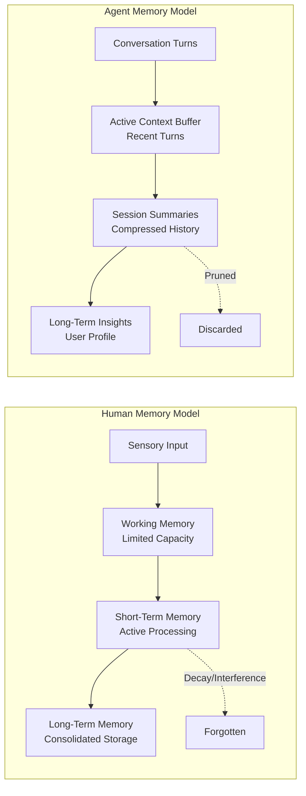
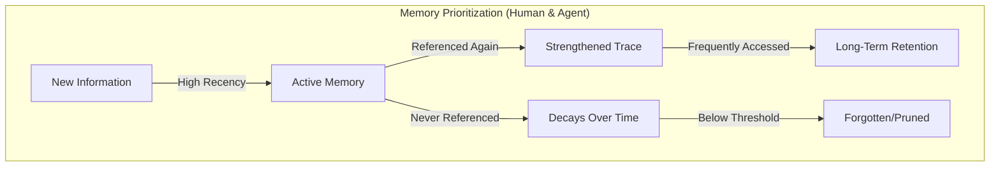
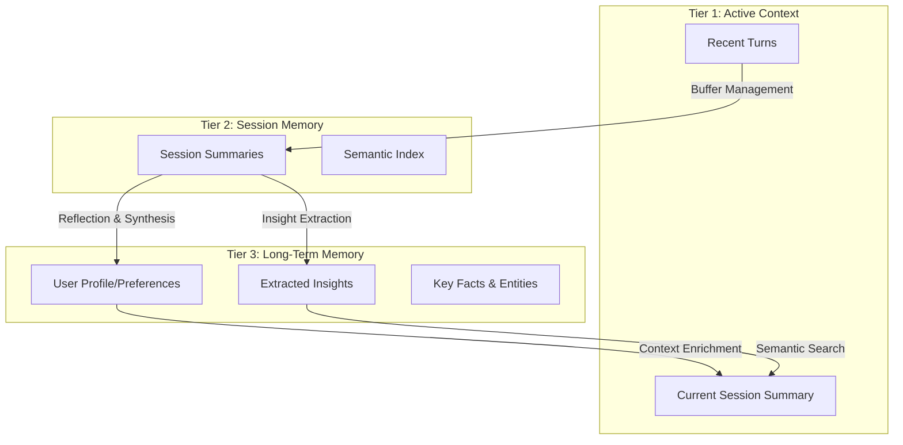
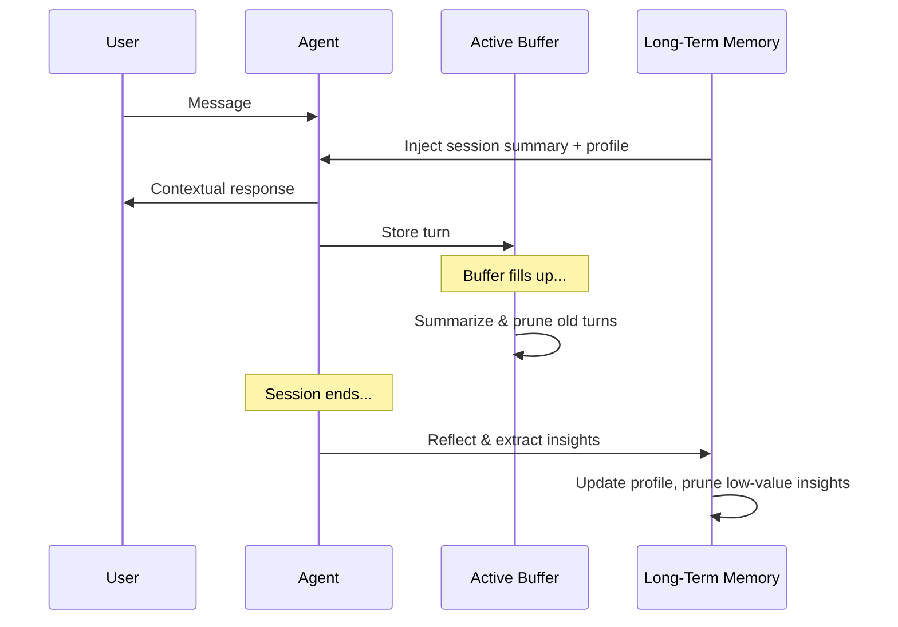
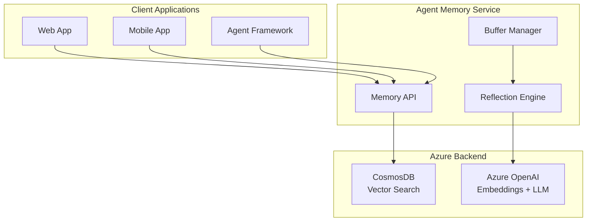

# Effective Long-Term Memory for AI Agents: Lessons from Human Cognition

**Target Audience:** AI/ML Engineers, Solution Architects, Developers building AI agents  
**Estimated Reading Time:** 12-15 minutes

---

## Outline

### 1. Introduction: Why Agent Memory Matters
- The rise of AI agents in enterprise applications
- Key use cases enabled by effective memory:
  - **Personalization**: Remembering user preferences, history, communication style
  - **Recommendations**: Context-aware suggestions based on past interactions
  - **Continuity**: Seamless multi-session experiences
- The cost problem: Context windows are expensive and limited
- Thesis: *Effective agent memory enables personalized, context-aware, and cost-efficient interactions*

### 2. The Challenge: Context Window Limitations
- LLM context windows are finite (and expensive per token)
- Naive approaches fail at scale:
  - Stuffing entire conversation history → token explosion
  - Simple truncation → loss of important context
  - No memory between sessions → repetitive, impersonal interactions
- The real need: Agents that engage in **prolonged or recurring conversations** while:
  - Recalling important information
  - Not overwhelming active context
  - Minimizing inference costs

### 3. Inspiration from Human Memory
*How humans naturally manage memory - and what AI agents can learn*

#### 3.1 The Multi-Store Model of Human Memory
Cognitive psychology's **Atkinson-Shiffrin model** describes memory as flowing through distinct stages:

1. **Sensory Memory**: Brief registration of incoming stimuli (milliseconds)
2. **Short-Term/Working Memory**: Active processing, limited capacity (~7 items), seconds to minutes
3. **Long-Term Memory**: Consolidated storage, virtually unlimited capacity, can last a lifetime

The key insight: **not everything moves to long-term storage**. Information must be:
- **Attended to** (deemed relevant)
- **Encoded** (processed meaningfully)
- **Consolidated** (strengthened through rehearsal or sleep)



#### 3.2 Reflection and Consolidation
Human memory consolidation happens during **reflection and sleep**:
- The hippocampus replays experiences, extracting patterns
- Important events are tagged for long-term storage
- Emotional significance strengthens memory traces
- **"Sleeping on it"** literally helps us remember what matters

**Agent parallel**: End-of-session reflection where an LLM:
- Reviews the conversation holistically
- Extracts key insights and learnings
- Updates the user's long-term profile
- Discards transient details

#### 3.3 Recency, Frequency, and Importance
The **Ebbinghaus Forgetting Curve** (1885) showed that memory decays exponentially over time—unless reinforced:

- **Recency Effect**: Recently encountered information is more accessible (the "availability heuristic")
- **Spacing Effect**: Information reviewed at intervals is retained better than massed repetition
- **Emotional/Importance Tagging**: The amygdala flags significant events for preferential encoding



**Agent implementation**: Track each insight with:
- `date_added` and `last_accessed` timestamps
- `access_count` (how often it's been referenced)
- `importance` score (LLM-assessed significance)

### 4. Conceptual Design: A Tiered Memory Architecture

#### 4.1 Three-Tier Memory Model



#### 4.2 Key Design Principles
1. **Automatic Buffer Management**: Compress old turns into summaries when buffer fills
2. **Semantic Retrieval**: Vector search to find relevant past context
3. **Reflection-Based Learning**: LLM-powered insight extraction at session end
4. **Bounded Long-Term Memory**: Prioritized pruning based on recency/frequency/importance
5. **Citation Tracking**: When insights are used, they're strengthened (like human rehearsal)

#### 4.3 The Power of Session Summaries + Long-Term Profile

A critical design pattern: **load session summary and long-term profile as context for each new conversation**.

This approach is highly effective for two reasons:

**1. Continuity Matches Human Expectations**

When humans interact with service providers (advisors, doctors, support agents), they expect:
- "Last time we talked about X..."
- "You mentioned you were working on Y..."
- Acknowledgment of their history and preferences

Loading the previous session summary enables natural conversation continuity:
```
[Previous Session Summary]
User discussed refinancing their mortgage. They expressed concern about 
closing costs and preferred a 15-year term. Action item: research 
lenders with low closing costs.

[Agent Response to "Any updates?"]
"Yes! Since our last conversation about your refinancing goals, I've 
researched several lenders with low closing costs for 15-year terms..."
```

**2. Domain-Tailored Effectiveness**

The long-term profile can be structured for specific use cases:

| Use Case | Profile Structure |
|----------|-------------------|
| **Recommendations** | Purchase history, brand preferences, price sensitivity, style preferences |
| **Healthcare** | Medical history, allergies, treatment preferences, communication style |
| **Financial Advisory** | Risk tolerance, investment goals, life events, income trajectory |
| **Customer Support** | Product ownership, past issues, expertise level, preferred resolution style |

The profile becomes a **domain-specific lens** that makes every interaction more relevant.

#### 4.4 The Memory Lifecycle



### 5. Itemized Insights: Human-Like Memory Prioritization
*A key innovation for bounded, intelligent memory*

#### 5.1 The Problem with Unlimited Memory
- Naive approach: Store everything → retrieval becomes noisy
- Real humans forget unimportant things → agents should too
- Bounded memory forces prioritization, improving signal-to-noise

#### 5.2 Insight Tracking with Citation
Each insight is individually tracked:
- `date_added`: When the insight was created
- `last_accessed`: When it was last cited/used
- `access_count`: How many times it's been referenced
- `importance`: LLM-assessed significance (high/medium/low)

#### 5.3 Retention Scoring (Ebbinghaus-Inspired)
```
retention_score = (decay_factor + recency_boost) × importance_weight

where:
  decay_factor = e^(-days_since_access / (base_decay × strength))
  strength = 1 + log(1 + access_count)  # More citations = slower decay
  recency_boost = 0.3 if insight < 7 days old, else 0
```

#### 5.4 Bounded Memory with Intelligent Pruning
- Maximum N insights retained (e.g., 5-10 per user)
- Lowest-scored insights are pruned when capacity exceeded
- Frequently cited insights survive longer (like human memory consolidation)

### 6. The Solution Accelerator: Agent Memory for Azure
*Reference implementation at [github.com/james-tn/agent-memory](https://github.com/james-tn/agent-memory)*

#### 6.1 Key Features
- **Multiple backends**: SQLite (dev) and Azure CosmosDB (production)
- **Microsoft Agent Framework integration**: Works as `context_provider`
- **Vector search**: Semantic retrieval of relevant memories
- **Automatic buffer management**: Configurable turn limits
- **LLM-powered reflection**: Extracts insights at session end
- **Itemized insight tracking**: Citation-based memory prioritization
- **One-click Azure deployment**: Bicep templates for CosmosDB infrastructure

#### 6.2 Architecture Overview


#### 6.3 Adding Memory to Your Agent: It's Simple

**With Microsoft Agent Framework—just add memory as a context provider:**

```python
from agent_framework import ChatAgent
from memory import AgentMemory, AgentMemoryConfig

# Configure memory with auto-enrichment
config = AgentMemoryConfig(
    auto_enrich_context=True,  # Automatically inject relevant memory
    buffer_size=10,            # Summarize when buffer reaches 10 turns
)

# Create memory instance
memory = AgentMemory(user_id="user123", openai_client=client, config=config)

# Create agent with memory as context provider
agent = ChatAgent(
    chat_client=chat_client,
    instructions="You are a financial advisor...",
    context_providers=[memory]  # Memory is automatically injected!
)

# Use it - memory management is automatic
async with memory:
    await memory.start_session()
    response = await agent.run("What's my risk tolerance?")
    # Agent automatically receives user's profile and session history
    await memory.end_session()  # Reflects and extracts insights
```

**That's it.** The memory system handles:
- Loading previous session summary and long-term profile
- Storing each conversation turn
- Buffer management when conversations get long
- End-of-session reflection and insight extraction

### 7. Comparison with Alternative Approaches

*[TODO: Add detailed comparison with other agent memory frameworks]*

### 8. Getting Started

**Quick Start:**
```bash
# Clone the repository
git clone https://github.com/james-tn/agent-memory

# Install dependencies
cd agent-memory && uv sync

# Run the simplest demo (SQLite, no Azure required)
uv run python demo/01_basic_memory.py

# Try Agent Framework integration
uv run python demo/02_agent_framework.py
```

**For production with Azure CosmosDB:**
```bash
# Deploy infrastructure
azd up

# Run CosmosDB demo
uv run python demo/04_cosmosdb.py
```

See the [GitHub repository](https://github.com/james-tn/agent-memory) for full documentation, demos, and deployment guides.

### 9. Conclusion

Effective agent memory is more than just storage—it's about **understanding, prioritizing, and forgetting** like humans do.

**Key takeaways:**
- Human cognition provides a proven blueprint for memory architecture
- Tiered memory (buffer → session → long-term) mirrors how our brains work
- Session summaries + long-term profiles enable natural conversation continuity
- Domain-tailored profiles make recommendations and personalization highly effective
- Bounded memory with intelligent pruning keeps context focused and costs manageable
- Citation tracking strengthens important memories (like human rehearsal)

The Agent Memory solution accelerator provides a production-ready foundation for building memory-aware AI agents on Azure. Try the demos, explore the code, and bring human-like memory to your AI applications.

**Get started:** [github.com/james-tn/agent-memory](https://github.com/james-tn/agent-memory)
