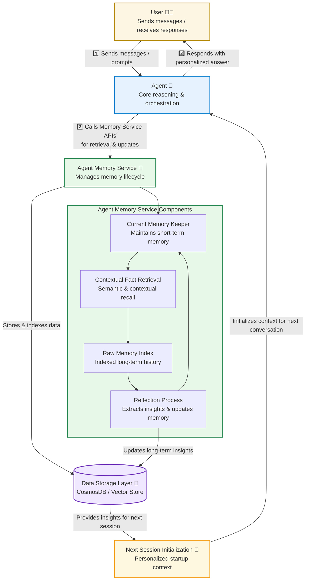

# 🧠 Agent Memory Service Design  
  
---  
  
## 1. Overview  
  
The **Agent Memory Service** enables AI agents to maintain and use long‑term memory, allowing for personalized, context‑aware, and cost‑efficient interactions.    
It supports agents that engage in prolonged or recurring conversations with users, helping them recall important information without overwhelming the system’s active context or incurring high inference costs.  
  
---  
  
## 2. Application Scenarios  
  
The service is designed for two main categories of applications:  
  
- **Personalized, long‑term interactions:**    
  Agents that build ongoing relationships with users and benefit from remembering user preferences, behaviors, and past interactions (e.g., digital assistants, tutors, or financial advisors).  
  
- **Long‑running conversations with complex context:**    
  Agents that handle extended sessions where conversation history, tool outputs, and external context exceed the model’s context window or become too costly to retain in full.  
  
---  
  
## 3. Inspiration from Human Memory  
  
The design is inspired by how humans manage memory and learning:  
  
- **Active vs. Long‑Term Memory:**    
  Humans keep only key details in short‑term (active) memory while storing the rest in long‑term memory or external aids (e.g., notebooks). When needed, they retrieve details using associative recall.  
  
- **Reflection and Learning:**    
  After interactions, humans naturally reflect on events, extracting key insights and lessons learned to store for future use.  
  
- **Recency, Frequency, and Importance:**    
  Recent and frequently encountered information is prioritized in active memory. Information deemed important through reflection is also retained longer or recalled more easily.  
  
---  
  
## 4. Core Components  
  
The Agent Memory Service consists of four main components that work together to manage memory storage, retrieval, and reflection.  
  
### 4.1 Raw Memory Index  
Stores detailed interaction history between the agent and user.    
- Data is indexed with metadata, enriched, and vectorized for efficient retrieval.    
- Supports semantic and contextual search across past sessions.  
  
### 4.2 Contextual Fact Retrieval Service  
An intelligent retrieval layer operating on top of the raw memory index.    
- **Synchronous mode:** Automatically monitors conversations and retrieves relevant information when the user refers to details outside the current context.    
- **On‑demand mode:** Exposed as a callable tool that the main agent can invoke when it decides additional context is needed.  
  
### 4.3 Current Memory Keeper  
Maintains the agent’s working memory during active conversations.    
- Summarizes older parts of the conversation and retains only the last *n* turns.    
- Injects relevant facts or insights from long‑term memory into the current context as needed.    
- Ensures the active memory remains concise and relevant.  
  
### 4.4 Reflection Process  
Periodically reviews new interactions to extract insights and lessons learned.    
- Updates both medium‑term and long‑term insights.    
- Can also perform large‑scale reflection across the conversation history to identify evolving patterns or preferences.  
  
---  
  
## 5. Integration with Agent Flow  
  
This section describes how the memory service integrates with the main agent throughout the lifecycle of a session:  
1. **Startup:** Load previous summaries, last *n* turns, and relevant insights.    
2. **During Conversation:** Retrieve facts, compress memory, and store raw data.    
3. **End of Conversation:** Trigger reflection and update long‑term insights.  
  
---  
  
## 6. Customization and Configuration  
  
Different application scenarios may require specialized memory behavior and reflection logic.    
The following parameters can be configured:  
  
| **Parameter** | **Description** | **Example** |  
|----------------|-----------------|--------------|  
| `n_turns` | Number of recent turns to keep in working memory | 5 |  
| `summarization_threshold` | Token or character limit that triggers summarization | 4000 tokens |  
| `retrieval_mode` | Synchronous or agent‑driven retrieval | `synchronous` |  
  
Application developers can customize:  
- **Reflection prompts** — to define what insights to extract (e.g., user preferences, learning progress).    
- **Insight selection prompts** — to determine which insights are loaded into the next session’s initial context.  
  
**Examples:**  
- *Financial service agent:* Extracts insights about customer preferences and product usage tendencies.    
- *AI tutoring assistant:* Stores insights about student progress, learning gaps, and improvement areas.  
  
---  
  
## 🌐 Master Overview Diagram: End‑to‑End Agent Memory Architecture  
  

  
---  
  
## 7. Summary  
  
The **Agent Memory Service** architecture provides a scalable and human‑inspired way for agents to manage memory across sessions.    
Key benefits include:  
  
- Efficient context management through compression and retrieval.    
- Personalized continuity between sessions via long‑term insights.    
- Configurable reflection and storage strategies suited to domain needs.    
- Seamless integration with existing agent frameworks through API‑based flows.  
  
This end‑to‑end design ensures agents remain contextually aware, memory‑efficient, and capable of long‑term relationship building with users.

## 8. Next Steps and Vision  
  
### 8.1 Immediate Next Step — Plug‑in Library for Microsoft Agent Framework  
The next phase is to evolve the Agent Memory Service into a **stand‑alone plug‑in library** that integrates seamlessly with **Microsoft's Agent Framework**.    
This library would:  
  
- Provide a **drop‑in memory module** for any agent built with the framework.    
- Offer standardized APIs for:  
  - Memory initialization and persistence.    
  - Contextual retrieval and summarization.    
  - Reflection and insight extraction.    
  
### 8.2 Longer‑Term Vision — Hosted Memory Backend Service  
In the longer horizon, the Agent Memory Service can evolve into a **hosted memory backend**, serving multiple agent ecosystems such as:  
  
- **Microsoft Agent Framework** (first‑party integration).    
- **Azure Agent Service** (as a memory microservice).    
 