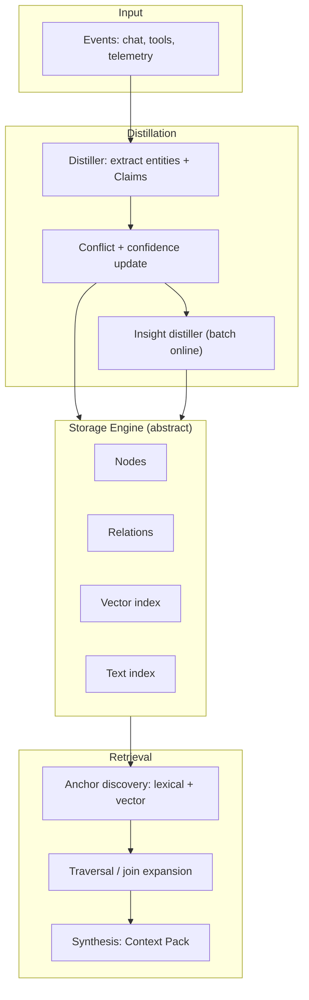
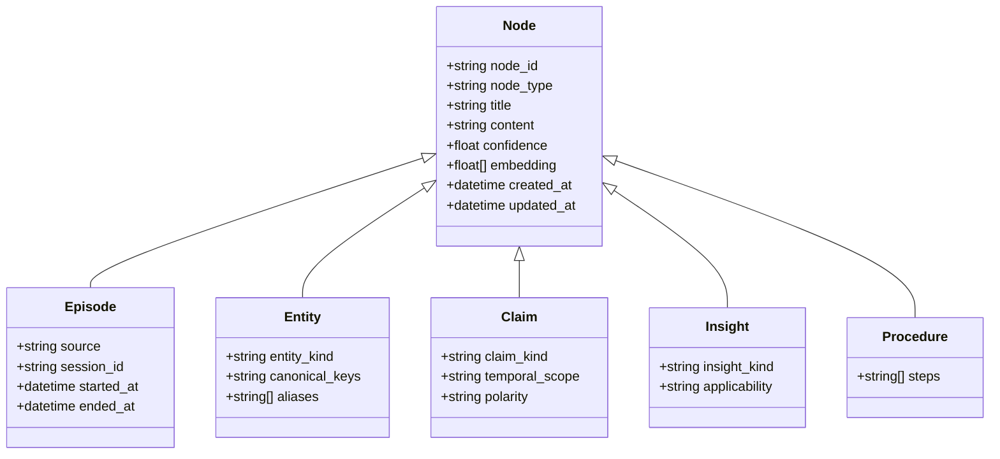

# 🧠 SAM: Spreading Activation Memory

**Episode → Entity → Claim → Insight → Procedure**

A cognitive-inspired memory architecture for AI agents that mimics how human memory works: retrieval through **spreading activation** from cue-based anchors, not just vector similarity search.

## Cognitive Science Foundations

This architecture is grounded in established memory research:

| Human Memory | SAM Equivalent | Mechanism |
|--------------|----------------|-----------|
| **Episodic Memory** | Episode nodes | Autobiographical events ("what happened") |
| **Semantic Memory** | Entity + Claim nodes | Stable knowledge about the world |
| **Spreading Activation** | Retrieval algorithm | Cues activate related nodes, activation propagates |
| **Forgetting Curve** | Decay mechanism | Unused memories fade over time (Ebbinghaus) |
| **Spaced Repetition** | Reinforcement on access | Retrieval strengthens memory traces |
| **Priming** | Goal-directed boost | Context/goals bias which memories surface |
| **Interference** | Degree penalty | High-connectivity nodes (hubs) are dampened |

**Key insight**: Human memory retrieval isn't "search" — it's activation spreading through associations. A cue triggers anchor nodes, activation flows along learned connections, and the strongest activations reach consciousness. SAM implements this computationally.

---

This document defines a **structured ontology** for agent memory and a **storage engine abstraction** that supports:
- local-first development (SQLite default)
- optional Azure cloud deployments (Postgres, Cosmos DB)
- hybrid retrieval (spreading activation + vector + lexical)

## Table of Contents

1. [Goals](#1-goals)
2. [Final Minimal Ontology](#2-final-minimal-ontology)
3. [Relationships](#3-relationships-conceptual)
4. [System Overview](#4-system-overview)
5. [Storage Engine Abstraction](#5-storage-engine-abstraction-local-first)
6. [Logical Data Model](#6-logical-data-model)
7. [Engine-specific Schemas](#7-engine-specific-schemas)
8. [Ingestion Model](#8-ingestion-model)
9. [Retrieval Model](#9-retrieval-model-anchor--expand--synthesize)
10. [Updated Ontology Diagram](#10-updated-ontology-diagram)
11. [Minimal API Surface](#11-minimal-api-surface)
12. [Prior Implementation Evaluation](#12-prior-implementation-evaluation)
13. [Retrieval Algorithm Specification](#13-retrieval-algorithm-specification)
14. [Ingestion Algorithm Specification](#14-ingestion-algorithm-specification)
15. [Implementation Plan](#15-implementation-plan)
16. [Multi-Tenancy](#16-multi-tenancy)
17. [Forgetting & Decay Mechanism](#17-forgetting--decay-mechanism)
18. [LLM-Based Contradiction Detection](#18-llm-based-contradiction-detection)
19. [Feedback Loop & Continuous Learning](#19-feedback-loop--continuous-learning)

---

## 1) Goals

- **Ground memory in experience** (auditability): everything learned should trace back to Episodes.
- **Support living knowledge**: Claims and Insights gain/lose strength over time and use.
- **Enable multi-modal retrieval**: hybrid anchors (lexical + semantic), plus traversal for associative recall.
- **Abstract storage engines**: same logical model across engines.
- **Default to local lightweight engine**: SQLite-based, with vector search + SQL.

Non-goals:
- Building a full ontology taxonomy (Concept nodes) as a separate node type.
- Enforcing one “true” graph database—graph is an access pattern, not necessarily a required backend.

---

## 2) Final Minimal Ontology

### 2.1 Episode
**What it is**: A record of something that happened.

**Purpose**
- Ground all memory in real experience
- Provide raw material for learning
- Enable auditability and temporal reasoning

**Lifecycle**
- Working memory holds active conversation turns (in-memory buffer)
- When buffer is flushed (every k turns), content is **appended** to the current open Episode
- A new Episode starts when the current one exceeds a size limit (default: **10,000 tokens**)
- Episode is closed → triggers reflection (Entity/Claim extraction, summary generation)

Examples
- A chat session with a customer (may span multiple flushes)
- A support ticket resolution thread
- A multi-turn user interaction

### 2.2 Entity
**What it is**: A stable reference to a person, system, or object.

**Purpose**
- Anchor memory to real-world actors or things
- Enable long-term personalization and relationships

Examples
- A user
- A customer account
- A service or product

### 2.3 Claim
**What it is**: An atomic, descriptive claim about one or more Entities.

**Purpose**
- Capture what is or was true about specific Entities
- Bridge between raw experience and learning
- Carry semantic meaning (text + tags + embeddings)

**Constraint: Claims must always reference Entities**
- Every Claim MUST have at least one `ABOUT` edge to an Entity
- Claims are never "conceptual stand-ins" - use Entities for abstract concepts
- If a claim does not reference a specific Entity, either:
  - Create an abstract Entity (e.g., "Billing Process", "Premium Users"), or
  - It is probably an Insight, not a Claim

Examples
- "User:Alice prefers email follow-ups" -> ABOUT -> Entity:Alice
- "Billing issues escalate after 48 hours" -> ABOUT -> Entity:BillingProcess  
- "Account:Acme has 3 open support tickets" -> ABOUT -> Entity:Acme

Key idea
- **Claims are descriptive**: "What is/was true?" (not prescriptive)
- **Claims are living units**: confidence can rise/fall via evidence and use
- **Claims are entity-bound**: always linked to at least one Entity via ABOUT edge
### 2.4 Insight
**What it is**: A generalized, actionable heuristic distilled from multiple Claims.

**Purpose**
- Answer "What should we do?" or "What tends to help?"
- Reduce repeated reasoning by encoding experience
- Drive better future decisions

**Distinction from Claims**

| Claim (descriptive) | Insight (prescriptive) |
|--------------------|------------------------|
| "Billing issues often escalate after 48 hours" | "Offer proactive outreach before 48 hours for billing issues" |
| "Technical users prefer detailed documentation" | "Send documentation links rather than summaries for technical users" |
| "Premium users have lower churn with personal contact" | "Prioritize phone outreach for premium user complaints" |

Examples (actionable recommendations)
- "Offer proactive outreach before 48 hours for billing issues"
- "Send email follow-ups rather than calls for technical users"
- "Escalate premium user complaints within 24 hours"

Key idea
- Insights are the **intelligence layer** of memory
- Insights are **derived from Claims**, not from raw episodes
- Insights are **context-general** (applicable across entities), Claims are **entity-specific**
### 2.5 Procedure
**What it is**: A reusable, executable workflow derived from high-confidence Insights.

**Purpose**
- Connect insights to concrete action
- Enable consistency and automation
- Reduce cognitive load by encoding "how to do X"

**When to create Procedures**
- When an Insight reaches high confidence (> 0.8) AND has been applied successfully multiple times
- When multiple related Insights form a coherent workflow
- When user explicitly defines or approves a procedure

**Lifecycle**
1. **Genesis**: High-confidence Insight triggers procedure candidate generation
2. **Validation**: Procedure is tested against historical cases or user-approved
3. **Activation**: Procedure is marked active and linked to triggering Insights
4. **Versioning**: When supporting Insights change, procedure is re-evaluated
5. **Deprecation**: Low-use or contradicted procedures are archived

Examples
- Escalation flow for billing disputes
- Onboarding checklist for new premium users
- Follow-up sequence for technical support tickets

Key idea
- Procedures are **derived from Insights**, not created directly from episodes
- Procedures should be **versioned** when their supporting Insights change
- Procedures are **optional** - many agents work fine with just Claims + Insights
---

## 3) Relationships (Conceptual)

- Episodes **involve** Entities
- Episodes **produce** Claims
- Claims **support** Insights
- Insights **influence** Procedures
- All relationships can **strengthen/weaken** over time through use

Recommended minimal edge vocabulary:
- `INVOLVES` (Episode → Entity)
- `PRODUCED` (Episode → Claim)
- `ABOUT` (Claim → Entity) (optional but useful)
- `RELATED_TO` (Entity → Entity)
- `ASSOCIATED_WITH` (Entity → Entity)
- `OWNS` / `USES` / `MEMBER_OF` (Entity → Entity, domain-agnostic)
- `SUPPORTS` (Claim → Insight)
- `CONTRADICTS` (Claim → Claim) (optional)
- `INFLUENCES` (Insight → Procedure)

### 3.1 Entity ↔ Entity relationships (why they matter)
Entity-to-entity edges allow memory to connect “who/what” relationships that drive recall:
- Person ↔ Organization (works_at)
- Customer ↔ Account (owns)
- Product ↔ Brand (made_by)
- Person ↔ Person (family_of, colleague_of)

These edges act as **high-signal bridges** during spreading activation.

### 3.2 Relationship strength updates
Every new interaction that reinforces an edge should increase its weight; contradictory evidence should reduce it.
Suggested update rule (bounded in $[0,1]$):

$$
w \leftarrow \min\bigl(1,\; w + \eta \cdot (1 - w)\bigr)
$$

For contradiction/decay:

$$
w \leftarrow w \cdot (1 - \gamma)
$$

---

## 4) System Overview



---

## 5) Storage Engine Abstraction (Local-first)

### 5.1 Why abstract the engine?
Different deployments want different tradeoffs:
- **Local / lightweight**: fast iteration, offline, privacy-friendly.
- **Cloud / multi-tenant**: scale, managed ops, shared learning.

This architecture treats storage as a **capability interface**:
- SQL filtering (structure)
- vector similarity (semantic)
- optional graph traversal (associative)

### 5.2 Engine options

Default engine (local):
- **SQLite** + FTS5 + a vector extension
  - vector: `sqlite-vec` (preferred) or `sqlite-vss` (alternative)
  - lexical: FTS5
  - graph: adjacency tables + recursive CTEs (baseline), optional graph extension if desired

Cloud engines (optional):
- **PostgreSQL** (treated as Azure deployment in this project)
  - vector: `pgvector`
  - lexical: full-text (`tsvector`) + optional trigram (`pg_trgm`)
  - graph: adjacency tables + recursive CTEs, optional Apache AGE

- **Cosmos DB** (Azure)
  - vector indexing supported in some configurations
  - graph via Gremlin API (if chosen)

### 5.3 Capability interface (Python)

The rest of the system depends only on this interface. All methods require `tenant_id` for isolation.

**Note**: This is the complete interface. All methods used in retrieval/ingestion algorithms are defined here.

```python
from __future__ import annotations
from dataclasses import dataclass, field
from typing import Any, Dict, List, Optional, Protocol, Sequence, Tuple
from datetime import datetime

# ============================================================================
# Data Records
# ============================================================================

@dataclass
class NodeRecord:
    node_id: str
    tenant_id: str               # Required for isolation
    node_type: str               # Episode | Entity | Claim | Insight | Procedure
    title: Optional[str]
    content: str
    embedding: Optional[List[float]]
    confidence: float
    created_at: datetime
    updated_at: datetime
    last_accessed_at: Optional[datetime] = None
    access_count: int = 0
    # Claim-specific (nullable for other types)
    claim_kind: Optional[str] = None          # preference|constraint|profile|operational
    temporal_scope: Optional[str] = None     # past|current|future
    metadata: Dict[str, Any] = field(default_factory=dict)

@dataclass
class EdgeRecord:
    edge_id: str
    tenant_id: str               # Required for isolation
    src_id: str
    dst_id: str
    edge_type: str
    weight: float
    created_at: datetime
    updated_at: datetime
    metadata: Dict[str, Any] = field(default_factory=dict)

@dataclass
class Anchor:
    node_id: str
    score: float
    method: str                  # lexical | vector | entity | deterministic

@dataclass
class SearchFilters:
    tenant_id: str               # Required
    node_types: Optional[List[str]] = None
    claim_kinds: Optional[List[str]] = None
    min_confidence: Optional[float] = None
    created_after: Optional[datetime] = None
    created_before: Optional[datetime] = None

# ============================================================================
# Core MemoryStore Protocol
# ============================================================================

class MemoryStore(Protocol):
    \"\"\"
    Storage abstraction for graph memory.
    All methods enforce tenant isolation via tenant_id.
    \"\"\"
    
    # --- Node Operations ---
    async def upsert_node(self, node: NodeRecord) -> NodeRecord: ...
    async def get_node(self, tenant_id: str, node_id: str) -> Optional[NodeRecord]: ...
    async def get_nodes(self, tenant_id: str, node_ids: Sequence[str]) -> Dict[str, NodeRecord]:
        \"\"\"Batch fetch nodes. Returns {node_id: NodeRecord} for found nodes.\"\"\"
        ...
    async def delete_node(self, tenant_id: str, node_id: str) -> bool: ...
    async def archive_node(self, tenant_id: str, node_id: str) -> bool:
        \"\"\"Mark node as archived (excluded from normal queries).\"\"\"
        ...
    
    # --- Edge Operations ---
    async def upsert_edge(self, edge: EdgeRecord) -> EdgeRecord: ...
    async def get_edge(self, tenant_id: str, src_id: str, dst_id: str, edge_type: str) -> Optional[EdgeRecord]: ...
    async def delete_edge(self, tenant_id: str, edge_id: str) -> bool: ...
    async def count_edges(self, tenant_id: str, src_id: Optional[str] = None, dst_id: Optional[str] = None) -> int: ...
    
    # --- Search Operations ---
    async def lexical_search(
        self, 
        query: str, 
        filters: SearchFilters,
        limit: int = 20
    ) -> List[Anchor]: ...
    
    async def vector_search(
        self, 
        embedding: List[float], 
        filters: SearchFilters,
        limit: int = 20
    ) -> List[Anchor]: ...
    
    async def entity_name_search(
        self,
        name: str,
        tenant_id: str,
        limit: int = 5
    ) -> List[Anchor]:
        \"\"\"Fast exact/prefix match on entity names.\"\"\"
        ...
    
    # --- Entity Resolution ---
    async def find_entity_exact(self, tenant_id: str, name: str) -> Optional[NodeRecord]: ...
    async def find_entity_by_alias(self, tenant_id: str, alias: str) -> Optional[NodeRecord]: ...
    async def find_entity_fuzzy(self, tenant_id: str, name: str, threshold: float = 0.85) -> Optional[NodeRecord]: ...
    async def find_entity_semantic(self, tenant_id: str, embedding: List[float], threshold: float = 0.9) -> Optional[NodeRecord]: ...
    
    # --- Claim Operations ---
    async def find_similar_fact(
        self,
        tenant_id: str,
        embedding: List[float],
        subject_entity_id: Optional[str] = None,
        threshold: float = 0.92
    ) -> Optional[NodeRecord]: ...
    
    async def get_facts_for_entity(
        self,
        tenant_id: str,
        entity_id: str,
        min_confidence: float = 0.5,
        claim_kinds: Optional[List[str]] = None
    ) -> List[NodeRecord]: ...
    
    # --- Insight Operations ---
    async def find_similar_insight(
        self,
        tenant_id: str,
        embedding: List[float],
        threshold: float = 0.9
    ) -> Optional[NodeRecord]: ...
    
    # --- Graph Traversal ---
    async def get_neighbors(
        self, 
        tenant_id: str,
        node_id: str, 
        edge_types: Optional[Sequence[str]] = None
    ) -> List[Tuple[str, str, float, int]]:
        \"\"\"Returns [(neighbor_id, edge_type, weight, neighbor_degree)].\"\"\"
        ...

    async def shortest_path(
        self,
        tenant_id: str,
        src_id: str,
        dst_id: str,
        max_depth: int = 3
    ) -> Optional[List[Tuple[str, str, str]]]:
        \"\"\"Returns path as [(node_id, edge_type, next_node_id), ...] or None.\"\"\"
        ...
    
    # --- Listing / Query ---
    async def list_nodes(
        self,
        tenant_id: str,
        node_type: Optional[str] = None,
        limit: int = 1000,
        offset: int = 0
    ) -> List[NodeRecord]: ...
    
    async def list_edges(
        self,
        tenant_id: str,
        edge_type: Optional[str] = None,
        limit: int = 1000,
        offset: int = 0
    ) -> List[EdgeRecord]: ...
    
    async def query_nodes(
        self,
        tenant_id: str,
        node_type: Optional[str] = None,
        created_before: Optional[datetime] = None,
        created_after: Optional[datetime] = None,
        min_confidence: Optional[float] = None,
        limit: int = 1000
    ) -> List[NodeRecord]: ...
    
    # --- Transaction Support ---
    async def begin(self) -> Any: ...
    async def commit(self, tx: Any) -> None: ...
    async def rollback(self, tx: Any) -> None: ...

# ============================================================================
# Feedback Store (Optional Extension)
# ============================================================================

@dataclass
class RetrievalFeedback:
    feedback_id: str
    retrieval_id: str
    tenant_id: str
    timestamp: datetime
    query: str
    goal: Optional[str]
    retrieved_node_ids: List[str]
    explicit_rating: Optional[int] = None       # -1, 0, +1
    nodes_used_in_response: List[str] = field(default_factory=list)
    nodes_marked_incorrect: List[str] = field(default_factory=list)
    task_success: Optional[bool] = None

class FeedbackStore(Protocol):
    \"\"\"Optional extension for feedback-based learning.\"\"\"
    async def save_feedback(self, feedback: RetrievalFeedback) -> None: ...
    async def get_feedback(self, feedback_id: str) -> Optional[RetrievalFeedback]: ...
    async def get_feedback_for_node(self, tenant_id: str, node_id: str) -> List[RetrievalFeedback]: ...
```

---
-

## 6) Logical Data Model

### 6.1 Node common fields
All node types share:
- `node_id` (stable id)
- `node_type` ∈ {Episode, Entity, Claim, Insight, Procedure}
- `content` (text)
- `embedding` (optional)
- `confidence` (0–1)
- timestamps + usage stats
- `metadata` (JSON)

### 6.2 Episode
Suggested metadata:
- `source`: chat | ticket | telemetry | tool
- `session_id`
- `participants`: list of entity ids
- `started_at`, `ended_at`

### 6.3 Entity
Suggested metadata:
- `entity_kind`: user | account | system | product
- `canonical_keys`: e.g., user_id, email hash, sku
- `aliases`

### 6.4 Claim
Suggested metadata:
- `claim_kind`: preference | constraint | profile | operational | other
- `polarity`: positive | negative (optional)
- `scope`: global | context (optional)
- `temporal_scope`: past | current | future
- `evidence`: list of episode ids and snippets

### 6.5 Insight
Suggested metadata:
- `insight_kind`: heuristic | policy | playbook
- `applicability`: filters/segments

### 6.6 Procedure
Suggested metadata:
- `steps`: list
- `inputs`, `outputs`
- `tooling`: optional automation hooks

---

## 7) Engine-specific Schemas

### 7.1 SQLite (default)
SQLite is treated as the default engine for local development and "lightweight mode".

**Multi-tenancy**: All tables include `tenant_id` as a required column. Queries MUST always filter by tenant_id.

Baseline (SQL tables):
```sql
-- Nodes (with tenant isolation)
CREATE TABLE IF NOT EXISTS nodes (
  node_id TEXT PRIMARY KEY,
  tenant_id TEXT NOT NULL,              -- Required for isolation
  node_type TEXT NOT NULL,
  title TEXT,
  content TEXT NOT NULL,
  embedding BLOB,                       -- Stored as binary, indexed by sqlite-vec
  confidence REAL NOT NULL DEFAULT 0.8,
  claim_kind TEXT,                       -- For Claims: preference|constraint|profile|operational
  temporal_scope TEXT,                  -- For Claims: past|current|future
  created_at TEXT NOT NULL,
  updated_at TEXT NOT NULL,
  access_count INTEGER NOT NULL DEFAULT 0,
  last_accessed_at TEXT,
  metadata_json TEXT NOT NULL DEFAULT '{}'
);

CREATE INDEX IF NOT EXISTS idx_nodes_tenant ON nodes(tenant_id);
CREATE INDEX IF NOT EXISTS idx_nodes_type ON nodes(node_type);
CREATE INDEX IF NOT EXISTS idx_nodes_tenant_type ON nodes(tenant_id, node_type);
CREATE INDEX IF NOT EXISTS idx_nodes_claim_kind ON nodes(claim_kind) WHERE node_type = 'Claim';

-- Edges (with tenant isolation)
CREATE TABLE IF NOT EXISTS edges (
  edge_id TEXT PRIMARY KEY,
  tenant_id TEXT NOT NULL,              -- Required for isolation
  src_id TEXT NOT NULL,
  dst_id TEXT NOT NULL,
  edge_type TEXT NOT NULL,
  weight REAL NOT NULL DEFAULT 1.0,
  created_at TEXT NOT NULL,
  updated_at TEXT NOT NULL,
  metadata_json TEXT NOT NULL DEFAULT '{}',
  FOREIGN KEY (src_id) REFERENCES nodes(node_id),
  FOREIGN KEY (dst_id) REFERENCES nodes(node_id)
);

CREATE INDEX IF NOT EXISTS idx_edges_tenant ON edges(tenant_id);
CREATE INDEX IF NOT EXISTS idx_edges_src ON edges(src_id);
CREATE INDEX IF NOT EXISTS idx_edges_dst ON edges(dst_id);
CREATE INDEX IF NOT EXISTS idx_edges_type ON edges(edge_type);
CREATE INDEX IF NOT EXISTS idx_edges_tenant_src ON edges(tenant_id, src_id);
```

Lexical (FTS5 with tenant awareness):
```sql
-- FTS5 index (tenant filtering happens at query time via JOIN)
CREATE VIRTUAL TABLE IF NOT EXISTS nodes_fts USING fts5(
  node_id UNINDEXED,
  content,
  title,
  tokenize='porter'
);

-- Trigger to keep FTS in sync
CREATE TRIGGER IF NOT EXISTS nodes_fts_insert AFTER INSERT ON nodes BEGIN
  INSERT INTO nodes_fts(node_id, content, title) VALUES (NEW.node_id, NEW.content, NEW.title);
END;

CREATE TRIGGER IF NOT EXISTS nodes_fts_update AFTER UPDATE ON nodes BEGIN
  UPDATE nodes_fts SET content = NEW.content, title = NEW.title WHERE node_id = NEW.node_id;
END;

CREATE TRIGGER IF NOT EXISTS nodes_fts_delete AFTER DELETE ON nodes BEGIN
  DELETE FROM nodes_fts WHERE node_id = OLD.node_id;
END;
```

Vector (sqlite-vec):
```sql
-- Vector index using sqlite-vec extension
-- Tenant filtering happens by joining with nodes table
CREATE VIRTUAL TABLE IF NOT EXISTS nodes_vec USING vec0(
  node_id TEXT PRIMARY KEY,
  embedding FLOAT[1536]                 -- Adjust dimension for your model
);

-- Sync triggers similar to FTS
```

Graph traversal (tenant-scoped):
```sql
-- Always filter by tenant_id in traversal
WITH RECURSIVE walk(node_id, depth, path, activation) AS (
  SELECT ?1 AS node_id, 0 AS depth, printf('%s', ?1) AS path, 1.0 AS activation
  UNION ALL
  SELECT e.dst_id, w.depth + 1, w.path || '>' || e.dst_id, w.activation * 0.7 * e.weight
  FROM walk w
  JOIN edges e ON e.src_id = w.node_id AND e.tenant_id = ?3
  WHERE w.depth < ?2 AND w.activation * 0.7 * e.weight > 0.1
)
SELECT node_id, MIN(depth) AS min_depth, MAX(activation) AS max_activation
FROM walk
GROUP BY node_id
ORDER BY max_activation DESC
LIMIT 200;
```
### 7.2 PostgreSQL (optional, cloud deployment)
- Nodes table similar to SQLite.
- Lexical: `tsvector` + GIN
- Vector: `pgvector`
- Graph: either adjacency + recursive SQL, or Apache AGE for Cypher.

### 7.3 Cosmos DB (optional, Azure)
- Model nodes/edges as documents (or use graph API if chosen).
- Maintain searchable indexes:
  - vector index for semantic retrieval
  - text index / filters for structured query

---

## 8) Ingestion Model

### 8.1 Distillation (Episode → Claims)
For every input event:
1) Create an Episode
2) Resolve or create involved Entities
3) Extract Claims
4) Link: Episode → Claims, Episode → Entities, Claim → Entities (optional)

### 8.2 Confidence and decay
Claims and Insights should be “living”. Recommended minimal approach:
- **Update confidence** based on new evidence (reinforcement) and contradictions.
- **Decay** confidence slightly with time if not reinforced (optional).

A simple update rule example:
- reinforcement: $c \leftarrow 1 - (1-c)(1-\alpha)$
- contradiction: $c \leftarrow c(1-\beta)$

### 8.3 Incremental updates (new Claims/entities/relations)
**New Claims arrive**
- Resolve target entities first (exact → alias → fuzzy → semantic).
- If a matching Claim exists, update confidence + evidence provenance.
- If it conflicts, attach `CONTRADICTS` and downweight the older Claim.

**New entities appear**
- Create a new Entity only if no match passes threshold.
- Otherwise, merge evidence into existing entity (aliases, attributes, embeddings).

**New interactions between entities**
- Create or update Entity → Entity edges (e.g., `RELATED_TO`, `OWNS`).
- Increase edge weight on repeated co-mentions or interaction evidence.
- Decrease edge weight when contradicted or no longer relevant.

---

## 9) Retrieval Model (Anchor → Expand → Synthesize)

### 9.1 Anchor discovery (hybrid)
- **Entity anchors**: exact entity name match against a fast name index (highest score).
- **Semantic anchors**: vector similarity search over `embedding`.
- **Keyword anchors**: keyword overlap between query terms and node keywords.
- **Deterministic anchors**: known ids (e.g., current user entity, active session).

Anchor scoring mirrors the prototype implementation:
- entity match: score = 1.0
- semantic match: score = cosine similarity
- keyword match: score = 0.7

### 9.2 Spreading activation (expansion)
Expansion uses BFS-style propagation with two key enhancements:

**Core parameters:**
- `max_hops` cap (default 3)
- `threshold` for pruning low activation
- `decay` per hop (default 0.7)
- **edge-type weights** × **edge weights**
- Activation **does not accumulate**; the max activation per node is kept

**Enhancement 1: Degree-based penalty (hub dampening)**

High-degree "hub" nodes (e.g., the user entity connected to hundreds of Claims) can flood the graph with irrelevant activations. We apply a degree penalty to dampen propagation from hubs:

$$
\text{degree\_penalty}(n) = \min\left(1.0,\; \max\left(0.1,\; \frac{\text{scale}}{\sqrt{\text{degree}(n)}}\right)\right)
$$

With `scale=5`, a node with degree 25 passes full activation, while degree 400 passes only 25%.

**Enhancement 2: Goal-directed activation**

Instead of filtering by goal relevance *after* spreading (wasteful), we boost goal-relevant nodes *during* spreading. This mimics human goal-directed recall where the goal primes relevant pathways:

$$
\text{goal\_multiplier}(n) = (1 - w) + w \times \text{sim}(\text{goal\_embedding}, n.\text{embedding})
$$

With `w=0.5`, a highly relevant node (sim=0.9) gets multiplier 0.95, while irrelevant (sim=0.2) gets 0.6.

**Combined activation formula:**

$$
\text{activation}_{next} = \text{activation}_{current} \times \text{decay} \times w_{edge\_type} \times w_{edge} \times \text{degree\_penalty} \times \text{goal\_multiplier}
$$

### 9.3 Filtering & goal-directed recall
As memory grows, nodes fan out. The retrieval agent should filter using:
- **Goal relevance**: boost nodes that match the query intent and constraints.
- **Recency**: prefer recent Episodes/Claims unless user asks for history.
- **Frequency**: prefer Claims supported by multiple episodes.
- **Specificity**: prefer narrower, higher-precision Claims.
- **Evidence quality**: observed > inferred > speculative.

Practical filters:
- Top-$k$ per node type (e.g., top 5 Entities, top 10 Claims)
- Max-degree caps per anchor (avoid hub explosion)
- Edge-type allowlist per query intent

### 9.4 Human memory analogs (applied)
Humans retrieve memory via **associative cues** and **goal bias**:
- Cues activate related clusters (spreading activation)
- Goals suppress irrelevant associations (inhibition)
- Recency/frequency modulate recall strength

Apply this by combining activation with a **task relevance score** and pruning low utility nodes.

### 9.5 Activated subgraph + reasoning chain
After activation:
- take the top-$k$ nodes by activation (default 20)
- extract the subgraph induced by those nodes
- compute **shortest paths** between high-activation nodes (depth ≤ 3) to form a reasoning chain

The reasoning chain is a list of steps:
`node_a --(edge_type)--> node_b`, used for explainability.

### 9.6 Synthesis
Return a compact “Context Pack”:
- relevant Entities
- top Claims (with confidence + evidence episode references)
- top Insights (with supporting Claim references)
- optional Procedures

Synthesis should include:
- top anchors with their match method
- top activated nodes and scores
- a short reasoning chain (5–10 steps)

---

## 10) Updated Ontology Diagram



---

## 11) Minimal API Surface

- `POST /memory/episodes` → ingest an episode (raw + structured signals)
- `POST /memory/retrieve` → retrieve Context Pack for a query
- `GET /memory/nodes/{id}` → inspect a node (debug/audit)

---

## 12) Prior Implementation Evaluation

This section consolidates lessons from the CosmosDB-based implementation to inform this new architecture.

### 12.1 What worked well
| Capability | Implementation | Lesson Applied |
|------------|----------------|----------------|
| Transparent memory injection | `ContextProvider.invoking()` | Keep Context Provider as first-class integration path |
| Lifecycle hooks | `invoking`, `invoked`, session start/end | Preserve session lifecycle APIs |
| Hybrid retrieval | Vector + lexical via CosmosDB | Formalize as anchor discovery stage |
| Session caching | Hot sessions near-zero latency | Maintain session pool pattern |
| Orchestration | CurrentMemoryKeeper + CFR + Reflection | Evolve into structured ingestion/retrieval pipelines |

### 12.2 What needs improvement
| Limitation | Impact | Solution in New Design |
|------------|--------|------------------------|
| Cloud dependency | No offline/local mode | Storage engine abstraction (SQLite default) |
| Ad hoc memory docs | No structured relationships | Episode/Entity/Claim/Insight ontology |
| CFR-only retrieval | No spreading activation | Anchor → activation → reasoning pipeline |
| Cold-start latency | ~100ms session restore | Maintain session pool, optimize loading |

### 12.3 Code reference (existing implementation)
- **Embedded provider**: [cosmos_memory_provider_embedded.py](../memory/cosmos_memory_provider_embedded.py)
- **Remote provider**: [cosmos_memory_provider.py](../memory/cosmos_memory_provider.py)
- **Memory wrapper**: [cosmos_agent_memory.py](../memory/cosmos_agent_memory.py)
- **Orchestrator**: [orchestrator.py](../memory/orchestrator.py)
- **Search utilities**: [cosmos_utils.py](../memory/cosmos_utils.py)

---

## 13) Retrieval Algorithm Specification

This section provides the complete retrieval algorithm with defined inputs, outputs, and steps.

**Implementation notes:**
- All store methods are async; the algorithm is fully async
- Batch fetches are used to minimize round trips
- Missing embeddings are handled gracefully

### 13.1 Request interface

```python
@dataclass
class RetrievalRequest:
    query: str                              # Natural language query
    tenant_id: str                          # Required for isolation
    goal: Optional[str] = None              # Task intent (for goal-directed filtering)
    user_entity_id: Optional[str] = None    # Current user (deterministic anchor)
    max_anchors: int = 10                   # Anchor discovery limit
    max_hops: int = 3                       # Spreading activation depth
    activation_threshold: float = 0.1       # Prune nodes below this
    top_k: int = 20                         # Final node limit
    include_reasoning_chain: bool = True    # Whether to compute paths
```

### 13.2 Response interface

```python
@dataclass
class RetrievalResponse:
    entities: List[NodeRecord]              # Relevant entities
    Claims: List[NodeRecord]                 # Top Claims with confidence
    insights: List[NodeRecord]              # Top insights
    procedures: List[NodeRecord]            # Applicable procedures
    anchors: List[Anchor]                   # Initial anchors with scores
    activated_nodes: List[Tuple[str, float]]  # (node_id, activation)
    reasoning_chain: List[Tuple[str, str, str]]  # (src, edge_type, dst)
```

### 13.3 Algorithm steps

**Step 1: Anchor Discovery**
```python
async def discover_anchors(
    store: MemoryStore,
    request: RetrievalRequest,
    embed_fn: Callable[[str], List[float]]
) -> List[Anchor]:
    anchors = []
    filters = SearchFilters(tenant_id=request.tenant_id)
    
    # Deterministic anchors (highest priority)
    if request.user_entity_id:
        anchors.append(Anchor(request.user_entity_id, 1.0, "deterministic"))

    # Entity name match (fast, exact/prefix)
    entity_matches = await store.entity_name_search(
        request.query, request.tenant_id, limit=5
    )
    for e in entity_matches:
        anchors.append(Anchor(e.node_id, 1.0, "entity"))

    # Semantic search
    query_embedding = embed_fn(request.query)
    semantic_hits = await store.vector_search(
        query_embedding, filters, limit=request.max_anchors
    )
    for hit in semantic_hits:
        anchors.append(Anchor(hit.node_id, hit.score, "semantic"))

    # Keyword search
    keyword_hits = await store.lexical_search(
        request.query, filters, limit=request.max_anchors
    )
    for hit in keyword_hits:
        anchors.append(Anchor(hit.node_id, 0.7 * hit.score, "keyword"))

    # Dedupe: keep highest score per node
    seen = {}
    for a in anchors:
        if a.node_id not in seen or a.score > seen[a.node_id].score:
            seen[a.node_id] = a
    
    return sorted(seen.values(), key=lambda a: a.score, reverse=True)[:request.max_anchors]
```

**Step 2: Goal-Directed Spreading Activation**
```python
EDGE_TYPE_WEIGHTS = {
    "INVOLVES": 0.9, "PRODUCED": 0.8, "ABOUT": 0.85,
    "RELATED_TO": 0.7, "SUPPORTS": 0.8, "CONTRADICTS": 0.3,
    "INFLUENCES": 0.75
}
DECAY = 0.7
DEGREE_PENALTY_SCALE = 5.0
GOAL_BOOST_WEIGHT = 0.5

def degree_penalty(degree: int) -> float:
    if degree <= 1:
        return 1.0
    penalty = DEGREE_PENALTY_SCALE / math.sqrt(degree)
    return max(0.1, min(1.0, penalty))

def goal_relevance(
    node_embedding: Optional[List[float]],
    goal_embedding: Optional[List[float]]
) -> float:
    \"\"\"Compute goal-directed boost. Returns 1.0 if either embedding is missing.\"\"\"
    if goal_embedding is None or node_embedding is None:
        return 1.0
    sim = cosine_similarity(goal_embedding, node_embedding)
    return (1 - GOAL_BOOST_WEIGHT) + (GOAL_BOOST_WEIGHT * max(0, sim))

async def spread_activation(
    store: MemoryStore,
    tenant_id: str,
    anchors: List[Anchor],
    goal_embedding: Optional[List[float]],
    max_hops: int,
    activation_threshold: float
) -> Dict[str, float]:
    activation = {a.node_id: a.score for a in anchors}
    visited = set()
    frontier = [(a.node_id, a.score, 0) for a in anchors]
    
    # Pre-fetch anchor node data for embeddings
    anchor_ids = [a.node_id for a in anchors]
    node_cache = await store.get_nodes(tenant_id, anchor_ids)
    
    while frontier:
        node_id, current_activation, depth = frontier.pop(0)
        if node_id in visited or depth >= max_hops:
            continue
        visited.add(node_id)
        
        # get_neighbors returns [(neighbor_id, edge_type, weight, neighbor_degree)]
        neighbors = await store.get_neighbors(tenant_id, node_id)
        deg_penalty = degree_penalty(len(neighbors))
        
        # Batch fetch neighbor nodes for embeddings (if not cached)
        neighbor_ids = [n[0] for n in neighbors if n[0] not in node_cache]
        if neighbor_ids:
            new_nodes = await store.get_nodes(tenant_id, neighbor_ids)
            node_cache.update(new_nodes)
        
        for neighbor_id, edge_type, edge_weight, _ in neighbors:
            w_type = EDGE_TYPE_WEIGHTS.get(edge_type, 0.5)
            
            # Goal relevance from cached embedding
            neighbor_node = node_cache.get(neighbor_id)
            neighbor_emb = neighbor_node.embedding if neighbor_node else None
            goal_mult = goal_relevance(neighbor_emb, goal_embedding)
            
            new_activation = (
                current_activation * DECAY * w_type * edge_weight 
                * deg_penalty * goal_mult
            )
            
            if new_activation >= activation_threshold:
                if neighbor_id not in activation or new_activation > activation[neighbor_id]:
                    activation[neighbor_id] = new_activation
                    frontier.append((neighbor_id, new_activation, depth + 1))
    
    return activation
```

**Step 3: Final Filtering & Ranking**
```python
async def filter_and_rank(
    store: MemoryStore,
    tenant_id: str,
    activation: Dict[str, float],
    top_k: int
) -> Tuple[List[Tuple[str, float]], Dict[str, NodeRecord]]:
    # Batch fetch all activated nodes
    node_ids = list(activation.keys())
    nodes = await store.get_nodes(tenant_id, node_ids)
    
    # Apply recency boost
    now = datetime.utcnow()
    for node_id, node in nodes.items():
        if node.updated_at:
            days_old = (now - node.updated_at).days
            recency = math.exp(-days_old / 30)  # 30-day half-life
            activation[node_id] *= recency
    
    # Group by type and apply caps
    by_type: Dict[str, List[str]] = {}
    for node_id, node in nodes.items():
        by_type.setdefault(node.node_type, []).append(node_id)
    
    TYPE_CAPS = {"Entity": 5, "Claim": 15, "Insight": 5, "Episode": 3, "Procedure": 3}
    filtered = []
    for node_type, type_nodes in by_type.items():
        cap = TYPE_CAPS.get(node_type, 5)
        top_of_type = sorted(type_nodes, key=lambda n: activation[n], reverse=True)[:cap]
        filtered.extend(top_of_type)
    
    activated_nodes = sorted(
        [(nid, activation[nid]) for nid in filtered],
        key=lambda x: x[1], 
        reverse=True
    )[:top_k]
    
    return activated_nodes, nodes
```

**Step 4: Reasoning Chain (optional)**
```python
async def build_reasoning_chain(
    store: MemoryStore,
    tenant_id: str,
    activated_nodes: List[Tuple[str, float]],
    max_steps: int = 10
) -> List[Tuple[str, str, str]]:
    reasoning_chain = []
    high_activation_ids = [nid for nid, _ in activated_nodes[:10]]
    
    for i, src in enumerate(high_activation_ids):
        for dst in high_activation_ids[i+1:]:
            path = await store.shortest_path(tenant_id, src, dst, max_depth=3)
            if path:
                reasoning_chain.extend(path)
    
    # Dedupe preserving order
    seen = set()
    deduped = []
    for step in reasoning_chain:
        key = (step[0], step[1], step[2])
        if key not in seen:
            seen.add(key)
            deduped.append(step)
    
    return deduped[:max_steps]
```

**Step 5: Synthesis (main entry point)**
```python
async def retrieve(
    store: MemoryStore,
    request: RetrievalRequest,
    embed_fn: Callable[[str], List[float]]
) -> RetrievalResponse:
    # Step 1: Anchor discovery
    anchors = await discover_anchors(store, request, embed_fn)
    
    # Step 2: Spreading activation
    goal_embedding = embed_fn(request.goal) if request.goal else None
    activation = await spread_activation(
        store, request.tenant_id, anchors, goal_embedding,
        request.max_hops, request.activation_threshold
    )
    
    # Step 3: Filter and rank
    activated_nodes, nodes_cache = await filter_and_rank(
        store, request.tenant_id, activation, request.top_k
    )
    
    # Step 4: Reasoning chain
    reasoning_chain = []
    if request.include_reasoning_chain:
        reasoning_chain = await build_reasoning_chain(
            store, request.tenant_id, activated_nodes
        )
    
    # Step 5: Build response
    final_nodes = [nodes_cache[nid] for nid, _ in activated_nodes if nid in nodes_cache]
    
    return RetrievalResponse(
        entities=[n for n in final_nodes if n.node_type == "Entity"],
        Claims=[n for n in final_nodes if n.node_type == "Claim"],
        insights=[n for n in final_nodes if n.node_type == "Insight"],
        procedures=[n for n in final_nodes if n.node_type == "Procedure"],
        anchors=anchors,
        activated_nodes=activated_nodes,
        reasoning_chain=reasoning_chain
    )
```

---
## 14) Ingestion Algorithm Specification

This section provides the complete ingestion algorithm for processing new episodes.

**Implementation notes:**
- All store methods are async; the algorithm is fully async
- Claims MUST have at least one ABOUT edge to an Entity
- Contradiction detection uses LLM classification (see Section 18)

### 14.1 Request interface

```python
@dataclass
class IngestionRequest:
    tenant_id: str                          # Required for isolation
    content: str                            # Raw episode content (e.g., conversation)
    source: str                             # "chat" | "ticket" | "tool" | "telemetry"
    session_id: Optional[str] = None        # Link to active session (metadata only)
    user_entity_id: Optional[str] = None    # Known user entity
    timestamp: Optional[datetime] = None    # Event time (defaults to now)
    metadata: Dict[str, Any] = field(default_factory=dict)
```

### 14.2 Response interface

```python
@dataclass
class IngestionResult:
    episode_id: str                         # Created episode node
    entities: List[str]                     # Resolved/created entity IDs
    Claims: List[str]                        # Extracted Claim IDs
    edges_created: int                      # Number of new edges
    insights_updated: List[str]             # Insights affected (if batch mode)
```

### 14.3 Algorithm steps

**Step 1: Create Episode**
```python
async def create_episode(
    store: MemoryStore,
    request: IngestionRequest,
    embed_fn: Callable[[str], List[float]]
) -> NodeRecord:
    ts = request.timestamp or datetime.utcnow()
    episode = NodeRecord(
        node_id=generate_id(),
        tenant_id=request.tenant_id,
        node_type="Episode",
        title=extract_title(request.content),
        content=request.content,
        embedding=embed_fn(request.content),
        confidence=1.0,
        created_at=ts,
        updated_at=ts,
        metadata={
            "source": request.source,
            "session_id": request.session_id,
            **request.metadata
        }
    )
    await store.upsert_node(episode)
    return episode
```

**Step 2: Entity Resolution**
```python
async def resolve_entities(
    store: MemoryStore,
    tenant_id: str,
    episode: NodeRecord,
    content: str,
    embed_fn: Callable[[str], List[float]],
    extract_fn: Callable[[str], List[EntityMention]]
) -> List[str]:
    extracted = extract_fn(content)  # LLM or NER
    resolved_ids = []
    
    for mention in extracted:
        # Resolution cascade: exact -> alias -> fuzzy -> semantic
        match = await store.find_entity_exact(tenant_id, mention.name)
        if not match:
            match = await store.find_entity_by_alias(tenant_id, mention.name)
        if not match:
            match = await store.find_entity_fuzzy(tenant_id, mention.name, threshold=0.85)
        if not match:
            emb = embed_fn(mention.name)
            match = await store.find_entity_semantic(tenant_id, emb, threshold=0.9)
        
        if match:
            # Update existing entity with new alias
            aliases = match.metadata.get("aliases", [])
            if mention.name not in aliases:
                aliases.append(mention.name)
                match.metadata["aliases"] = aliases
            match.updated_at = datetime.utcnow()
            await store.upsert_node(match)
            resolved_ids.append(match.node_id)
        else:
            # Create new entity
            entity = NodeRecord(
                node_id=generate_id(),
                tenant_id=tenant_id,
                node_type="Entity",
                title=mention.name,
                content=mention.description or mention.name,
                embedding=embed_fn(mention.name),
                confidence=0.8,
                created_at=datetime.utcnow(),
                updated_at=datetime.utcnow(),
                metadata={"entity_kind": mention.kind, "aliases": [mention.name]}
            )
            await store.upsert_node(entity)
            resolved_ids.append(entity.node_id)
        
        # Link Episode -> Entity
        await store.upsert_edge(EdgeRecord(
            edge_id=generate_id(),
            tenant_id=tenant_id,
            src_id=episode.node_id,
            dst_id=resolved_ids[-1],
            edge_type="INVOLVES",
            weight=1.0,
            created_at=datetime.utcnow(),
            updated_at=datetime.utcnow(),
            metadata={}
        ))
    
    return resolved_ids
```

**Step 3: Claim Extraction (with entity binding)**
```python
async def extract_and_store_facts(
    store: MemoryStore,
    tenant_id: str,
    episode: NodeRecord,
    resolved_entity_ids: List[str],
    content: str,
    embed_fn: Callable[[str], List[float]],
    extract_fn: Callable[[str, List[str]], List[ClaimMention]],
    classify_fn: Callable[[str, str], ClaimRelationship]  # LLM contradiction classifier
) -> List[str]:
    \"\"\"
    Extract Claims and ensure each has at least one ABOUT edge to an Entity.
    Uses LLM-based contradiction detection.
    \"\"\"
    extracted = extract_fn(content, resolved_entity_ids)
    fact_ids = []
    
    for mention in extracted:
        # Validation: Claims must reference at least one entity
        if not mention.subject_entity_ids:
            # Skip Claims without entity references (or log warning)
            continue
        
        fact_embedding = embed_fn(mention.text)
        
        # Check for existing similar Claim about same entity
        existing = await store.find_similar_fact(
            tenant_id, fact_embedding,
            subject_entity_id=mention.subject_entity_ids[0],
            threshold=0.85
        )
        
        if existing:
            # Use LLM to classify relationship (see Section 18)
            relationship = classify_fn(existing.content, mention.text)
            
            if relationship == ClaimRelationship.IDENTICAL:
                # Merge evidence, boost confidence
                existing.confidence = min(1.0, existing.confidence + 0.15 * (1 - existing.confidence))
                existing.metadata.setdefault("evidence", []).append({
                    "episode_id": episode.node_id,
                    "snippet": mention.snippet
                })
                existing.updated_at = datetime.utcnow()
                await store.upsert_node(existing)
                fact_ids.append(existing.node_id)
                continue
                
            elif relationship == ClaimRelationship.REINFORCING:
                # Boost existing, also create new
                existing.confidence = min(1.0, existing.confidence + 0.1 * (1 - existing.confidence))
                await store.upsert_node(existing)
                # Fall through to create new Claim
                
            elif relationship == ClaimRelationship.CONTRADICTING:
                # Reduce old confidence significantly
                existing.confidence *= 0.5
                await store.upsert_node(existing)
                # Create new Claim and add CONTRADICTS edge (below)
                
            elif relationship == ClaimRelationship.SUPERSEDING:
                # Archive old, create new
                existing.confidence *= 0.3
                existing.metadata["superseded"] = True
                await store.upsert_node(existing)
        
        # Create new Claim
        new_fact = NodeRecord(
            node_id=generate_id(),
            tenant_id=tenant_id,
            node_type="Claim",
            title=mention.text[:100],
            content=mention.text,
            embedding=fact_embedding,
            confidence=0.7,
            claim_kind=mention.kind,
            temporal_scope=mention.temporal_scope or "current",
            created_at=datetime.utcnow(),
            updated_at=datetime.utcnow(),
            metadata={
                "evidence": [{"episode_id": episode.node_id, "snippet": mention.snippet}]
            }
        )
        await store.upsert_node(new_fact)
        fact_ids.append(new_fact.node_id)
        
        # Link Episode -> Claim
        await store.upsert_edge(EdgeRecord(
            edge_id=generate_id(),
            tenant_id=tenant_id,
            src_id=episode.node_id,
            dst_id=new_fact.node_id,
            edge_type="PRODUCED",
            weight=1.0,
            created_at=datetime.utcnow(),
            updated_at=datetime.utcnow(),
            metadata={}
        ))
        
        # Link Claim -> Entity (REQUIRED: at least one ABOUT edge)
        for entity_id in mention.subject_entity_ids:
            await store.upsert_edge(EdgeRecord(
                edge_id=generate_id(),
                tenant_id=tenant_id,
                src_id=new_fact.node_id,
                dst_id=entity_id,
                edge_type="ABOUT",
                weight=1.0,
                created_at=datetime.utcnow(),
                updated_at=datetime.utcnow(),
                metadata={}
            ))
        
        # Add CONTRADICTS edge if applicable
        if existing and relationship == ClaimRelationship.CONTRADICTING:
            await store.upsert_edge(EdgeRecord(
                edge_id=generate_id(),
                tenant_id=tenant_id,
                src_id=new_fact.node_id,
                dst_id=existing.node_id,
                edge_type="CONTRADICTS",
                weight=0.9,
                created_at=datetime.utcnow(),
                updated_at=datetime.utcnow(),
                metadata={}
            ))
    
    return fact_ids
```

**Step 4: Entity-Entity Relationship Updates**
```python
async def update_entity_relationships(
    store: MemoryStore,
    tenant_id: str,
    resolved_entity_ids: List[str],
    content: str,
    extract_fn: Callable[[str, List[str]], List[RelationshipMention]]
) -> int:
    relationships = extract_fn(content, resolved_entity_ids)
    edges_created = 0
    
    for rel in relationships:
        existing = await store.get_edge(tenant_id, rel.src_id, rel.dst_id, rel.edge_type)
        
        if existing:
            # Strengthen existing edge (asymptotic to 1.0)
            eta = 0.1
            existing.weight = min(1.0, existing.weight + eta * (1 - existing.weight))
            existing.updated_at = datetime.utcnow()
            await store.upsert_edge(existing)
        else:
            await store.upsert_edge(EdgeRecord(
                edge_id=generate_id(),
                tenant_id=tenant_id,
                src_id=rel.src_id,
                dst_id=rel.dst_id,
                edge_type=rel.edge_type,
                weight=0.5,
                created_at=datetime.utcnow(),
                updated_at=datetime.utcnow(),
                metadata={}
            ))
            edges_created += 1
    
    return edges_created
```

**Step 5: Insight Distillation (batch or session-end)**
```python
async def distill_insights(
    store: MemoryStore,
    tenant_id: str,
    entity_id: str,
    embed_fn: Callable[[str], List[float]],
    generate_fn: Callable[[List[NodeRecord]], List[InsightCandidate]],
    min_facts: int = 3
) -> List[str]:
    \"\"\"Called periodically or at session end for an entity.\"\"\"
    Claims = await store.get_facts_for_entity(
        tenant_id, entity_id, min_confidence=0.5
    )
    
    if len(Claims) < min_facts:
        return []
    
    insight_ids = []
    candidates = generate_fn(Claims)  # LLM generates insight candidates
    
    for candidate in candidates:
        emb = embed_fn(candidate.text)
        existing = await store.find_similar_insight(tenant_id, emb, threshold=0.9)
        
        if existing:
            existing.confidence = min(1.0, existing.confidence + 0.1)
            existing.updated_at = datetime.utcnow()
            await store.upsert_node(existing)
            insight_ids.append(existing.node_id)
        else:
            insight = NodeRecord(
                node_id=generate_id(),
                tenant_id=tenant_id,
                node_type="Insight",
                title=candidate.text[:100],
                content=candidate.text,
                embedding=emb,
                confidence=0.6,
                created_at=datetime.utcnow(),
                updated_at=datetime.utcnow(),
                metadata={"insight_kind": candidate.kind}
            )
            await store.upsert_node(insight)
            insight_ids.append(insight.node_id)
            
            # Link supporting Claims
            for fact_id in candidate.supporting_fact_ids:
                await store.upsert_edge(EdgeRecord(
                    edge_id=generate_id(),
                    tenant_id=tenant_id,
                    src_id=fact_id,
                    dst_id=insight.node_id,
                    edge_type="SUPPORTS",
                    weight=0.8,
                    created_at=datetime.utcnow(),
                    updated_at=datetime.utcnow(),
                    metadata={}
                ))
    
    return insight_ids
```

**Step 6: Main Entry Point**
```python
async def ingest(
    store: MemoryStore,
    request: IngestionRequest,
    embed_fn: Callable[[str], List[float]],
    extract_entities_fn: Callable,
    extract_facts_fn: Callable,
    extract_relationships_fn: Callable,
    classify_fact_fn: Callable
) -> IngestionResult:
    # Step 1: Create episode
    episode = await create_episode(store, request, embed_fn)
    
    # Step 2: Entity resolution
    entity_ids = await resolve_entities(
        store, request.tenant_id, episode, request.content,
        embed_fn, extract_entities_fn
    )
    
    # Step 3: Claim extraction
    fact_ids = await extract_and_store_facts(
        store, request.tenant_id, episode, entity_ids, request.content,
        embed_fn, extract_facts_fn, classify_fact_fn
    )
    
    # Step 4: Entity relationships
    edges_created = await update_entity_relationships(
        store, request.tenant_id, entity_ids, request.content,
        extract_relationships_fn
    )
    
    # Edges from episode + Claims
    edges_created += len(entity_ids) + len(fact_ids) * 2
    
    return IngestionResult(
        episode_id=episode.node_id,
        entities=entity_ids,
        Claims=fact_ids,
        edges_created=edges_created,
        insights_updated=[]  # Populated if distill_insights called
    )
```

---
## 15) Implementation Plan

Goal: keep the **client-facing interface** similar to the CosmosDB implementation while upgrading internals to the structured memory agent.

**Complexity note**: This document describes a complete system. Not all features are needed for v1.

### 15.1 Implementation Tiers

The architecture has three complexity tiers. Start with Tier 1 and add features as needed:

**Tier 1: Minimal Viable Memory (MVP)**
| Component | Include | Defer |
|-----------|---------|-------|
| Ontology | Episode, Entity, Claim | Insight, Procedure |
| Storage | SQLite only | Postgres, Cosmos |
| Retrieval | Vector + lexical anchors, simple BFS | Goal-directed activation, reasoning chain |
| Ingestion | Episode, entity resolution, Claims | Insight distillation, procedures |
| Decay | None | All decay logic |
| Contradiction | Embedding similarity only | LLM classification |
| Feedback | None | All feedback logic |
| Multi-tenancy | Single tenant | Full isolation |

**Tier 2: Production-Ready**
| Component | Add |
|-----------|-----|
| Ontology | Insight nodes |
| Storage | PostgreSQL adapter |
| Retrieval | Goal-directed activation, degree penalty, reasoning chain |
| Ingestion | Insight distillation |
| Decay | Basic time-based decay |
| Contradiction | LLM classification (batch) |
| Feedback | Basic feedback collection |
| Multi-tenancy | Row-level tenant isolation |

**Tier 3: Full Featured**
| Component | Add |
|-----------|-----|
| Ontology | Procedure nodes + lifecycle |
| Storage | Cosmos DB adapter |
| Decay | Full claim_kind aware decay, episode archival |
| Contradiction | Real-time LLM classification |
| Feedback | Full feedback loop with reliability scores |
| Multi-tenancy | System tenant for shared knowledge |

### 15.2 Interface parity (what stays the same)
- **Context Provider** entry point for Agent Framework usage
- Session lifecycle hooks: `invoking()`, `invoked()`, session start/end
- Client-facing memory wrapper with `start_session()`, `end_session()`, `add_turn()`, `retrieve_context()`

### 15.3 Internal improvements
- Replace ad hoc memory docs with **Episode/Entity/Claim/Insight/Procedure** nodes
- Add **Storage Engine abstraction** (SQLite default, Postgres/Cosmos optional)
- Replace CFR-only retrieval with **anchor -> activation -> reasoning -> synthesis** pipeline

### 15.4 Milestones

| Phase | Deliverable | Key Tasks | Tier |
|-------|-------------|-----------|------|
| 1 | Interface contracts | `MemoryStore` protocol, `NodeRecord`/`EdgeRecord` | 1 |
| 2 | SQLite adapter | FTS5 + sqlite-vec + adjacency traversal | 1 |
| 3 | Basic ingestion | Episode creation, entity resolution, Claim extraction | 1 |
| 4 | Basic retrieval | Anchor discovery, simple BFS, synthesis | 1 |
| 5 | Agent integration | Context Provider, session management | 1 |
| 6 | Goal-directed retrieval | Degree penalty, goal-directed activation | 2 |
| 7 | Insight distillation | Batch insight generation from Claims | 2 |
| 8 | LLM contradiction | Classification during ingestion | 2 |
| 9 | Decay job | Claim-kind aware decay with scheduler | 2 |
| 10 | PostgreSQL adapter | Full Postgres support | 2 |
| 11 | Feedback loop | Collection and application | 3 |
| 12 | Procedure lifecycle | Creation, versioning, deprecation | 3 |
| 13 | Cosmos adapter | Azure deployment support | 3 |

### 15.5 Success criteria
- Client code using old Cosmos provider requires **minimal changes**
- Retrieval quality improves via structured activation and reasoning chain
- Local-first default works offline with SQLite
- Cloud backends remain supported with same interface

**MVP success** (Tier 1 only):
- Can ingest conversations and extract entities/Claims
- Can retrieve relevant Claims for a query
- Works entirely offline with SQLite

---
## 16) Multi-Tenancy

This system is designed as **multi-tenant by default**. Each tenant (user, organization, or agent instance) has isolated memory.

### 16.1 Tenant isolation model

```
┌─────────────────────────────────────────────────────────────────────────────────┐
│                           MULTI-TENANT ARCHITECTURE                             │
├─────────────────────────────────────────────────────────────────────────────────┤
│                                                                                 │
│   Tenant A                      Tenant B                      Tenant C          │
│   ┌─────────────┐              ┌─────────────┐              ┌─────────────┐    │
│   │ Episodes    │              │ Episodes    │              │ Episodes    │    │
│   │ Entities    │              │ Entities    │              │ Entities    │    │
│   │ Claims       │              │ Claims       │              │ Claims       │    │
│   │ Insights    │              │ Insights    │              │ Insights    │    │
│   └──────┬──────┘              └──────┬──────┘              └──────┬──────┘    │
│          │                            │                            │            │
│          └────────────────────────────┴────────────────────────────┘            │
│                                       │                                         │
│                              ┌────────▼────────┐                               │
│                              │  Storage Engine  │                               │
│                              │  (tenant_id col) │                               │
│                              └──────────────────┘                               │
│                                                                                 │
└─────────────────────────────────────────────────────────────────────────────────┘
```

### 16.2 Implementation approach

**Option A: Row-level isolation (recommended for SQLite/Postgres)**
```sql
-- All nodes have tenant_id
CREATE TABLE nodes (
    node_id TEXT PRIMARY KEY,
    tenant_id TEXT NOT NULL,  -- Isolation key
    node_type TEXT NOT NULL,
    ...
);

CREATE INDEX idx_nodes_tenant ON nodes(tenant_id);

-- All queries MUST include tenant_id
SELECT * FROM nodes WHERE tenant_id = ? AND node_type = 'Claim';
```

**Option B: Schema-per-tenant (for strict isolation)**
```sql
-- Each tenant gets own schema
CREATE SCHEMA tenant_abc123;
CREATE TABLE tenant_abc123.nodes (...);
```

**Option C: Database-per-tenant (for compliance/enterprise)**
- Each tenant has isolated database file (SQLite) or database (Postgres)
- Maximum isolation, higher operational overhead

### 16.3 Query enforcement

```python
class TenantScopedMemoryStore:
    """Wrapper that enforces tenant isolation on all operations."""
    
    def __init__(self, store: MemoryStore, tenant_id: str):
        self._store = store
        self._tenant_id = tenant_id
    
    async def upsert_node(self, node: NodeRecord) -> NodeRecord:
        # Enforce tenant_id on write
        node.metadata["tenant_id"] = self._tenant_id
        return await self._store.upsert_node(node)
    
    async def vector_search(self, embedding: List[float], limit: int) -> List[Anchor]:
        # Filter by tenant on read
        results = await self._store.vector_search(
            embedding, 
            limit=limit,
            filter={"tenant_id": self._tenant_id}
        )
        return results
    
    async def get_neighbors(self, node_id: str, ...) -> List[Tuple]:
        # Validate node belongs to tenant before traversal
        node = await self._store.get_node(node_id)
        if node.metadata.get("tenant_id") != self._tenant_id:
            raise PermissionError("Cross-tenant access denied")
        return await self._store.get_neighbors(node_id, ...)
```

### 16.4 Cross-tenant considerations

| Scenario | Behavior |
|----------|----------|
| Entity resolution | NEVER match across tenants |
| Spreading activation | NEVER traverse into other tenant's nodes |
| Shared knowledge | Use separate "system" tenant for global Claims (opt-in) |
| Embedding model | Can share across tenants (stateless) |

---

## 17) Forgetting & Decay Mechanism

Human memory forgets - so should the system. Without decay, memory accumulates unboundedly, stale Claims persist, and weak signals clutter retrieval.

### 17.1 What decays

| Element | Decay Trigger | Effect |
|---------|---------------|--------|
| **Claim confidence** | Time since last access/reinforcement | Lower retrieval ranking |
| **Edge weight** | Time since last traversal | Weaker spreading activation |
| **Entity aliases** | Never used in resolution | Pruned from alias list |
| **Episodes** | Age + low reference count | Archived or summarized |

### 17.2 Claim-kind aware decay

**Different Claim kinds decay at different rates.**

Claims are not all equal - operational/global Claims should be more stable than ephemeral preferences:

| claim_kind | decay_rate | min_confidence | Rationale |
|-----------|------------|----------------|-----------|
| `operational` | 0.005 | 0.3 | Core business rules, stable |
| `profile` | 0.01 | 0.2 | User profile data, semi-stable |
| `preference` | 0.03 | 0.1 | User preferences, can change |
| `constraint` | 0.01 | 0.25 | Constraints are usually stable |
| `other` | 0.02 | 0.1 | Default category |

Similarly, `temporal_scope` affects decay:

| temporal_scope | decay_multiplier | Rationale |
|----------------|------------------|-----------|
| `past` | 2.0x | Historical Claims decay faster |
| `current` | 1.0x | Default |
| `future` | 0.5x | Planned/expected Claims decay slower |

### 17.3 Decay formulas

**Time-based confidence decay:**
```math
c(t) = c_0 * e^(-lambda * delta_t)
```

Where:
- c_0 = confidence at last update
- delta_t = days since last access
- lambda = decay rate (varies by claim_kind)

**Access-reinforced decay (recommended):**
```math
c(t) = c_base + (c_peak - c_base) * e^(-lambda * delta_t)
```

Where:
- c_base = floor confidence (from claim_kind table above)
- c_peak = confidence at last reinforcement
- Accessing a node resets delta_t and may boost c_peak

### 17.4 Decay job implementation

```python
# Decay rates by claim_kind
DECAY_RATES = {
    "operational": 0.005,
    "profile": 0.01,
    "preference": 0.03,
    "constraint": 0.01,
    "other": 0.02,
}

MIN_CONFIDENCE = {
    "operational": 0.3,
    "profile": 0.2,
    "preference": 0.1,
    "constraint": 0.25,
    "other": 0.1,
}

TEMPORAL_MULTIPLIER = {
    "past": 2.0,
    "current": 1.0,
    "future": 0.5,
}

async def run_decay_job(
    store: MemoryStore,
    tenant_id: str,
    edge_decay_rate: float = 0.01,
    min_edge_weight: float = 0.05,
    prune_threshold: float = 0.05,
    batch_size: int = 1000,
):
    \"\"\"
    Background job to apply decay across all nodes and edges.
    Run daily or weekly. Respects claim_kind and temporal_scope.
    \"\"\"
    now = datetime.utcnow()
    
    # Decay node confidence
    offset = 0
    while True:
        nodes = await store.list_nodes(tenant_id, limit=batch_size, offset=offset)
        if not nodes:
            break
        offset += len(nodes)
        
        for node in nodes:
            if node.node_type != "Claim":
                continue  # Only decay Claims
            
            if node.last_accessed_at is None:
                continue
            
            days_since_access = (now - node.last_accessed_at).days
            if days_since_access <= 0:
                continue
            
            # Get decay parameters based on claim_kind
            claim_kind = node.claim_kind or "other"
            base_rate = DECAY_RATES.get(claim_kind, 0.02)
            min_conf = MIN_CONFIDENCE.get(claim_kind, 0.1)
            
            # Apply temporal multiplier
            temporal = node.temporal_scope or "current"
            rate = base_rate * TEMPORAL_MULTIPLIER.get(temporal, 1.0)
            
            # Compute decay
            decay_factor = math.exp(-rate * days_since_access)
            new_confidence = max(min_conf, node.confidence * decay_factor)
            
            if new_confidence < prune_threshold:
                await store.archive_node(tenant_id, node.node_id)
            elif new_confidence != node.confidence:
                node.confidence = new_confidence
                await store.upsert_node(node)
    
    # Decay edge weights (simpler - no claim_kind awareness)
    offset = 0
    while True:
        edges = await store.list_edges(tenant_id, limit=batch_size, offset=offset)
        if not edges:
            break
        offset += len(edges)
        
        for edge in edges:
            days_since_traversal = (now - edge.updated_at).days
            if days_since_traversal <= 0:
                continue
            
            decay_factor = math.exp(-edge_decay_rate * days_since_traversal)
            new_weight = max(min_edge_weight, edge.weight * decay_factor)
            
            if new_weight < prune_threshold:
                await store.delete_edge(tenant_id, edge.edge_id)
            elif new_weight != edge.weight:
                edge.weight = new_weight
                await store.upsert_edge(edge)
```

### 17.5 Reinforcement on access

```python
async def on_node_accessed(
    store: MemoryStore, 
    tenant_id: str,
    node_id: str, 
    boost: float = 0.1
):
    \"\"\"
    Called when a node is included in retrieval results.
    Reinforces the node against decay.
    \"\"\"
    node = await store.get_node(tenant_id, node_id)
    if not node:
        return
    
    node.last_accessed_at = datetime.utcnow()
    node.access_count += 1
    
    # Slight confidence boost (asymptotic to 1.0)
    node.confidence = min(1.0, node.confidence + boost * (1 - node.confidence))
    await store.upsert_node(node)
```

### 17.6 Episode archival

Old episodes with low reference counts can be:
1. **Summarized**: Extract key Claims, then compress episode content
2. **Archived**: Move to cold storage, exclude from normal retrieval
3. **Deleted**: Remove entirely (with cascade to orphaned Claims)

```python
async def archive_old_episodes(
    store: MemoryStore,
    tenant_id: str,
    max_age_days: int = 365,
    min_reference_count: int = 2,
):
    \"\"\"Archive episodes older than threshold with few references.\"\"\"
    cutoff = datetime.utcnow() - timedelta(days=max_age_days)
    old_episodes = await store.query_nodes(
        tenant_id=tenant_id,
        node_type="Episode",
        created_before=cutoff,
    )
    
    for episode in old_episodes:
        ref_count = await store.count_edges(tenant_id, dst_id=episode.node_id)
        if ref_count < min_reference_count:
            await store.archive_node(tenant_id, episode.node_id)
```

---
## 18) LLM-Based Contradiction Detection

Simple embedding similarity cannot reliably detect semantic contradictions. We use LLM-based classification for accurate contradiction handling.

### 18.1 When to check for contradictions

```
┌─────────────────────────────────────────────────────────────────────────────────┐
│                    CONTRADICTION CHECK TRIGGERS                                 │
├─────────────────────────────────────────────────────────────────────────────────┤
│                                                                                 │
│  1. New Claim extracted → check against existing Claims for same entity          │
│  2. Similar Claims found (embedding sim > 0.7) → LLM classifies relationship    │
│  3. User explicitly corrects information → find and update contradicted Claims  │
│                                                                                 │
└─────────────────────────────────────────────────────────────────────────────────┘
```

### 18.2 Contradiction classification

```python
from enum import Enum

class ClaimRelationship(Enum):
    IDENTICAL = "identical"           # Same Claim, merge evidence
    REINFORCING = "reinforcing"       # Compatible, strengthens confidence
    INDEPENDENT = "independent"       # Unrelated, no action needed
    CONTRADICTING = "contradicting"   # Mutually exclusive
    SUPERSEDING = "superseding"       # New Claim replaces old (temporal update)
    REFINING = "refining"             # New Claim is more specific version

CONTRADICTION_PROMPT = """
You are analyzing the relationship between two Claims about the same entity.

Entity: {entity_name}

Existing Claim: "{existing_fact}"
(Recorded: {existing_date}, Confidence: {existing_confidence})

New Claim: "{new_fact}"
(Source: {new_source})

Classify the relationship between these Claims:

1. IDENTICAL - They express the same information
2. REINFORCING - They are compatible and support each other
3. INDEPENDENT - They are about different aspects, no relationship
4. CONTRADICTING - They are mutually exclusive (both cannot be true)
5. SUPERSEDING - The new Claim is a temporal update (old was true, now new is true)
6. REFINING - The new Claim is a more specific/detailed version of the old

Respond with JSON:
{{
    "relationship": "<one of the above>",
    "confidence": <0.0-1.0>,
    "reasoning": "<brief explanation>",
    "recommended_action": "<merge|keep_both|replace|archive_old|flag_for_review>"
}}
"""

async def classify_fact_relationship(
    llm_client: LLMClient,
    entity: NodeRecord,
    existing_fact: NodeRecord,
    new_fact_text: str,
    new_source: str,
) -> dict:
    """Use LLM to classify relationship between existing and new Claim."""
    prompt = CONTRADICTION_PROMPT.format(
        entity_name=entity.title,
        existing_fact=existing_fact.content,
        existing_date=existing_fact.created_at,
        existing_confidence=existing_fact.confidence,
        new_fact=new_fact_text,
        new_source=new_source,
    )
    
    response = await llm_client.complete(prompt, response_format="json")
    return json.loads(response)
```

### 18.3 Handling each relationship type

```python
async def handle_fact_relationship(
    store: MemoryStore,
    classification: dict,
    existing_fact: NodeRecord,
    new_fact: NodeRecord,
    episode_id: str,
):
    """Take action based on LLM classification."""
    relationship = classification["relationship"]
    
    if relationship == "IDENTICAL":
        # Merge: boost confidence, add evidence
        existing_fact.confidence = reinforce_confidence(existing_fact.confidence)
        existing_fact.metadata["evidence"].append({
            "episode_id": episode_id,
            "snippet": new_fact.content
        })
        await store.upsert_node(existing_fact)
        # Don't create new Claim
        
    elif relationship == "REINFORCING":
        # Keep both, create SUPPORTS edge
        await store.upsert_node(new_fact)
        await store.upsert_edge(EdgeRecord(
            edge_id=generate_id(),
            src_id=new_fact.node_id,
            dst_id=existing_fact.node_id,
            edge_type="SUPPORTS",
            weight=0.8,
            ...
        ))
        
    elif relationship == "INDEPENDENT":
        # Just create new Claim, no relationship
        await store.upsert_node(new_fact)
        
    elif relationship == "CONTRADICTING":
        # Create both, add CONTRADICTS edge, reduce old confidence
        await store.upsert_node(new_fact)
        existing_fact.confidence *= 0.5  # Significant reduction
        await store.upsert_node(existing_fact)
        await store.upsert_edge(EdgeRecord(
            edge_id=generate_id(),
            src_id=new_fact.node_id,
            dst_id=existing_fact.node_id,
            edge_type="CONTRADICTS",
            weight=0.9,
            metadata={"reasoning": classification["reasoning"]},
            ...
        ))
        
    elif relationship == "SUPERSEDING":
        # New replaces old: archive old, create new
        existing_fact.metadata["superseded_by"] = new_fact.node_id
        existing_fact.confidence *= 0.3
        await store.upsert_node(existing_fact)
        await store.upsert_node(new_fact)
        await store.upsert_edge(EdgeRecord(
            edge_id=generate_id(),
            src_id=new_fact.node_id,
            dst_id=existing_fact.node_id,
            edge_type="SUPERSEDES",
            weight=1.0,
            ...
        ))
        
    elif relationship == "REFINING":
        # New is more specific: link as refinement
        await store.upsert_node(new_fact)
        await store.upsert_edge(EdgeRecord(
            edge_id=generate_id(),
            src_id=new_fact.node_id,
            dst_id=existing_fact.node_id,
            edge_type="REFINES",
            weight=0.9,
            ...
        ))
```

### 18.4 Cost optimization

LLM calls are expensive. Optimize by:

1. **Pre-filter with embeddings**: Only call LLM if similarity > 0.7
2. **Batch processing**: Group similar Claims, classify in batches
3. **Cache classifications**: Store relationship decisions for repeated patterns
4. **Skip low-confidence Claims**: Don't bother checking against Claims with confidence < 0.3

---

## 19) Feedback Loop & Continuous Learning

The system should improve over time by learning from actual usage. If retrieved context was helpful, reinforce those pathways. If not, dampen them.

### 19.1 Feedback signals

| Signal | Source | Meaning |
|--------|--------|---------|
| **Explicit thumbs up/down** | User rating | Direct quality feedback |
| **Context used in response** | LLM output analysis | Retrieved Claim was relevant |
| **Follow-up correction** | User says "that's wrong" | Retrieved Claim was incorrect |
| **Task success** | Downstream metric | Memory contributed to goal |
| **Retrieval click-through** | UI interaction | User found result useful |

### 19.2 Feedback data model

```python
@dataclass
class RetrievalFeedback:
    feedback_id: str
    retrieval_id: str                    # Links to original retrieval
    tenant_id: str
    timestamp: datetime
    
    # What was retrieved
    query: str
    goal: Optional[str]
    retrieved_node_ids: List[str]
    
    # Feedback signals
    explicit_rating: Optional[int]       # -1, 0, +1
    nodes_used_in_response: List[str]    # Subset that LLM actually used
    nodes_marked_incorrect: List[str]    # User corrections
    task_success: Optional[bool]         # Downstream outcome
    
    # Derived
    relevance_scores: Dict[str, float]   # Per-node relevance estimate
```

### 19.3 Feedback collection

```python
async def record_retrieval_for_feedback(
    store: MemoryStore,
    retrieval_id: str,
    query: str,
    goal: Optional[str],
    retrieved_nodes: List[NodeRecord],
    tenant_id: str,
) -> str:
    """Record retrieval for later feedback association."""
    feedback = RetrievalFeedback(
        feedback_id=generate_id(),
        retrieval_id=retrieval_id,
        tenant_id=tenant_id,
        timestamp=datetime.utcnow(),
        query=query,
        goal=goal,
        retrieved_node_ids=[n.node_id for n in retrieved_nodes],
        explicit_rating=None,
        nodes_used_in_response=[],
        nodes_marked_incorrect=[],
        task_success=None,
        relevance_scores={},
    )
    await store.save_feedback(feedback)
    return feedback.feedback_id

async def submit_feedback(
    store: MemoryStore,
    feedback_id: str,
    rating: Optional[int] = None,
    nodes_used: Optional[List[str]] = None,
    nodes_incorrect: Optional[List[str]] = None,
    task_success: Optional[bool] = None,
):
    """User or system submits feedback on a retrieval."""
    feedback = await store.get_feedback(feedback_id)
    
    if rating is not None:
        feedback.explicit_rating = rating
    if nodes_used is not None:
        feedback.nodes_used_in_response = nodes_used
    if nodes_incorrect is not None:
        feedback.nodes_marked_incorrect = nodes_incorrect
    if task_success is not None:
        feedback.task_success = task_success
    
    await store.save_feedback(feedback)
    
    # Apply feedback immediately
    await apply_feedback_to_memory(store, feedback)
```

### 19.4 Applying feedback to memory

```python
async def apply_feedback_to_memory(
    store: MemoryStore,
    feedback: RetrievalFeedback,
    positive_boost: float = 0.1,
    negative_penalty: float = 0.2,
    incorrect_penalty: float = 0.5,
):
    """Update node confidence and edge weights based on feedback."""
    
    # Positive feedback: boost nodes that were used
    if feedback.explicit_rating == 1 or feedback.task_success:
        for node_id in feedback.nodes_used_in_response:
            node = await store.get_node(node_id)
            node.confidence = min(1.0, node.confidence + positive_boost * (1 - node.confidence))
            node.metadata["positive_feedback_count"] = node.metadata.get("positive_feedback_count", 0) + 1
            await store.upsert_node(node)
    
    # Negative feedback: dampen nodes that were retrieved but not used
    if feedback.explicit_rating == -1:
        unused_nodes = set(feedback.retrieved_node_ids) - set(feedback.nodes_used_in_response)
        for node_id in unused_nodes:
            node = await store.get_node(node_id)
            node.confidence *= (1 - negative_penalty)
            node.metadata["negative_feedback_count"] = node.metadata.get("negative_feedback_count", 0) + 1
            await store.upsert_node(node)
    
    # Incorrect nodes: significant penalty
    for node_id in feedback.nodes_marked_incorrect:
        node = await store.get_node(node_id)
        node.confidence *= (1 - incorrect_penalty)
        node.metadata["marked_incorrect_count"] = node.metadata.get("marked_incorrect_count", 0) + 1
        # Flag for human review if marked incorrect multiple times
        if node.metadata["marked_incorrect_count"] >= 3:
            node.metadata["needs_review"] = True
        await store.upsert_node(node)

async def analyze_llm_response_for_feedback(
    llm_client: LLMClient,
    response_text: str,
    retrieved_nodes: List[NodeRecord],
) -> List[str]:
    """
    Analyze LLM response to determine which retrieved Claims were actually used.
    Returns list of node_ids that appear to have been used.
    """
    prompt = f"""
    The following Claims were provided as context:
    {json.dumps([{"id": n.node_id, "content": n.content} for n in retrieved_nodes])}
    
    The assistant's response was:
    "{response_text}"
    
    Which Claims from the context were actually used or referenced in the response?
    Return a JSON array of Claim IDs that were used: ["id1", "id2", ...]
    """
    
    response = await llm_client.complete(prompt, response_format="json")
    return json.loads(response)
```

### 19.5 Aggregate learning (optional)

Over time, aggregate feedback to identify patterns:

```python
async def compute_node_reliability_score(
    store: MemoryStore,
    node_id: str,
) -> float:
    """
    Compute reliability score based on historical feedback.
    Used as a boost factor in retrieval.
    """
    node = await store.get_node(node_id)
    
    positive = node.metadata.get("positive_feedback_count", 0)
    negative = node.metadata.get("negative_feedback_count", 0)
    incorrect = node.metadata.get("marked_incorrect_count", 0)
    
    if positive + negative + incorrect == 0:
        return 1.0  # No feedback, neutral
    
    # Wilson score interval (lower bound) for reliability
    total = positive + negative + incorrect
    positive_rate = positive / total
    
    # Penalize incorrect heavily
    adjusted_positive = positive - (incorrect * 3)
    adjusted_rate = max(0, adjusted_positive) / total
    
    return 0.5 + 0.5 * adjusted_rate  # Range [0.5, 1.0]
```

### 19.6 Integration with retrieval

```python
# In spreading activation, include reliability as a factor:

def get_node_boost(node_id: str) -> float:
    """Boost factor including feedback-based reliability."""
    reliability = compute_node_reliability_score(store, node_id)
    return reliability  # Can combine with other boost factors
```

