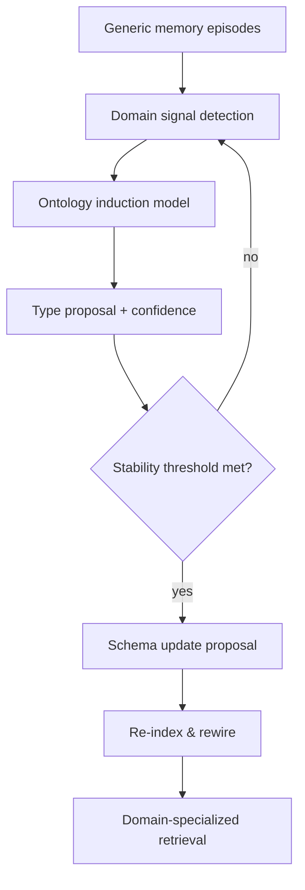

# 🧠 Adaptive Domain-Specific Memory Architecture (Evolving Ontology)

This document defines an **advanced, dynamic** memory architecture where the system starts generic and **learns a domain-specific ontology over time**. The goal is to **improve retrieval relevance** and **spreading activation quality** by evolving entity/edge types from real usage.

---

## 1) Motivation

Generic ontologies are useful early, but **domain-specific structure** makes memory recall more precise. Human memory adapts to context: a shopping assistant “knows” brands, size, fit; a finance assistant “knows” accounts, risk tolerance, tax rules. The system should:

- start with **generic memory**
- detect **domain convergence**
- **evolve schema** (entity + edge types)
- **re-index & rewire** when patterns stabilize

---

## 2) Core Idea: Two-Phase Memory

### Phase A — Generic Accumulation
- Use minimal ontology: Episode, Entity, Fact, Insight, Procedure
- Store embeddings + keywords + loose links
- Retrieval is vector/lexical + light traversal

### Phase B — Domain Specialization
- Detect stable domain patterns (e.g., shopping, finance)
- Generate a **domain-specific ontology**
- Re-assign old memory to new types
- Add domain-aware edges and weights

---

## 3) Dynamic Ontology Lifecycle

### 3.1 Triggering domain specialization
A background process watches signals:
- **Topic clustering**: repeated terms and co-occurrence patterns
- **Entity recurrence**: same types appearing over many episodes
- **Edge patterns**: repeated relational templates
- **Confidence threshold**: only specialize after $N$ episodes or $K$ extracted candidates

Trigger condition example:
- “Create Shopping Ontology when ≥ 200 episodes have ≥ 70% topic overlap in apparel + retail + product terms.”

### 3.2 Ontology induction (model-assisted)
A powerful model proposes:
- **New entity types** (e.g., Brand, SKU, SizeProfile, Recipient)
- **New edge types** (e.g., PREFERS_BRAND, RETURNED_FOR_FIT)
- **Type constraints** (which nodes can connect)

### 3.3 Governance / validation
Before applying schema:
- verify stability over time
- check for redundancy with existing types
- attach confidence to each proposed type

### 3.4 Schema evolution
Evolving schema can include:
- adding new types
- merging similar types
- deprecating unused types
- reweighting edge types for activation

---

## 4) Ontology Evolution Pipeline

---

## 5) Data Model Strategy

### 5.1 Layered typing
- **Core node types**: Episode, Entity, Fact, Insight, Procedure
- **Domain tags**: `domain="shopping"` or `domain="finance"`
- **Subtypes** inside metadata: `entity_subtype`, `edge_subtype`

This lets you specialize **without breaking storage**.

### 5.2 Progressive typing
Start with:
- `Entity` + `entity_subtype = "unknown"`

Later promote:
- `Entity` + `entity_subtype = "Brand"`
- Add edges: `PREFERS_BRAND`, `AVOIDS_MATERIAL`

---

## 6) Retrieval & Spreading Activation (Domain-Aware)

Once a domain schema emerges:

- **Anchor selection uses domain-specific types**
  - Example (shopping): Brand, SizeProfile, Recipient, Material
- **Edge weights are tuned by domain**
  - Example: `RETURNED_FOR_FIT` has stronger impact than `VIEWED`
- **Constraint-aware traversal**
  - Example: budget + size + allergy constraints

This results in **higher precision recall** and **fewer irrelevant facts**.

---

## 7) Re-indexing & Background Reflection

When schema updates:
1. Re-classify existing facts/entities
2. Recompute embeddings for new type labels (optional)
3. Update indexes / edge weights
4. Keep history for auditability

This runs asynchronously as a **reflection process**.

---

## 8) Example: Shopping Domain Specialization

### Before specialization
- Entity ("Nike")
- Entity ("running shoes")
- Fact ("prefers wide fit")

### After specialization
- Brand("Nike")
- Category("Running Shoes")
- SizeProfile("wide fit")
- Edge: `PREFERS_BRAND`
- Edge: `HAS_SIZE_PROFILE`

---

## 9) Example: Personal Finance Specialization

### Before specialization
- Entity ("401k")
- Fact ("high risk tolerance")

### After specialization
- AccountType("401k")
- RiskProfile("high")
- Edge: `HAS_RISK_PROFILE`
- Edge: `SAVES_FOR`

---

## 10) System Interfaces (Stable)

Client-facing interfaces **do not change**, even as ontology evolves:

- `start_session()`
- `add_turn()`
- `retrieve_context()`

Internally:
- retrieval adapts based on current domain ontology
- schema updates are opaque to clients

---

## 11) Risks & Mitigations

**Risk:** schema churn creates instability
- Mitigation: only update schema after thresholds + confidence

**Risk:** domain mismatch (user changes domain)
- Mitigation: allow multi-domain coexistence with domain tagging

**Risk:** expensive re-indexing
- Mitigation: background batch jobs, incremental updates

---

## 12) Roadmap (High Level)

1. **Phase 1** — Generic memory with minimal ontology
2. **Phase 2** — Domain detection & ontology induction
3. **Phase 3** — Domain-aware retrieval + activation weights
4. **Phase 4** — Continuous schema refinement

---

## 13) Summary

This adaptive architecture mirrors how humans learn domain structure over time. Start generic, **infer the domain**, **evolve the ontology**, and improve retrieval precision without breaking client interfaces. The result is a memory system that becomes **more specialized and effective** as it learns.
