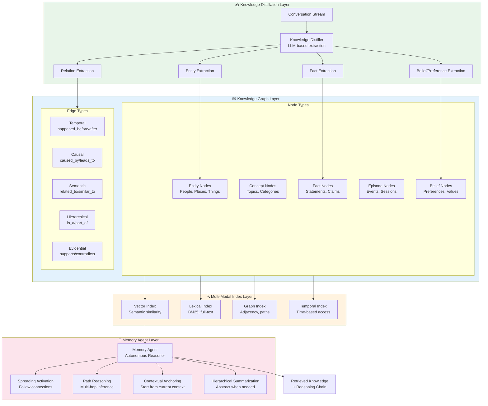
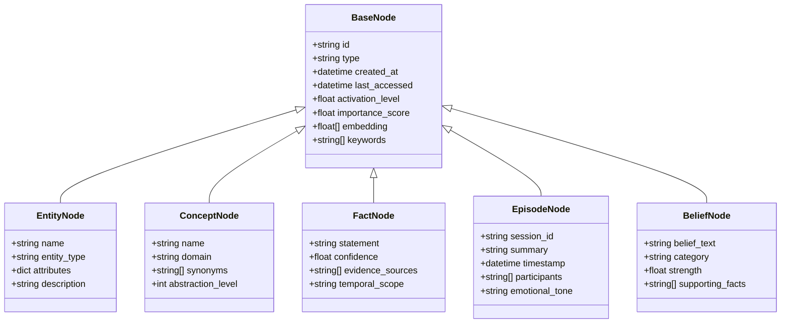
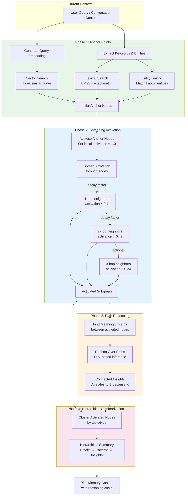
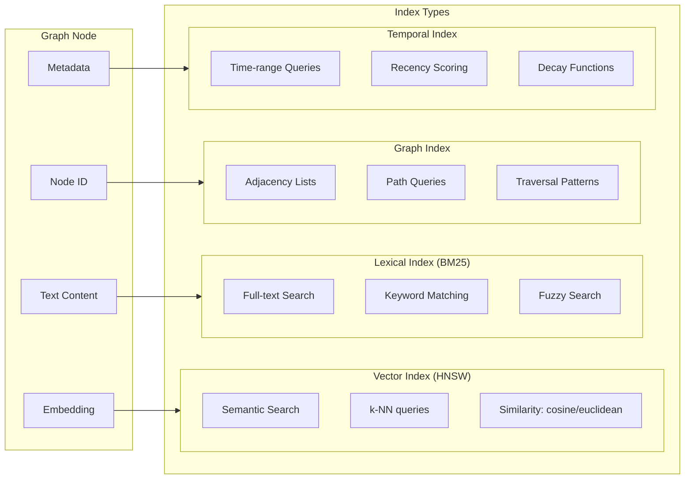
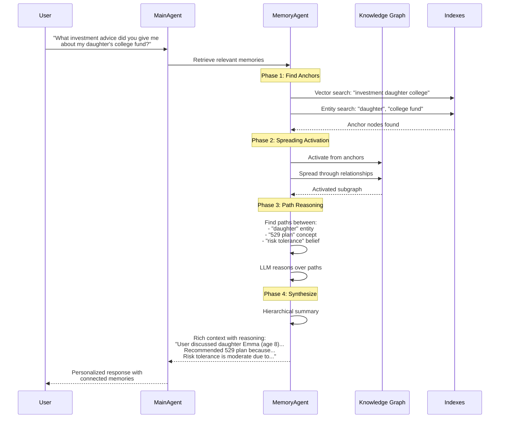
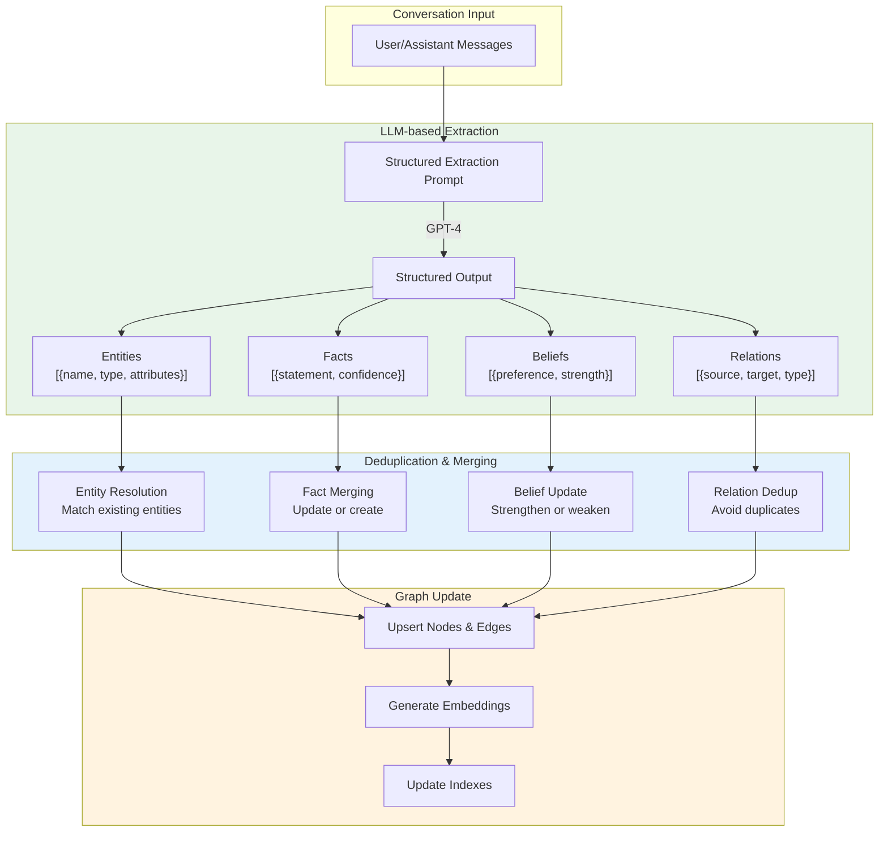
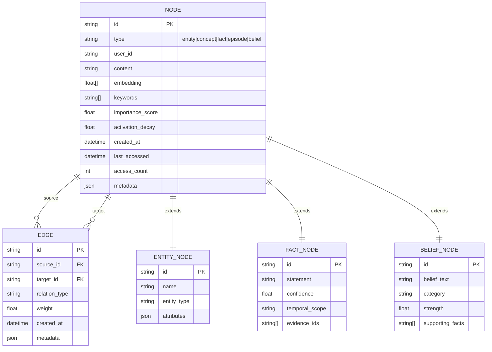

# 🧠 Graph-Based Knowledge Memory Architecture

## Vision: Human-Like Associative Memory

Your current system uses **flat vector search** - each memory is an independent document retrieved by similarity. Human memory works differently:

- **Associative**: Memories connect to other memories through relationships
- **Contextual Activation**: Recalling one memory activates related memories ("spreading activation")
- **Multi-hop Reasoning**: "My friend John → works at Microsoft → HQ in Seattle → rainy weather"
- **Hierarchical Abstraction**: Specific facts → General patterns → Core beliefs

---

## 🔄 Current vs. Proposed Architecture

```
┌─────────────────────────────────────────────────────────────────────────────────┐
│                           CURRENT ARCHITECTURE                                  │
├─────────────────────────────────────────────────────────────────────────────────┤
│                                                                                 │
│    Conversation ──────► Flat Documents ──────► Vector Search ──────► Results   │
│                              │                      │                           │
│                         [embedding]            [top-k cosine]                   │
│                                                                                 │
│    Problem: No relationships, no reasoning, just similarity matching           │
│                                                                                 │
└─────────────────────────────────────────────────────────────────────────────────┘

┌─────────────────────────────────────────────────────────────────────────────────┐
│                          PROPOSED ARCHITECTURE                                   │
├─────────────────────────────────────────────────────────────────────────────────┤
│                                                                                 │
│    Conversation ──► Knowledge Distillation ──► Graph + Indexes ──► Memory Agent│
│                              │                      │                    │      │
│                    [entities, relations,     [lexical +           [traverse,   │
│                     facts, beliefs]           vector +            reason,      │
│                                               graph]              activate]    │
│                                                                                 │
└─────────────────────────────────────────────────────────────────────────────────┘
```

---

## 🏗️ Core Architecture Design



---

## 📊 Knowledge Graph Schema

### Node Types



### Edge Types

```python
class EdgeType(Enum):
    # Temporal
    HAPPENED_BEFORE = "happened_before"
    HAPPENED_AFTER = "happened_after"
    HAPPENED_DURING = "happened_during"
    
    # Causal
    CAUSED_BY = "caused_by"
    LEADS_TO = "leads_to"
    INFLUENCED_BY = "influenced_by"
    
    # Semantic
    RELATED_TO = "related_to"
    SIMILAR_TO = "similar_to"
    CONTRASTS_WITH = "contrasts_with"
    
    # Hierarchical
    IS_A = "is_a"
    PART_OF = "part_of"
    CONTAINS = "contains"
    GENERALIZES = "generalizes"
    SPECIALIZES = "specializes"
    
    # Evidential
    SUPPORTS = "supports"
    CONTRADICTS = "contradicts"
    DERIVED_FROM = "derived_from"
    
    # Associative
    MENTIONED_WITH = "mentioned_with"
    ASSOCIATED_WITH = "associated_with"
    REMINDS_OF = "reminds_of"
```

---

## 🧠 Memory Agent: Human-Like Retrieval



---

## 🔥 Spreading Activation Algorithm

This mimics how human neurons fire and activate related neurons:

```python
class SpreadingActivation:
    """
    Spreading Activation for graph-based memory retrieval.
    
    Inspired by Collins & Loftus (1975) semantic memory model.
    """
    
    def __init__(
        self,
        decay_factor: float = 0.7,      # How much activation decays per hop
        threshold: float = 0.1,          # Minimum activation to continue spreading
        max_hops: int = 3,               # Maximum propagation depth
        edge_weights: dict = None        # Different weights for edge types
    ):
        self.decay = decay_factor
        self.threshold = threshold
        self.max_hops = max_hops
        self.edge_weights = edge_weights or {
            "related_to": 0.8,
            "is_a": 0.9,
            "part_of": 0.85,
            "caused_by": 0.7,
            "mentioned_with": 0.6,
            "temporal": 0.5
        }
    
    async def activate(
        self,
        graph: KnowledgeGraph,
        anchor_nodes: List[str],
        query_context: str
    ) -> Dict[str, float]:
        """
        Spread activation from anchor nodes through the graph.
        
        Returns:
            Dict mapping node_id -> activation_level
        """
        activations = {}
        
        # Initialize anchor nodes with full activation
        frontier = []
        for node_id in anchor_nodes:
            activations[node_id] = 1.0
            frontier.append((node_id, 1.0, 0))  # (node, activation, depth)
        
        # BFS-style spreading
        while frontier:
            node_id, current_activation, depth = frontier.pop(0)
            
            if depth >= self.max_hops:
                continue
                
            # Get neighbors
            neighbors = await graph.get_neighbors(node_id)
            
            for neighbor_id, edge_type in neighbors:
                # Calculate new activation
                edge_weight = self.edge_weights.get(edge_type, 0.5)
                new_activation = current_activation * self.decay * edge_weight
                
                # Only propagate if above threshold
                if new_activation > self.threshold:
                    # Take max if already activated
                    if neighbor_id in activations:
                        activations[neighbor_id] = max(
                            activations[neighbor_id],
                            new_activation
                        )
                    else:
                        activations[neighbor_id] = new_activation
                        frontier.append((neighbor_id, new_activation, depth + 1))
        
        return activations
```

---

## 🔍 Multi-Modal Index Design



### CosmosDB Implementation Strategy

```python
class MultiModalIndex:
    """
    Multi-modal index using CosmosDB features.
    """
    
    def __init__(self, container: ContainerProxy):
        self.container = container
    
    async def hybrid_search(
        self,
        query_text: str,
        query_embedding: List[float],
        filters: dict = None,
        weights: dict = None
    ) -> List[dict]:
        """
        Combine vector, lexical, and graph search.
        
        Uses CosmosDB's:
        - VectorSearchPath for embeddings
        - Full-text search for keywords
        - Graph queries for traversal
        """
        weights = weights or {
            "vector": 0.4,
            "lexical": 0.3,
            "recency": 0.2,
            "importance": 0.1
        }
        
        # Vector search component
        vector_results = await self._vector_search(query_embedding)
        
        # Lexical search component  
        lexical_results = await self._lexical_search(query_text)
        
        # Merge and re-rank using Reciprocal Rank Fusion
        merged = self._rrf_merge(
            [vector_results, lexical_results],
            weights
        )
        
        # Apply recency and importance boosts
        for result in merged:
            result['final_score'] = (
                result['rrf_score'] * 
                self._recency_boost(result['created_at']) *
                self._importance_boost(result.get('importance_score', 0.5))
            )
        
        return sorted(merged, key=lambda x: x['final_score'], reverse=True)
```

---

## 🤖 Memory Agent Design

The Memory Agent is an **autonomous reasoning agent** that traverses the knowledge graph:



### Memory Agent Implementation

```python
class MemoryAgent:
    """
    Autonomous agent for intelligent memory retrieval.
    
    Unlike simple vector search, this agent:
    1. Reasons about what information is needed
    2. Traverses the knowledge graph strategically
    3. Connects disparate pieces of information
    4. Explains the reasoning chain
    """
    
    def __init__(
        self,
        knowledge_graph: KnowledgeGraph,
        index: MultiModalIndex,
        llm_client: AzureChatClient,
        spreading_activation: SpreadingActivation
    ):
        self.kg = knowledge_graph
        self.index = index
        self.llm = llm_client
        self.activation = spreading_activation
        
        # Define agent tools
        self.tools = [
            self.search_by_similarity,
            self.search_by_keywords,
            self.find_entity,
            self.get_related_nodes,
            self.find_path_between,
            self.get_temporal_context,
            self.summarize_cluster
        ]
    
    @ai_function
    async def search_by_similarity(
        self,
        query: str,
        limit: int = 5
    ) -> List[dict]:
        """Semantic search for similar memories."""
        embedding = await self.embed(query)
        return await self.index.vector_search(embedding, limit)
    
    @ai_function
    async def find_entity(
        self,
        entity_name: str,
        entity_type: str = None
    ) -> Optional[dict]:
        """Find a specific entity in the knowledge graph."""
        return await self.kg.find_entity(entity_name, entity_type)
    
    @ai_function
    async def get_related_nodes(
        self,
        node_id: str,
        relation_types: List[str] = None,
        max_hops: int = 2
    ) -> List[dict]:
        """Get nodes related to a given node."""
        return await self.kg.traverse(node_id, relation_types, max_hops)
    
    @ai_function
    async def find_path_between(
        self,
        source_id: str,
        target_id: str,
        max_length: int = 4
    ) -> List[dict]:
        """Find reasoning path between two nodes."""
        return await self.kg.shortest_path(source_id, target_id, max_length)
    
    async def retrieve(
        self,
        query: str,
        conversation_context: List[dict],
        max_tokens: int = 2000
    ) -> MemoryRetrievalResult:
        """
        Main retrieval method - autonomous memory agent.
        
        The agent reasons about:
        1. What information is being asked for
        2. What anchor points to start from
        3. How to traverse the graph
        4. How to synthesize findings
        """
        # Step 1: Analyze query intent
        intent = await self._analyze_intent(query, conversation_context)
        
        # Step 2: Find anchor points
        anchors = await self._find_anchors(query, intent)
        
        # Step 3: Spreading activation
        activations = await self.activation.activate(
            self.kg,
            [a['id'] for a in anchors],
            query
        )
        
        # Step 4: Gather activated subgraph
        subgraph = await self._gather_subgraph(activations)
        
        # Step 5: Reason over subgraph
        reasoning = await self._reason_over_subgraph(
            query, 
            subgraph,
            intent
        )
        
        # Step 6: Synthesize response
        return await self._synthesize(
            query,
            subgraph,
            reasoning,
            max_tokens
        )
```

---

## 📈 Knowledge Distillation Pipeline



### Extraction Prompt

```python
KNOWLEDGE_EXTRACTION_PROMPT = """
Analyze this conversation and extract structured knowledge:

<conversation>
{conversation}
</conversation>

Extract the following in JSON format:

{
  "entities": [
    {
      "name": "string - entity name",
      "type": "person|place|organization|product|concept|event",
      "attributes": {"key": "value"},
      "description": "brief description if mentioned"
    }
  ],
  
  "relations": [
    {
      "source": "entity name",
      "target": "entity name",
      "relation_type": "is_a|part_of|works_at|owns|prefers|related_to|etc",
      "context": "why this relation exists"
    }
  ],
  
  "facts": [
    {
      "statement": "factual statement about the user or topic",
      "entities_involved": ["entity names"],
      "confidence": 0.0-1.0,
      "temporal_scope": "permanent|temporary|past|current",
      "source_type": "user_stated|inferred|hypothetical"
    }
  ],
  
  "beliefs_preferences": [
    {
      "belief": "user preference or value statement",
      "category": "financial|lifestyle|communication|risk|etc",
      "strength": 0.0-1.0,
      "evidence": "what in conversation supports this"
    }
  ]
}

Focus on information that would be useful for future conversations.
Do not extract trivial or generic information.
"""
```

---

## 🏛️ Data Model for CosmosDB



---

## 🎯 Implementation Phases

### Phase 1: Knowledge Graph Foundation
```
Week 1-2:
├── Define node/edge schemas
├── Implement CosmosDB storage layer
├── Set up vector + lexical indexes
└── Basic CRUD operations
```

### Phase 2: Knowledge Distillation
```
Week 3-4:
├── LLM extraction pipeline
├── Entity resolution / deduplication
├── Relation extraction
└── Belief/preference tracking
```

### Phase 3: Spreading Activation
```
Week 5-6:
├── Activation algorithm
├── Edge weight tuning
├── Threshold optimization
└── Performance benchmarking
```

### Phase 4: Memory Agent
```
Week 7-8:
├── Agent with graph tools
├── Path reasoning
├── Hierarchical summarization
└── Integration with main agent
```

---

## 📊 Comparison: Current vs. Graph-Based

| Aspect | Current (Flat Vector) | Graph-Based (Proposed) |
|--------|----------------------|------------------------|
| **Structure** | Independent documents | Connected knowledge graph |
| **Retrieval** | Top-k similarity | Multi-hop reasoning |
| **Relationships** | Implicit (in text) | Explicit (edges) |
| **Reasoning** | None | Path-based inference |
| **Explanation** | "Similar to query" | "A → B → C because..." |
| **Efficiency** | Always full search | Targeted traversal |
| **Human-like** | Memory recall | Associative thinking |
| **Update** | Replace document | Merge into graph |
| **Conflict** | Last write wins | Evidence-based resolution |

---

## 🚀 Quick Start: Minimal Implementation

```python
# Minimal implementation to get started

from dataclasses import dataclass, field
from typing import List, Dict, Optional
from enum import Enum

class NodeType(Enum):
    ENTITY = "entity"
    CONCEPT = "concept"
    FACT = "fact"
    EPISODE = "episode"
    BELIEF = "belief"

@dataclass
class GraphNode:
    id: str
    type: NodeType
    content: str
    embedding: List[float]
    keywords: List[str] = field(default_factory=list)
    importance: float = 0.5
    metadata: Dict = field(default_factory=dict)

@dataclass  
class GraphEdge:
    source_id: str
    target_id: str
    relation_type: str
    weight: float = 1.0

class KnowledgeGraph:
    """Simple in-memory knowledge graph for prototyping."""
    
    def __init__(self):
        self.nodes: Dict[str, GraphNode] = {}
        self.edges: List[GraphEdge] = []
        self.adjacency: Dict[str, List[tuple]] = {}  # node_id -> [(neighbor_id, edge_type)]
    
    def add_node(self, node: GraphNode):
        self.nodes[node.id] = node
        if node.id not in self.adjacency:
            self.adjacency[node.id] = []
    
    def add_edge(self, edge: GraphEdge):
        self.edges.append(edge)
        if edge.source_id not in self.adjacency:
            self.adjacency[edge.source_id] = []
        self.adjacency[edge.source_id].append((edge.target_id, edge.relation_type))
    
    def get_neighbors(self, node_id: str) -> List[tuple]:
        return self.adjacency.get(node_id, [])
    
    def spreading_activation(
        self,
        anchor_ids: List[str],
        decay: float = 0.7,
        threshold: float = 0.1,
        max_hops: int = 3
    ) -> Dict[str, float]:
        """Simple spreading activation from anchor nodes."""
        activations = {nid: 1.0 for nid in anchor_ids}
        frontier = [(nid, 1.0, 0) for nid in anchor_ids]
        
        while frontier:
            node_id, activation, depth = frontier.pop(0)
            
            if depth >= max_hops:
                continue
            
            for neighbor_id, _ in self.get_neighbors(node_id):
                new_activation = activation * decay
                
                if new_activation > threshold:
                    if neighbor_id not in activations or activations[neighbor_id] < new_activation:
                        activations[neighbor_id] = new_activation
                        frontier.append((neighbor_id, new_activation, depth + 1))
        
        return activations
```

---

## 🧪 Example: How It Works

```
User: "What did we discuss about my daughter's college savings?"

1. ANCHOR FINDING:
   - Vector search finds: ["529_plan_discussion", "emma_mentioned", "college_savings_goal"]
   - Entity match finds: ["daughter_emma" entity]

2. SPREADING ACTIVATION:
   daughter_emma (1.0)
       → college_goal (0.7) ─── edge: "related_to"
       → age_8 (0.7) ─── edge: "has_attribute"
       → education_priority (0.7) ─── edge: "part_of"
   
   college_goal (0.7)
       → 529_plan (0.49) ─── edge: "solution_for"
       → time_horizon (0.49) ─── edge: "has_property"
   
   529_plan (0.49)
       → tax_advantages (0.34) ─── edge: "has_benefit"
       → state_specific (0.34) ─── edge: "has_property"

3. PATH REASONING:
   Path found: daughter_emma → college_goal → 529_plan → tax_advantages
   Inference: "529 plan recommended for Emma's college because of tax advantages"

4. HIERARCHICAL SUMMARY:
   "User has daughter Emma (age 8). Discussed 529 plan for college savings.
    Key considerations: 10-year time horizon, tax advantages important,
    moderate risk tolerance for education funds."
```

---

## 📚 References

1. **Collins & Loftus (1975)** - Spreading Activation Theory of Semantic Processing
2. **Knowledge Graphs Survey** - A Survey on Knowledge Graphs (Ji et al., 2021)
3. **GraphRAG** - Microsoft's Graph-based RAG approach
4. **MemGPT** - Memory management for LLMs
5. **Cognitive Architectures** - ACT-R, SOAR memory models
