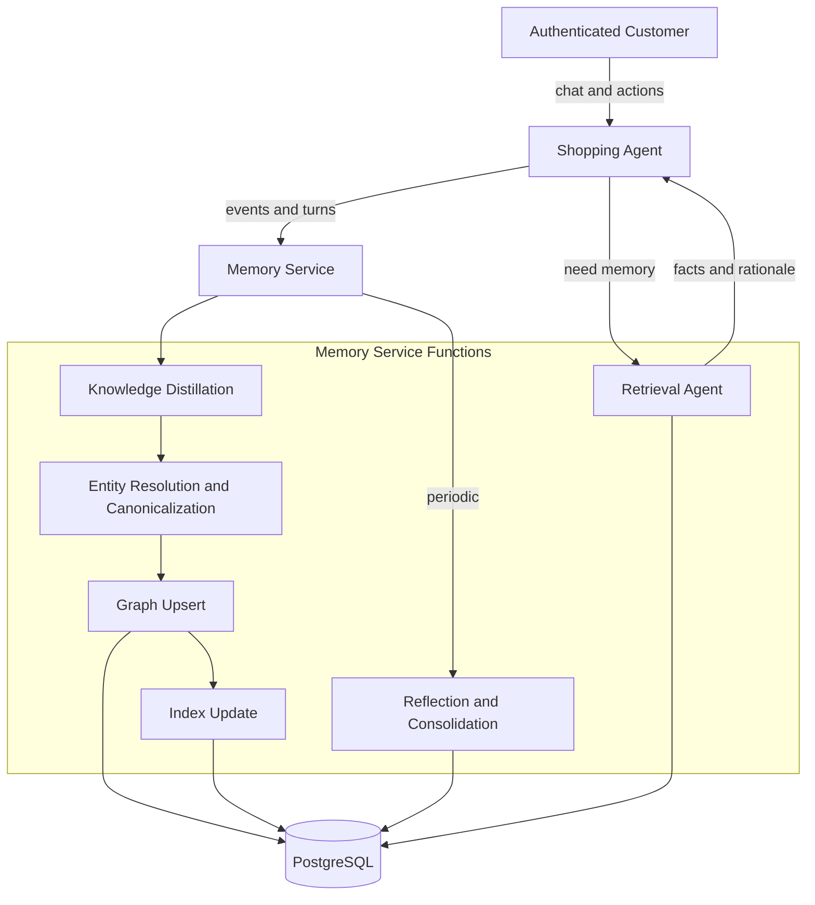

# 🛍️ Personal Shopping Assistant Memory Service (PostgreSQL + Apache AGE)

## 1) Goal
Build an intelligence memory service for an authenticated e-commerce shopping assistant that:
- Distills conversations + user behavior into a **domain-rich knowledge graph**.
- Supports **hybrid retrieval**: lexical + semantic + graph traversal.
- Produces **human-like recall** via spreading activation + constraint-aware traversal.
- Stays multi-tenant safe (per-customer isolation) and auditable.

This design combines:
- The graph-based memory concepts (knowledge distillation → graph → indexes → memory agent).
- A scenario-specific shopping ontology to create depth and useful relationships.
- A concrete PostgreSQL implementation using Apache AGE + pgvector + full-text search.

---

## 2) Shopping scenario assumptions
- Users are authenticated customers (customer_id known).
- The agent assists with browsing, comparing, building carts, finding gifts, returns, sizing, restocks.
- The agent can access tools/services: catalog search, product detail, inventory, orders, returns, promotions.
- We persist **user-specific memory** and **interaction-derived facts**, not the entire product catalog (catalog stays in the commerce DB/search).

---

## 3) Memory model: what we store
A shopping assistant benefits from multiple memory layers:

### 3.1 Episodic memory (what happened)
- Sessions and key events: “Asked for running shoes for trail in Seattle, budget $150, size 10 wide.”
- Order events: purchases, returns, exchanges, delivery issues.

### 3.2 Semantic memory (what’s true)
- Stable facts: sizes, preferred brands, dislikes, allergies/material constraints, address preferences (if allowed), budget norms.
- Derived facts: “prefers wide fit in Nike running shoes”, confidence and evidence.

### 3.3 Preference / policy memory (what to do)
- Communication preferences: “show 3 options”, “don’t upsell”, “prefer sustainable”.
- Constraints: “no leather”, “only waterproof for hiking”, “delivery before Dec 20”.

### 3.4 Domain concept graph (how things relate)
- Brand ↔ category ↔ attributes ↔ occasions ↔ recipients ↔ fit.
- The depth comes from consistent relationships, not from storing huge raw text.

---

## 4) Scenario-specific ontology (nodes & edges)

### 4.1 Vertex labels (node types)
You’ll typically model these as AGE vertex labels plus a metadata row per node.

**Customer-centric nodes**
- `Customer` (one per authenticated customer)
- `Profile` (customer profile summary)
- `Preference` (e.g., brand preference, style preference)
- `Constraint` (hard constraints like “no leather”, “budget <= 150”, “delivery before date”)
- `SizeProfile` (sizes by category: shoes, tops, pants)

**Shopping workflow nodes**
- `Session` (episodic container)
- `ShoppingIntent` (e.g., “gift”, “replace item”, “outfit planning”)
- `Occasion` (birthday, wedding, work)
- `Recipient` (self, spouse, kid)

**Commerce facts (customer-linked, not full catalog)**
- `ProductRef` (SKU reference node; minimal, stable identifiers only)
- `BrandRef`, `CategoryRef` (refs; may mirror catalog IDs)
- `OrderRef` (order id reference)
- `ReturnRef` (return id reference)

**Derived nodes**
- `Fact` (atomic statements)
- `Bundle` (set of nodes summarized into a “memory chunk”)

### 4.2 Edge labels (relationship types)
Common edges that create depth:

**Customer → preference/constraints**
- `PREFERS_BRAND` (Customer → BrandRef)
- `DISLIKES_BRAND` (Customer → BrandRef)
- `PREFERS_STYLE` (Customer → Preference)
- `HAS_CONSTRAINT` (Customer → Constraint)
- `HAS_SIZE_PROFILE` (Customer → SizeProfile)

**Shopping episode structure**
- `HAD_SESSION` (Customer → Session)
- `MENTIONED_IN` (Entity/Fact → Session)
- `HAS_INTENT` (Session → ShoppingIntent)
- `FOR_OCCASION` (Session/Intent → Occasion)
- `FOR_RECIPIENT` (Session/Intent → Recipient)

**Product interactions**
- `VIEWED` (Customer → ProductRef)
- `ADDED_TO_CART` (Customer → ProductRef)
- `PURCHASED` (Customer → ProductRef)
- `RETURNED` (Customer → ProductRef)
- `CONSIDERED` (Session/Intent → ProductRef)

**Product semantics (customer-focused references)**
- `IN_CATEGORY` (ProductRef → CategoryRef)
- `OF_BRAND` (ProductRef → BrandRef)
- `HAS_ATTRIBUTE` (ProductRef → Fact/Preference/Constraint) as needed for retrieval
- `SIMILAR_TO` (ProductRef → ProductRef) for agent-discovered similarity (optional)

**Reasoning edges**
- `SUPPORTS` (Fact → Preference/Constraint)
- `CONTRADICTS` (Fact ↔ Fact)
- `DERIVED_FROM` (Fact → Session / OrderRef / ReturnRef)

### 4.3 Key design rule
Prefer **many small facts and explicit edges** over large free-text blobs.
- Large text still exists (session summary, conversation chunk), but it should not be the primary retrieval unit.

---

## 5) Three-Layer Graph Architecture

The memory service uses a **three-layer knowledge graph** to balance personalization, collective intelligence, and domain structure:

```
┌─────────────────────────────────────────────────────────────────────────────────┐
│                              THREE-LAYER ARCHITECTURE                           │
├─────────────────────────────────────────────────────────────────────────────────┤
│                                                                                 │
│  LAYER 3: USER LAYER (per-customer, private, dynamic weights)                  │
│  ─────────────────────────────────────────────────────────────                  │
│  • Personal preferences, constraints, sizing, purchase history                  │
│  • Edges evolve with each interaction (weight updates)                          │
│  • Strictly isolated by customer_id                                             │
│                                                                                 │
│      [Alice]──PREFERS_BRAND──►[ref:Nike]         weight: 0.92 (8 purchases)    │
│         │                                                                       │
│         ├──DISLIKES_BRAND──►[ref:Adidas]         weight: 0.78 (1 return)       │
│         │                                                                       │
│         ├──HAS_SIZE_PROFILE──►[Size 10 Wide]     weight: 0.95 (verified)       │
│         │                                                                       │
│         └──RETURNED──►[Order #123]               recency: 2 days               │
│                                                                                 │
├─────────────────────────────────────────────────────────────────────────────────┤
│                                                                                 │
│  LAYER 2: COMMUNITY LAYER (aggregate patterns, anonymized, batch-updated)      │
│  ───────────────────────────────────────────────────────────────────────────    │
│  • Cross-user patterns: co-purchase, substitution, segment defaults             │
│  • Privacy-preserving: minimum thresholds, no individual links                  │
│  • Used for cold-start and fallback when user has no personal data              │
│                                                                                 │
│      [Nike Running Shoes]──OFTEN_BOUGHT_WITH──►[Compression Socks]   (0.73)    │
│      [Wide Feet Segment]──TENDS_TO_PREFER──►[New Balance]            (0.68)    │
│      [Trail Runners]──OFTEN_ALSO_LIKE──►[Hydration Packs]            (0.61)    │
│                                                                                 │
├─────────────────────────────────────────────────────────────────────────────────┤
│                                                                                 │
│  LAYER 1: SHARED LAYER (domain ontology, curated, read-only for users)         │
│  ─────────────────────────────────────────────────────────────────────          │
│  • Product taxonomy, brand relationships, category hierarchy                    │
│  • Static or slowly updated by app administrators                               │
│  • Provides canonical entities that user-layer nodes reference                  │
│                                                                                 │
│      [Nike Air Max 90]──IS_A──►[Running Shoes]──PART_OF──►[Footwear]           │
│             │                                                                   │
│             └──MADE_BY──►[Nike]◄──COMPETES_WITH──►[Adidas]                     │
│                                                                                 │
└─────────────────────────────────────────────────────────────────────────────────┘
```

### 5.1 Layer Responsibilities

| Layer | Content | Updates | Visibility | Weight Behavior |
|-------|---------|---------|------------|-----------------|
| **User** | Preferences, constraints, purchases, returns, facts | Real-time on each interaction | Private to customer | Dynamic, evolves with use |
| **Community** | Co-purchase patterns, segment defaults, substitutions | Batch (nightly) + real-time overlay | Shared (anonymized) | Slowly changing |
| **Shared** | Product taxonomy, brand hierarchy, category structure | Admin-curated, catalog sync | Global read-only | Static |

### 5.2 Node References (User → Shared)

User-layer nodes **reference** shared-layer entities rather than duplicating them:

```sql
-- User layer: Alice's brand preference
-- Points to shared-layer brand, doesn't copy it
CREATE (alice:Customer {customer_id: 'alice_123'})
       -[:PREFERS_BRAND {weight: 0.92, access_count: 8, last_accessed: now()}]->
       (nike:BrandRef {shared_id: 'brand_nike'})

-- The BrandRef node has minimal data; full brand info lives in shared layer
```

**Why reference, not copy?**
- No sync issues when brand info changes
- Smaller user graphs
- Clear separation of "what we know about the world" vs. "what we know about this user"

### 5.3 Community Layer Patterns

The community layer stores **anonymized aggregate patterns** computed from user behavior:

```sql
-- Community patterns table (batch-computed)
CREATE TABLE community_patterns (
  id UUID PRIMARY KEY DEFAULT gen_random_uuid(),
  pattern_type TEXT NOT NULL,  -- 'co_purchase', 'substitution', 'segment_default'
  
  source_entity_type TEXT NOT NULL,
  source_entity_id TEXT NOT NULL,
  
  target_entity_type TEXT NOT NULL,
  target_entity_id TEXT NOT NULL,
  
  strength FLOAT NOT NULL,           -- 0.0 to 1.0
  confidence FLOAT NOT NULL,         -- Based on sample size
  sample_size INT NOT NULL,          -- Number of users in pattern
  
  segment TEXT,                      -- Optional: which user segment
  
  computed_at TIMESTAMP NOT NULL DEFAULT NOW(),
  expires_at TIMESTAMP,              -- For real-time overlay patterns
  
  metadata JSONB DEFAULT '{}'::jsonb,
  
  CONSTRAINT min_sample_size CHECK (sample_size >= 50)  -- Privacy threshold
);

CREATE INDEX idx_community_patterns_source ON community_patterns(source_entity_type, source_entity_id);
CREATE INDEX idx_community_patterns_segment ON community_patterns(segment) WHERE segment IS NOT NULL;
```

**Pattern types:**

| Pattern | Example | Computation |
|---------|---------|-------------|
| `co_purchase` | "Users who bought X also bought Y" | `P(Y\|X) = count(orders with both) / count(orders with X)` |
| `substitution` | "When X unavailable, users accept Y" | Analyze cart modifications |
| `segment_default` | "Budget shoppers prefer Amazon Basics" | Cluster users, extract centroid preferences |
| `often_returned_together` | "X and Y have similar return patterns" | Return reason correlation |

### 5.4 Weight Inheritance (Fallback Strategy)

When a user has no data for a preference, we use **contextual fallback**:

```python
def get_preference_weight(
    customer_id: str,
    entity_type: str,
    entity_id: str,
    context: QueryContext
) -> tuple[float, str, float]:
    """
    Returns (weight, source, confidence).
    
    Fallback order:
    1. User-specific preference (highest priority)
    2. Segment default (if context matches a segment)
    3. Global popularity (if enabled, lowest weight)
    4. Neutral (no signal)
    """
    
    # 1. Check user-specific preference
    user_edge = get_user_edge(customer_id, entity_type, entity_id)
    if user_edge:
        return (user_edge.weight, "personal", 1.0)
    
    # 2. Check segment defaults (if context suggests a segment)
    segment = infer_segment(context)  # e.g., "budget_shopper", "outdoor_enthusiast"
    if segment:
        segment_pattern = get_segment_default(segment, entity_type, entity_id)
        if segment_pattern and segment_pattern.confidence > 0.7:
            # Inherit at reduced strength (0.3x)
            return (
                segment_pattern.strength * 0.3,
                f"segment:{segment}",
                segment_pattern.confidence * 0.5  # Also reduce confidence
            )
    
    # 3. Global popularity (optional, must be explicitly enabled)
    if context.allow_global_fallback:
        global_pop = get_global_popularity(entity_type, entity_id)
        if global_pop:
            return (global_pop * 0.2, "global", 0.3)
    
    # 4. Neutral (no preference signal)
    return (0.5, "neutral", 0.0)
```

**Key principles:**
- **User signal always wins**: Personal data at full weight (1.0x)
- **Segment defaults are weak**: Inherited at 0.3x weight, clearly labeled
- **Global is weakest**: Only 0.2x weight, opt-in
- **Source transparency**: Always return where the weight came from

### 5.5 Dynamic Weight Updates (User Layer)

User-layer edge weights evolve with each interaction:

```sql
-- Function to update edge weight on interaction
CREATE OR REPLACE FUNCTION update_edge_on_interaction(
    p_customer_id UUID,
    p_edge_type TEXT,
    p_target_entity_id TEXT,
    p_event_type TEXT,  -- 'purchase', 'return', 'view', 'positive_review', 'negative_review'
    p_emotional_valence FLOAT DEFAULT 0.0  -- -1.0 to 1.0
) RETURNS VOID AS $$
DECLARE
    v_weight_delta FLOAT;
    v_emotional_boost FLOAT;
BEGIN
    -- Determine weight change based on event type
    v_weight_delta := CASE p_event_type
        WHEN 'purchase' THEN 0.10
        WHEN 'return' THEN -0.15  -- Returns can flip preference
        WHEN 'positive_review' THEN 0.12
        WHEN 'negative_review' THEN -0.10
        WHEN 'view' THEN 0.02
        WHEN 'add_to_cart' THEN 0.05
        ELSE 0.0
    END;
    
    -- Emotional intensity amplifies the change
    v_emotional_boost := 1.0 + ABS(p_emotional_valence) * 0.5;
    v_weight_delta := v_weight_delta * v_emotional_boost;
    
    -- Upsert the edge weight
    INSERT INTO user_edge_weights (customer_id, edge_type, target_entity_id, weight, access_count, last_accessed)
    VALUES (p_customer_id, p_edge_type, p_target_entity_id, 0.5 + v_weight_delta, 1, NOW())
    ON CONFLICT (customer_id, edge_type, target_entity_id) DO UPDATE SET
        weight = LEAST(1.0, GREATEST(0.0, user_edge_weights.weight + v_weight_delta)),
        access_count = user_edge_weights.access_count + 1,
        last_accessed = NOW();
END;
$$ LANGUAGE plpgsql;
```

### 5.6 Activation Weight Factors (Human Memory Model)

Edge weights during spreading activation are influenced by multiple factors that mirror human memory:

| Factor | What It Captures | Implementation |
|--------|------------------|----------------|
| **Recency** | When last accessed | `exp(-λt)` decay from `last_accessed` |
| **Frequency** | How often accessed | `log(1 + access_count)` |
| **Emotional Intensity** | Strong feelings | `emotional_intensity × \|valence\|` |
| **Self-Reference** | About me vs. general | Node type: identity > goal > action > fact |
| **Goal Relevance** | Helps current task | Cosine similarity to query embedding |
| **Context Congruence** | Fits current situation | Match category, season, location |
| **Distinctiveness** | Unusual/stands out | Inverse of occurrence frequency |
| **Associative Strength** | Connection strength | Edge weight × edge type weight |

```sql
-- Compute activation weight incorporating human memory factors
CREATE OR REPLACE FUNCTION compute_activation_weight(
    p_node_id BIGINT,
    p_edge_type TEXT,
    p_base_weight FLOAT,
    p_goal_embedding vector(1536) DEFAULT NULL
) RETURNS FLOAT AS $$
DECLARE
    v_node memory_nodes%ROWTYPE;
    v_recency FLOAT;
    v_frequency FLOAT;
    v_emotion_boost FLOAT;
    v_goal_relevance FLOAT;
    v_total FLOAT;
BEGIN
    SELECT * INTO v_node FROM memory_nodes WHERE graph_vertex_id = p_node_id;
    IF NOT FOUND THEN RETURN p_base_weight; END IF;
    
    -- Recency: exponential decay with 30-day half-life
    v_recency := POWER(0.5, EXTRACT(EPOCH FROM (NOW() - v_node.last_accessed)) / (30 * 86400));
    
    -- Frequency: log scale
    v_frequency := LEAST(LN(1 + v_node.access_count) / LN(101), 1.0);
    
    -- Emotional boost (from metadata)
    v_emotion_boost := 1.0 + COALESCE((v_node.metadata->>'emotional_intensity')::float, 0) * 
                             ABS(COALESCE((v_node.metadata->>'emotional_valence')::float, 0));
    
    -- Goal relevance (if embedding provided)
    IF p_goal_embedding IS NOT NULL AND v_node.embedding IS NOT NULL THEN
        v_goal_relevance := 1.0 - (v_node.embedding <=> p_goal_embedding);
    ELSE
        v_goal_relevance := 0.5;
    END IF;
    
    -- Combine factors
    v_total := p_base_weight * 
               POWER(v_recency, 0.25) * 
               POWER(0.5 + v_frequency * 0.5, 0.3) *
               POWER(v_emotion_boost, 0.35) *
               POWER(GREATEST(v_goal_relevance, 0.1), 0.4);
    
    RETURN v_total;
END;
$$ LANGUAGE plpgsql;
```

### 5.7 Query-Time Layer Traversal

When retrieving context, the memory agent traverses all three layers with appropriate weighting:

```
┌────────────────────────────────────────────────────────────────────────────┐
│  MULTI-LAYER TRAVERSAL                                                     │
├────────────────────────────────────────────────────────────────────────────┤
│                                                                            │
│  1. Start anchors in USER LAYER (Alice's nodes)                           │
│     Weight multiplier: 1.0x (full weight)                                 │
│                                                                            │
│  2. Spread activation through USER LAYER edges                            │
│     • Personal preference edges at full strength                          │
│     • Apply human memory factors (recency, frequency, emotion)            │
│                                                                            │
│  3. When hitting a REFERENCE edge → check for COMMUNITY patterns          │
│     Weight multiplier: 0.4x (reduced, only if user has no data)          │
│     • "Users who liked X also liked Y" patterns                           │
│     • Segment defaults                                                     │
│                                                                            │
│  4. Cross to SHARED LAYER for taxonomy traversal                          │
│     Weight multiplier: 0.5x                                               │
│     • IS_A, PART_OF, MADE_BY relationships                               │
│     • Enables "hiking boots → footwear → outdoor gear" reasoning         │
│                                                                            │
│  5. Combine activations, prioritize user-layer signals                    │
│                                                                            │
└────────────────────────────────────────────────────────────────────────────┘
```

### 5.8 Cold Start Handling

For new users with empty graphs:

```python
def handle_cold_start(customer_id: str, context: QueryContext) -> ContextPack:
    """
    Strategy for users with no/minimal personal data.
    """
    # 1. Check if any user data exists
    user_nodes = get_user_node_count(customer_id)
    
    if user_nodes == 0:
        # Pure cold start
        segment = infer_segment_from_context(context)
        
        return ContextPack(
            preferences=[],
            constraints=[],
            segment_hints=get_segment_defaults(segment) if segment else [],
            confidence="LOW",
            source="segment" if segment else "none",
            note="New customer - using segment defaults. Will personalize based on behavior.",
            suggested_questions=[
                "Do you have a preferred brand?",
                "What's your typical budget?",
                "Any specific requirements or constraints?"
            ]
        )
    
    elif user_nodes < 10:
        # Thin profile - blend user + community
        user_context = get_user_context(customer_id, context)
        community_boost = get_community_patterns(context)
        
        return ContextPack(
            preferences=user_context.preferences,
            constraints=user_context.constraints,
            segment_hints=community_boost,  # Supplement with community
            confidence="MEDIUM",
            source="personal+community",
            note="Limited history - supplementing with similar customer patterns."
        )
    
    else:
        # Normal retrieval
        return retrieve_full_context(customer_id, context)
```

### 5.9 Privacy Considerations

```sql
-- Community layer privacy constraints

-- 1. Minimum sample size (k-anonymity)
ALTER TABLE community_patterns 
  ADD CONSTRAINT min_sample_size CHECK (sample_size >= 50);

-- 2. No individual user links (by design - no customer_id column)

-- 3. User opt-out support
ALTER TABLE customers ADD COLUMN IF NOT EXISTS 
    exclude_from_community BOOLEAN DEFAULT FALSE;

-- 4. Audit logging for data access
CREATE TABLE memory_access_log (
    id UUID PRIMARY KEY DEFAULT gen_random_uuid(),
    customer_id UUID NOT NULL,
    access_type TEXT NOT NULL,  -- 'retrieve', 'community_contribute'
    accessed_at TIMESTAMP NOT NULL DEFAULT NOW(),
    query_hash TEXT,  -- Hashed query for debugging without exposing content
    nodes_accessed INT
);
```

### 5.10 Layer Priority Summary

| Scenario | Layer Used | Weight Multiplier | Confidence |
|----------|------------|-------------------|------------|
| User has explicit preference | User | 1.0x | HIGH |
| User has implicit signal (view, cart) | User | 0.7x | MEDIUM |
| No user data, segment matches | Community | 0.3x | LOW |
| No user data, no segment match | Shared (taxonomy only) | 0.5x | NONE |
| User opted out of community | User + Shared only | — | — |

---

## 6) End-to-end lifecycle



---

## 7) PostgreSQL implementation architecture
Use PostgreSQL as the unified store:
- **Apache AGE**: graph traversal with Cypher
- **pgvector**: semantic search over node embeddings
- **Full-text search**: `tsvector` for lexical
- **pg_trgm / fuzzystrmatch**: fuzzy name matching and alias resolution

### 7.1 Extensions
```sql
CREATE EXTENSION IF NOT EXISTS age;
CREATE EXTENSION IF NOT EXISTS vector;
CREATE EXTENSION IF NOT EXISTS pg_trgm;
CREATE EXTENSION IF NOT EXISTS fuzzystrmatch;

LOAD 'age';
SET search_path = ag_catalog, "$user", public;

SELECT create_graph('shopping_memory');
```

---

## 8) Storage schema (practical)
This design uses three layers:
1) AGE graph vertices/edges store graph structure and lightweight properties.
2) SQL tables store embeddings, text search vectors, tenant isolation, access stats, and operational metadata.

### 8.1 AGE vertex and edge labels
```sql
-- Vertex labels
SELECT create_vlabel('shopping_memory', 'Customer');
SELECT create_vlabel('shopping_memory', 'Session');
SELECT create_vlabel('shopping_memory', 'Preference');
SELECT create_vlabel('shopping_memory', 'Constraint');
SELECT create_vlabel('shopping_memory', 'SizeProfile');
SELECT create_vlabel('shopping_memory', 'BrandRef');
SELECT create_vlabel('shopping_memory', 'CategoryRef');
SELECT create_vlabel('shopping_memory', 'ProductRef');
SELECT create_vlabel('shopping_memory', 'OrderRef');
SELECT create_vlabel('shopping_memory', 'ReturnRef');
SELECT create_vlabel('shopping_memory', 'ShoppingIntent');
SELECT create_vlabel('shopping_memory', 'Occasion');
SELECT create_vlabel('shopping_memory', 'Recipient');
SELECT create_vlabel('shopping_memory', 'Fact');
SELECT create_vlabel('shopping_memory', 'Bundle');

-- Edge labels
SELECT create_elabel('shopping_memory', 'HAD_SESSION');
SELECT create_elabel('shopping_memory', 'HAS_INTENT');
SELECT create_elabel('shopping_memory', 'FOR_OCCASION');
SELECT create_elabel('shopping_memory', 'FOR_RECIPIENT');
SELECT create_elabel('shopping_memory', 'MENTIONED_IN');

SELECT create_elabel('shopping_memory', 'PREFERS_BRAND');
SELECT create_elabel('shopping_memory', 'DISLIKES_BRAND');
SELECT create_elabel('shopping_memory', 'PREFERS_STYLE');
SELECT create_elabel('shopping_memory', 'HAS_CONSTRAINT');
SELECT create_elabel('shopping_memory', 'HAS_SIZE_PROFILE');

SELECT create_elabel('shopping_memory', 'VIEWED');
SELECT create_elabel('shopping_memory', 'ADDED_TO_CART');
SELECT create_elabel('shopping_memory', 'PURCHASED');
SELECT create_elabel('shopping_memory', 'RETURNED');
SELECT create_elabel('shopping_memory', 'CONSIDERED');

SELECT create_elabel('shopping_memory', 'OF_BRAND');
SELECT create_elabel('shopping_memory', 'IN_CATEGORY');
SELECT create_elabel('shopping_memory', 'HAS_ATTRIBUTE');

SELECT create_elabel('shopping_memory', 'SUPPORTS');
SELECT create_elabel('shopping_memory', 'CONTRADICTS');
SELECT create_elabel('shopping_memory', 'DERIVED_FROM');
```

### 8.2 SQL tables
A metadata table ties a graph vertex (AGE internal id) to tenant-scoped operational data.

```sql
CREATE TABLE customers (
  customer_id UUID PRIMARY KEY,
  external_subject TEXT UNIQUE NOT NULL,
  created_at TIMESTAMP NOT NULL DEFAULT NOW(),
  metadata JSONB NOT NULL DEFAULT '{}'::jsonb
);

CREATE TABLE memory_nodes (
  id UUID PRIMARY KEY DEFAULT gen_random_uuid(),
  customer_id UUID NOT NULL REFERENCES customers(customer_id),

  -- AGE vertex id
  graph_vertex_id BIGINT NOT NULL,

  -- Node type
  vertex_label TEXT NOT NULL,

  -- Canonical naming / fuzzy matching
  name TEXT,
  name_norm TEXT,
  aliases TEXT[],

  -- Content
  content TEXT NOT NULL,
  content_tsv tsvector GENERATED ALWAYS AS (to_tsvector('english', coalesce(content, ''))) STORED,

  -- Embeddings
  embedding vector(1536),
  name_embedding vector(1536),

  -- Memory scoring
  importance FLOAT NOT NULL DEFAULT 0.5,
  confidence FLOAT NOT NULL DEFAULT 0.8,
  access_count INT NOT NULL DEFAULT 0,
  last_accessed TIMESTAMP NOT NULL DEFAULT NOW(),

  -- Constraints for retrieval
  temporal_start TIMESTAMP,
  temporal_end TIMESTAMP,
  location_text TEXT,

  created_at TIMESTAMP NOT NULL DEFAULT NOW(),
  updated_at TIMESTAMP NOT NULL DEFAULT NOW(),

  metadata JSONB NOT NULL DEFAULT '{}'::jsonb,

  UNIQUE(customer_id, graph_vertex_id)
);

CREATE INDEX idx_memory_nodes_customer_label ON memory_nodes(customer_id, vertex_label);
CREATE INDEX idx_memory_nodes_tsv ON memory_nodes USING GIN (content_tsv);
CREATE INDEX idx_memory_nodes_aliases ON memory_nodes USING GIN (aliases);
CREATE INDEX idx_memory_nodes_name_trgm ON memory_nodes USING GIN (name gin_trgm_ops);
CREATE INDEX idx_memory_nodes_embedding ON memory_nodes USING hnsw (embedding vector_cosine_ops);
CREATE INDEX idx_memory_nodes_name_embedding ON memory_nodes USING hnsw (name_embedding vector_cosine_ops);
CREATE INDEX idx_memory_nodes_temporal ON memory_nodes(customer_id, temporal_start, temporal_end);
```

### 8.3 Edge weights
Keep a small SQL table to tune spreading activation without code changes.

```sql
CREATE TABLE edge_type_weights (
  edge_type TEXT PRIMARY KEY,
  weight FLOAT NOT NULL,
  updated_at TIMESTAMP NOT NULL DEFAULT NOW()
);

INSERT INTO edge_type_weights(edge_type, weight) VALUES
  ('HAS_CONSTRAINT', 0.95),
  ('HAS_SIZE_PROFILE', 0.90),
  ('PREFERS_BRAND', 0.90),
  ('PURCHASED', 0.85),
  ('RETURNED', 0.80),
  ('CONSIDERED', 0.75),
  ('RELATED_TO', 0.70),
  ('MENTIONED_IN', 0.55),
  ('HAD_SESSION', 0.50)
ON CONFLICT (edge_type) DO UPDATE SET weight = excluded.weight, updated_at = NOW();
```

### 8.4 User-layer edge weights (dynamic, per-customer)
Stores personalized edge weights that evolve with each interaction (see Section 5.5):

```sql
CREATE TABLE user_edge_weights (
  id UUID PRIMARY KEY DEFAULT gen_random_uuid(),
  customer_id UUID NOT NULL REFERENCES customers(customer_id),
  edge_type TEXT NOT NULL,
  target_entity_id TEXT NOT NULL,
  
  weight FLOAT NOT NULL DEFAULT 0.5,
  access_count INT NOT NULL DEFAULT 1,
  last_accessed TIMESTAMP NOT NULL DEFAULT NOW(),
  
  -- Human memory factors
  emotional_intensity FLOAT DEFAULT 0.0,
  emotional_valence FLOAT DEFAULT 0.0,  -- -1 (negative) to 1 (positive)
  
  created_at TIMESTAMP NOT NULL DEFAULT NOW(),
  
  UNIQUE(customer_id, edge_type, target_entity_id)
);

CREATE INDEX idx_user_edge_weights_customer ON user_edge_weights(customer_id);
CREATE INDEX idx_user_edge_weights_lookup ON user_edge_weights(customer_id, edge_type, target_entity_id);
```

### 8.5 Community patterns
The `community_patterns` table (see Section 5.3 for full schema) stores aggregate cross-user patterns with privacy constraints (minimum 50 users per pattern).

---

## 9) Knowledge distillation (domain-specific)
The distiller converts events into graph updates. It should process:
- Chat turns (user + assistant)
- Tool events: product views, add-to-cart, purchase, return, browsing filters

### 9.1 Distillation output (structured)
For shopping, the distiller should emit:
- Entities: BrandRef, ProductRef, CategoryRef, Recipient, Occasion
- Constraints: budget, size, color/material constraints, delivery deadline, location
- Preferences: brand affinity, style preference, price sensitivity, sustainability
- Facts: “customer wears size 10 wide in running shoes”, confidence + evidence

### 9.2 Canonicalization strategy
To keep the graph consistent:
- Use canonical IDs when possible (SKU, brand_id, category_id).
- For free-text entities (recipient names, nicknames), store:
  - `name_norm`: lowercased, stripped punctuation
  - `aliases`: known nicknames
  - `name_embedding`: semantic embedding of name string

---

## 10) Retrieval design (anchor → activation → synthesis)

### 10.1 Anchor node selection (hybrid)
Use multiple sources to generate anchors:
- **Entity resolution** (exact + fuzzy + embedding over `name_embedding`)
- **Lexical search** over `content_tsv`
- **Semantic search** over `embedding`

### 10.2 Fuzzy entity resolution in PostgreSQL
Recommended matching order:
1) exact: `lower(name) = lower(query)`
2) alias: `aliases` contains match
3) trigram similarity: `similarity(name, query) > threshold`
4) semantic match: `name_embedding` cosine similarity
5) Levenshtein / phonetic as fallback

### 10.3 Constraint-aware retrieval
Shopping queries often include constraints:
- Temporal: “last month”, “before Dec 20”, “in summer”
- Location: “deliver to Seattle”, “in-store pickup Bellevue”
- Price: “under $150”, “around $80”
- Product attributes: size, color, material, waterproof

We encode constraints in nodes (`Constraint`, `Fact`, `Session`) and in metadata fields (`temporal_start/end`, `location_text`).

### 10.4 Spreading activation (database-side)
Once anchors exist, spread activation through the graph using a recursive CTE:
- depth-limited (usually 2–4)
- decay factor (typically 0.6–0.8)
- edge weight per type
- prune below threshold
- boost nodes satisfying constraints

Conceptually:
- “Customer wants waterproof hiking boots under $150 for Seattle trip next month”
- Anchors: Customer node, Constraint nodes (waterproof, budget, location, timeframe)
- Activation spreads to relevant purchases/returns/preferences and connected product refs

### 10.5 Example flows (end-to-end)
These are “storyboard” traces showing how the memory agent uses **hybrid anchoring + fuzzy name/attribute resolution + constraint-aware spreading activation** to surface *unstated but crucial* personal context.

Key framing:
- The memory agent does **not** query the product catalog.
- The memory agent produces a **Context Pack** (preferences, disqualifiers, sizing, evidence, and catalog query hints) so the shopping agent can perform precise catalog lookups and ranking.

#### Flow A: “Need waterproof hiking boots under $150 for Seattle trip next month” (vague request → rich personalization)
**User request**
- “I need waterproof hiking boots under $150 for a Seattle trip next month.”

**Step 1 — Parse intent + constraints (query distillation)**
- Intent candidates: `ShoppingIntent(outdoor travel footwear)`
- Constraints extracted from the user text:
  - Category: `hiking boots`
  - Attribute: `waterproof`
  - Budget: `<= 150`
  - Location: `Seattle`
  - Temporal: `next month` → `[start, end)` date range

**Step 2 — Attribute resolution (make constraints catalog-usable)**
The phrase “waterproof” is ambiguous in catalogs. The memory agent resolves it to a more precise intent by consulting prior preference facts:
- If the user previously complained “my ‘water resistant’ shoes soaked through”, activate a derived constraint: **require true waterproofing**, not DWR-only.

Output of attribute resolution:
- `waterproof` → `waterproofing_level = 'waterproof_membrane'` (not merely “water-resistant”)
- `hiking boots` → `category_path ~= Footwear/Boots/Hiking` (catalog mapping hint)
- `Seattle trip next month` → boost `fast_shipping` and “wet weather” suitability

**Step 3 — Anchor node identification (hybrid + fuzzy)**
Anchors are selected from multiple channels, then deduped by canonical ids.

Example anchors discovered (illustrative):
- `Customer` (exact by `customer_id`) with anchor score 1.00
- `CategoryRef(name='Hiking Boots')` (lexical match on “hiking boots”) score 0.82
- `Constraint(name='Waterproofing: membrane')` (semantic match) score 0.77
- `Fact(content='Usually needs wide fit in boots')` (semantic match) score 0.71
- `Fact(content='Dislikes heavy footwear for travel')` (lexical “trip” + past travel sessions) score 0.64
- `Location`-like fact in metadata: `location_text='Seattle, WA'` matched via trigram against “Seattle” score 0.69

**Step 4 — Spreading activation (constraint-aware traversal)**
Traversal starts from `Customer` and the top 2–4 anchors.

What gets discovered that the user did *not* state explicitly:
- **Sizing/fit** (from `SizeProfile` + return evidence):
  - “Often needs wide in boots; heel slip reported in standard widths.”
- **Disqualifiers** (from `RETURNED` + `DERIVED_FROM` + `SUPPORTS`):
  - “Returned a ‘hiking boot’ previously due to narrow toe box; avoid narrow-lasted models.”
  - “Blisters correlate with stiff heel counters (2 sessions).”
- **Preference shaping** (from `Preference` nodes):
  - “Prefers lighter boots for travel; avoids ‘heavy/stiff’ feel.”
  - “Prefers neutral colors for versatile outfits.”
- **Operational constraints** (from prior Seattle/pickup sessions):
  - “Used store pickup in Seattle before; if delivery window tight, prefer pickup-eligible inventory.”

Example explainable path snippets (what makes this feel like “human recall”):
- `Customer → HAS_SIZE_PROFILE → Fact(wide fit often needed)`
- `Customer → RETURNED → ProductRef(boot_sku_123) → DERIVED_FROM → Fact(narrow toe box)`
- `Fact(narrow toe box) → SUPPORTS → Constraint(require wide)`

**Step 5 — Context Pack returned to the shopping agent (structured, actionable)**
The output is organized so the shopping agent can directly form catalog queries.

Context Pack (example):
- Hard constraints (from user + resolved):
  - Category: hiking boots
  - Waterproofing: waterproof membrane (not water resistant)
  - Budget: <= $150
  - Timeline: must arrive within next-month trip window
- Inferred preferences (learned, not stated):
  - Fit: prefer wide options; avoid narrow toe-box profiles
  - Comfort: avoid stiff heel counters (blister history)
  - Weight: prefer lightweight/packable for travel
- Known disqualifiers (learned):
  - Avoid product families historically returned for “narrow fit”
- Catalog query hints (not the lookup itself):
  - `category_path`: Footwear/Boots/Hiking
  - `attributes`: waterproof_membrane=true, width in {W, EE} if available
  - `exclusions`: narrow_fit=true (if catalog has such signal) or downrank historically-problematic brands/models
  - `sort/rank boosts`: lightweight, comfort, blister-mitigation features, pickup-eligible

#### Flow B: “Gift for my spouse—minimalist gold jewelry under $80, anniversary in 2 weeks” (recipient resolution + allergy + style memory)
**User request**
- “Need a gift for my spouse—minimalist gold jewelry, under $80, anniversary in 2 weeks.”

**Step 1 — Parse entities/constraints**
- Entity mention: `spouse` (role, not a name)
- Occasion: anniversary
- Constraints: under $80, deadline in 2 weeks, attributes: minimalist, gold

**Step 2 — Name/recipient resolution (role → canonical recipient)**
The graph often stores a real recipient name but the user says “spouse”.

Example resolution process:
- Candidate recipients from memory:
  - `Recipient(name='Alex')` with `aliases=['spouse', 'partner']` (match score 0.96)
  - `Recipient(name='Mom')` with `aliases=['mother']` (match score 0.11)
- Select `Alex` as canonical recipient anchor.

**Step 3 — Attribute resolution (gold ≠ always safe)**
From memory, the agent may have a stored constraint like “nickel allergy” for the spouse.
If discovered, the memory agent upgrades the vague “gold jewelry” request into safer constraints:
- Prefer materials described as solid gold / hypoallergenic; avoid unknown base-metal plating.

**Step 4 — Spreading activation (recipient-first, deadline-aware)**
Anchors: `Customer`, `Recipient(Alex)`, `Occasion(anniversary)`, `Constraint(budget<=80)`, `Constraint(deadline in 2 weeks)`.

What gets discovered that the user did *not* state explicitly:
- Style preference for spouse:
  - “Minimalist jewelry liked; large hoops disliked.”
- Practical preference:
  - “Prefers adjustable chain lengths.”
- Risk constraints:
  - “Allergy: avoid nickel-containing alloys.”
- Operational history:
  - “A prior anniversary gift arrived late; prefer in-stock + fast shipping/pickup.”

**Step 5 — Context Pack returned to the shopping agent**
- Hard constraints:
  - Category: jewelry
  - Color/metal: gold-tone or gold
  - Budget: <= $80
  - Deadline: ship/pickup before date
- Inferred preferences:
  - Minimalist style; avoid statement/oversized pieces
  - Adjustable sizing preferred
- Learned disqualifiers:
  - Avoid materials likely to contain nickel (if the catalog can filter it)
- Catalog query hints:
  - `attributes`: minimalist=true, metal_color=gold, hypoallergenic=true (if available)
  - `fulfillment`: in_stock=true, delivery_date<=deadline, pickup_eligible=true

#### Flow C: “I keep getting blisters with running shoes—what should I try?” (symptom → causal memory → actionable filters)
**User request**
- “I keep getting blisters with running shoes. What should I try?”

**Step 1 — Anchor identification (symptom-centric)**
- Lexical anchors: “blisters”, “running shoes”
- Semantic anchors: past `Fact` nodes describing “heel slip”, “hot spots”, “narrow toe box”

Example anchors discovered (illustrative):
- `Fact(content='Heel slip causes blisters')` (high semantic) score 0.79
- `Fact(content='Toe box felt cramped')` score 0.72
- `ReturnRef`-connected facts from previous returns score 0.70+

**Step 2 — Spreading activation (find patterns, not just items)**
The memory agent traverses from symptom facts to evidence episodes:
- `Fact(blisters) → SUPPORTS → Constraint(avoid heel slip)`
- `Customer → RETURNED → ProductRef(...) → DERIVED_FROM → Fact(heel slip)`

What gets discovered that the user did *not* state explicitly:
- The blister pattern correlates with:
  - standard width models and low heel-lock designs
  - certain sock/material choices mentioned in prior sessions
- Positive counterexamples:
  - “One pair worked well: no blisters when using wide width and heel-lock lacing.”

**Step 3 — Context Pack returned to the shopping agent**
- Derived constraints (learned):
  - prefer wide widths; avoid narrow toe-box
  - prioritize heel-lock support / better heel containment features
- Catalog query hints:
  - `category_path`: Footwear/Running
  - `attributes`: width options include wide, heel_lock/supportive_heel=true (if catalog has such fields)
  - `downrank`: brands/models historically returned for heel slip

**Notes (how these flows demonstrate the techniques)**
- Anchor identification is shown with concrete candidate anchors and scores.
- Name/role resolution is shown (spouse → canonical `Recipient`).
- Attribute resolution is shown (waterproof vs water-resistant; “gold” with allergy constraints).
- Spreading activation is used to discover unstated preferences/disqualifiers and return them as an actionable Context Pack.

---

## 11) Practical query patterns

### 11.1 Hybrid anchor discovery (lexical + vector)
```sql
-- Lexical candidates
WITH lex AS (
  SELECT graph_vertex_id, ts_rank(content_tsv, plainto_tsquery('english', $1)) AS score
  FROM memory_nodes
  WHERE customer_id = $2
    AND content_tsv @@ plainto_tsquery('english', $1)
  ORDER BY score DESC
  LIMIT 20
),
-- Vector candidates
vec AS (
  SELECT graph_vertex_id, (1.0 - (embedding <=> $3)) AS score
  FROM memory_nodes
  WHERE customer_id = $2
    AND embedding IS NOT NULL
  ORDER BY embedding <=> $3
  LIMIT 20
)
SELECT graph_vertex_id, max(score) AS anchor_score
FROM (
  SELECT * FROM lex
  UNION ALL
  SELECT * FROM vec
) s
GROUP BY graph_vertex_id
ORDER BY anchor_score DESC
LIMIT 10;
```

### 11.2 Fuzzy name matching for entity anchors
```sql
SELECT graph_vertex_id,
       greatest(
         CASE WHEN lower(name) = lower($1) THEN 1.0 ELSE 0 END,
         CASE WHEN $1 = ANY(aliases) THEN 0.95 ELSE 0 END,
         similarity(lower(name), lower($1)),
         CASE WHEN name_embedding IS NULL THEN 0 ELSE (1.0 - (name_embedding <=> $2)) END
       ) AS match_score
FROM memory_nodes
WHERE customer_id = $3
  AND vertex_label IN ('Recipient', 'BrandRef', 'CategoryRef', 'ProductRef')
ORDER BY match_score DESC
LIMIT 10;
```

### 11.3 Spreading activation skeleton (recursive)
This skeleton assumes you already have a set of anchor vertex ids.

```sql
WITH RECURSIVE act AS (
  SELECT a.vertex_id AS vertex_id,
         a.anchor_score::float AS activation,
         0 AS depth,
         ARRAY[a.vertex_id] AS path
  FROM (SELECT unnest($1::bigint[]) AS vertex_id, unnest($2::float[]) AS anchor_score) a

  UNION ALL

  SELECT neighbor_id,
         (act.activation * $3 * coalesce(w.weight, 0.5))::float AS activation,
         act.depth + 1,
         act.path || neighbor_id
  FROM act
  CROSS JOIN LATERAL (
    SELECT (row->>'neighbor_id')::bigint AS neighbor_id,
           (row->>'edge_type')::text AS edge_type
    FROM cypher('shopping_memory', $$
      MATCH (n)-[r]-(m)
      WHERE id(n) = $vertex
      RETURN {neighbor_id: id(m), edge_type: type(r)}
    $$, jsonb_build_object('vertex', act.vertex_id)) AS (row agtype)
  ) e
  LEFT JOIN edge_type_weights w ON w.edge_type = e.edge_type
  WHERE act.depth < $4
    AND (act.activation * $3 * coalesce(w.weight, 0.5)) > $5
    AND e.neighbor_id <> ALL(act.path)
)
SELECT vertex_id,
       max(activation) AS activation,
       min(depth) AS min_depth
FROM act
GROUP BY vertex_id
ORDER BY activation DESC
LIMIT 50;
```

---

## 12) APIs (service surface)
Keep API minimal and scenario-aligned.

### 12.1 Ingestion
- `POST /memory/events`
  - accepts: chat_turn, product_view, add_to_cart, purchase, return, search_filter
  - distills and upserts graph nodes/edges

### 12.2 Retrieval
- `POST /memory/retrieve`
  - input: `customer_id`, `query`, optional constraints from agent
  - output: top facts, preferences, constraints, and a rationale graph path summary

### 12.3 Session lifecycle
- `POST /memory/session/start`
- `POST /memory/session/end`

---

## 13) Multi-tenant safety & governance
- Enforce `customer_id` on every row in `memory_nodes`.
- All retrieval queries must filter by `customer_id`.
- Avoid storing highly sensitive data unless required; apply policy to exclude payment details.
- Keep provenance in `metadata`: evidence session ids, order ids.

---

## 14) Evaluation (shopping-specific)
Define success beyond “retrieval accuracy”:
- Correct recall of sizes and constraints
- Correct recall of brand/style preferences
- Reduced irrelevant suggestions
- Ability to explain why: “Because you returned narrow shoes before”

Test cases:
- returns-driven preferences (e.g., prefers wide fit)
- occasion/recipient memory (gift shopping)
- temporal constraints (delivery deadline)
- conflicting preferences (likes Nike but wants vegan materials)

---

## 15) Recommended implementation sequence
1) Implement schema (extensions, graph, `memory_nodes`, indexes)
2) Implement ingestion for tool events (purchase/return/view) first (high signal)
3) Add conversation distillation (constraints + preferences)
4) Implement hybrid anchor selection
5) Implement spreading activation query
6) Add synthesis formatting (compact context for agent)
7) Add conflict handling (contradicts edges, confidence decay)

---

## 16) Intelligent Ingestion Pipeline

The ingestion pipeline transforms raw events (chat turns, purchases, returns, browsing) into graph updates while enriching existing knowledge through entity resolution, conflict detection, and inference.

### 16.1 Pipeline architecture (5 stages)

```
┌─────────────┐    ┌─────────────┐    ┌─────────────┐    ┌─────────────┐    ┌─────────────┐
│   STAGE 1   │───▶│   STAGE 2   │───▶│   STAGE 3   │───▶│   STAGE 4   │───▶│   STAGE 5   │
│ Extraction  │    │ Resolution  │    │  Conflict   │    │ Enrichment  │    │   Commit    │
│             │    │             │    │  Detection  │    │             │    │             │
│ - Entities  │    │ - Exact     │    │ - Direct    │    │ - Inference │    │ - Atomic    │
│ - Relations │    │ - Alias     │    │ - Temporal  │    │ - Missing   │    │ - Rollback  │
│ - Facts     │    │ - Fuzzy     │    │ - Scope     │    │   links     │    │ - Audit     │
│ - Prefs     │    │ - Semantic  │    │ - Confidence│    │ - Pattern   │    │             │
│ - Constraints│   │ - Shared    │    │             │    │   detect    │    │             │
└─────────────┘    └─────────────┘    └─────────────┘    └─────────────┘    └─────────────┘
```

### 16.2 Stage 1: Extraction

The extractor parses raw input (chat turn, tool event, or structured signal) into a normalized extraction result.

```python
from dataclasses import dataclass, field
from typing import List, Dict, Optional, Any
from enum import Enum

class EntityType(Enum):
    BRAND = "BrandRef"
    PRODUCT = "ProductRef"
    CATEGORY = "CategoryRef"
    RECIPIENT = "Recipient"
    OCCASION = "Occasion"
    LOCATION = "Location"
    MATERIAL = "Material"

class RelationType(Enum):
    PURCHASED = "PURCHASED"
    RETURNED = "RETURNED"
    VIEWED = "VIEWED"
    PREFERS = "PREFERS"
    DISLIKES = "DISLIKES"
    GIFT_FOR = "GIFT_FOR"
    DERIVED_FROM = "DERIVED_FROM"
    SUPPORTS = "SUPPORTS"

@dataclass
class ExtractedEntity:
    """An entity mention found in input."""
    entity_type: EntityType
    name: str                          # as mentioned (may need resolution)
    canonical_id: Optional[str] = None # if known (e.g., SKU, brand_id)
    confidence: float = 0.9
    attributes: Dict[str, Any] = field(default_factory=dict)

@dataclass
class ExtractedRelationship:
    """A relationship between entities."""
    relation_type: RelationType
    source_entity: ExtractedEntity
    target_entity: ExtractedEntity
    confidence: float = 0.9
    metadata: Dict[str, Any] = field(default_factory=dict)

@dataclass
class ExtractedFact:
    """A factual statement about the customer or entities."""
    content: str                       # e.g., "wears size 10 wide in running shoes"
    subject_entity: Optional[ExtractedEntity] = None
    confidence: float = 0.8
    evidence_type: str = "stated"      # stated | inferred | observed
    temporal_scope: Optional[str] = None  # current | past | future

@dataclass
class ExtractedPreference:
    """A preference (positive or negative)."""
    target_entity: ExtractedEntity
    preference_type: str               # brand_affinity | style | material | price_sensitivity
    strength: float = 0.7              # 0-1 scale
    polarity: str = "positive"         # positive | negative
    context: Optional[str] = None      # when does this apply?

@dataclass
class ExtractedConstraint:
    """A hard constraint."""
    constraint_type: str               # budget | size | material | deadline | location
    value: Any
    is_hard: bool = True               # hard = must satisfy; soft = prefer
    source: str = "stated"             # stated | inferred | policy

@dataclass
class ExtractionResult:
    """Complete extraction from a single input."""
    entities: List[ExtractedEntity] = field(default_factory=list)
    relationships: List[ExtractedRelationship] = field(default_factory=list)
    facts: List[ExtractedFact] = field(default_factory=list)
    preferences: List[ExtractedPreference] = field(default_factory=list)
    constraints: List[ExtractedConstraint] = field(default_factory=list)
    source_event_id: Optional[str] = None
    source_session_id: Optional[str] = None
```

#### Shopping-specific extraction patterns

| Event Type | Extracted Elements |
|------------|-------------------|
| **Purchase** | `ProductRef` entity, `PURCHASED` relationship, size/color facts, price constraint baseline |
| **Return** | `RETURNED` relationship, reason → derived constraint (narrow → prefer wide), negative preference |
| **Chat: "I need X for Y"** | Intent entity, recipient if mentioned, occasion, constraints from modifiers |
| **Chat: "I don't like Z"** | Negative preference for `Z`, link to prior context if available |
| **Browse filter applied** | Implicit preference (filtered by "sustainable" → eco preference) |

### 16.3 Stage 2: Entity Resolution

Entity resolution maps extracted mentions to existing graph nodes or determines they are new.

```python
from dataclasses import dataclass
from typing import List, Optional, Tuple
import asyncpg

@dataclass
class ResolutionCandidate:
    """A candidate match from the graph."""
    graph_vertex_id: int
    canonical_id: Optional[str]
    name: str
    match_method: str          # exact | alias | fuzzy | semantic | shared_layer
    match_score: float
    layer: str                 # user | community | shared

@dataclass
class ResolutionResult:
    """Result of resolving an entity mention."""
    extracted_entity: ExtractedEntity
    resolved_vertex_id: Optional[int]   # None if new entity
    candidates: List[ResolutionCandidate]
    is_new: bool
    resolution_method: str
    confidence: float

class EntityResolver:
    """Multi-stage entity resolution with layer awareness."""
    
    def __init__(self, pool: asyncpg.Pool, customer_id: str):
        self.pool = pool
        self.customer_id = customer_id
        self.resolution_thresholds = {
            "exact": 1.0,
            "alias": 0.95,
            "fuzzy": 0.75,
            "semantic": 0.80,
            "shared_layer": 0.85
        }
    
    async def resolve(
        self, 
        entity: ExtractedEntity,
        embedding: Optional[List[float]] = None
    ) -> ResolutionResult:
        """Resolve entity through cascading match strategies."""
        
        candidates = []
        
        # Stage 1: Exact match on canonical_id (if provided)
        if entity.canonical_id:
            exact = await self._exact_id_match(entity)
            if exact:
                return ResolutionResult(
                    extracted_entity=entity,
                    resolved_vertex_id=exact.graph_vertex_id,
                    candidates=[exact],
                    is_new=False,
                    resolution_method="exact_id",
                    confidence=1.0
                )
        
        # Stage 2: Exact name match in user layer
        exact_name = await self._exact_name_match(entity)
        candidates.extend(exact_name)
        
        # Stage 3: Alias match
        alias_matches = await self._alias_match(entity)
        candidates.extend(alias_matches)
        
        # Stage 4: Fuzzy match (trigram)
        fuzzy_matches = await self._fuzzy_match(entity)
        candidates.extend(fuzzy_matches)
        
        # Stage 5: Semantic match (embedding similarity)
        if embedding:
            semantic_matches = await self._semantic_match(entity, embedding)
            candidates.extend(semantic_matches)
        
        # Stage 6: Check shared layer (ontology/catalog entities)
        shared_matches = await self._shared_layer_match(entity)
        candidates.extend(shared_matches)
        
        # Dedupe and rank candidates
        candidates = self._dedupe_candidates(candidates)
        candidates.sort(key=lambda c: c.match_score, reverse=True)
        
        # Decision: match or create new
        if candidates and candidates[0].match_score >= self._get_threshold(candidates[0].match_method):
            best = candidates[0]
            return ResolutionResult(
                extracted_entity=entity,
                resolved_vertex_id=best.graph_vertex_id,
                candidates=candidates[:5],
                is_new=False,
                resolution_method=best.match_method,
                confidence=best.match_score
            )
        
        return ResolutionResult(
            extracted_entity=entity,
            resolved_vertex_id=None,
            candidates=candidates[:5],
            is_new=True,
            resolution_method="new",
            confidence=entity.confidence
        )
    
    async def _exact_id_match(self, entity: ExtractedEntity) -> Optional[ResolutionCandidate]:
        """Match by canonical ID (SKU, brand_id, etc.)."""
        query = """
            SELECT graph_vertex_id, canonical_id, name
            FROM memory_nodes
            WHERE customer_id = $1
              AND canonical_id = $2
              AND vertex_label = $3
            LIMIT 1
        """
        row = await self.pool.fetchrow(
            query, 
            self.customer_id, 
            entity.canonical_id,
            entity.entity_type.value
        )
        if row:
            return ResolutionCandidate(
                graph_vertex_id=row['graph_vertex_id'],
                canonical_id=row['canonical_id'],
                name=row['name'],
                match_method="exact",
                match_score=1.0,
                layer="user"
            )
        return None
    
    async def _exact_name_match(self, entity: ExtractedEntity) -> List[ResolutionCandidate]:
        """Exact name match (case-insensitive)."""
        query = """
            SELECT graph_vertex_id, canonical_id, name
            FROM memory_nodes
            WHERE customer_id = $1
              AND lower(name) = lower($2)
              AND vertex_label = $3
        """
        rows = await self.pool.fetch(
            query, 
            self.customer_id, 
            entity.name,
            entity.entity_type.value
        )
        return [
            ResolutionCandidate(
                graph_vertex_id=r['graph_vertex_id'],
                canonical_id=r['canonical_id'],
                name=r['name'],
                match_method="exact",
                match_score=1.0,
                layer="user"
            ) for r in rows
        ]
    
    async def _alias_match(self, entity: ExtractedEntity) -> List[ResolutionCandidate]:
        """Match against known aliases."""
        query = """
            SELECT graph_vertex_id, canonical_id, name
            FROM memory_nodes
            WHERE customer_id = $1
              AND vertex_label = $2
              AND lower($3) = ANY(SELECT lower(unnest(aliases)))
        """
        rows = await self.pool.fetch(
            query, 
            self.customer_id,
            entity.entity_type.value,
            entity.name
        )
        return [
            ResolutionCandidate(
                graph_vertex_id=r['graph_vertex_id'],
                canonical_id=r['canonical_id'],
                name=r['name'],
                match_method="alias",
                match_score=0.95,
                layer="user"
            ) for r in rows
        ]
    
    async def _fuzzy_match(self, entity: ExtractedEntity) -> List[ResolutionCandidate]:
        """Trigram similarity match."""
        query = """
            SELECT graph_vertex_id, canonical_id, name,
                   similarity(lower(name), lower($2)) AS sim
            FROM memory_nodes
            WHERE customer_id = $1
              AND vertex_label = $3
              AND similarity(lower(name), lower($2)) > 0.3
            ORDER BY sim DESC
            LIMIT 5
        """
        rows = await self.pool.fetch(
            query, 
            self.customer_id, 
            entity.name,
            entity.entity_type.value
        )
        return [
            ResolutionCandidate(
                graph_vertex_id=r['graph_vertex_id'],
                canonical_id=r['canonical_id'],
                name=r['name'],
                match_method="fuzzy",
                match_score=float(r['sim']),
                layer="user"
            ) for r in rows
        ]
    
    async def _semantic_match(
        self, 
        entity: ExtractedEntity, 
        embedding: List[float]
    ) -> List[ResolutionCandidate]:
        """Semantic similarity on name embeddings."""
        query = """
            SELECT graph_vertex_id, canonical_id, name,
                   (1.0 - (name_embedding <=> $2::vector)) AS sim
            FROM memory_nodes
            WHERE customer_id = $1
              AND vertex_label = $3
              AND name_embedding IS NOT NULL
            ORDER BY name_embedding <=> $2::vector
            LIMIT 5
        """
        rows = await self.pool.fetch(
            query, 
            self.customer_id, 
            embedding,
            entity.entity_type.value
        )
        return [
            ResolutionCandidate(
                graph_vertex_id=r['graph_vertex_id'],
                canonical_id=r['canonical_id'],
                name=r['name'],
                match_method="semantic",
                match_score=float(r['sim']),
                layer="user"
            ) for r in rows
        ]
    
    async def _shared_layer_match(self, entity: ExtractedEntity) -> List[ResolutionCandidate]:
        """Check shared ontology layer (brands, categories from catalog)."""
        query = """
            SELECT graph_vertex_id, canonical_id, name,
                   CASE 
                     WHEN lower(name) = lower($2) THEN 1.0
                     ELSE similarity(lower(name), lower($2))
                   END AS sim
            FROM shared_ontology_nodes
            WHERE vertex_label = $1
              AND (lower(name) = lower($2) OR similarity(lower(name), lower($2)) > 0.5)
            ORDER BY sim DESC
            LIMIT 3
        """
        rows = await self.pool.fetch(
            query, 
            entity.entity_type.value,
            entity.name
        )
        return [
            ResolutionCandidate(
                graph_vertex_id=r['graph_vertex_id'],
                canonical_id=r['canonical_id'],
                name=r['name'],
                match_method="shared_layer",
                match_score=float(r['sim']),
                layer="shared"
            ) for r in rows
        ]
    
    def _dedupe_candidates(self, candidates: List[ResolutionCandidate]) -> List[ResolutionCandidate]:
        """Remove duplicate candidates, keeping highest score."""
        seen = {}
        for c in candidates:
            if c.graph_vertex_id not in seen or c.match_score > seen[c.graph_vertex_id].match_score:
                seen[c.graph_vertex_id] = c
        return list(seen.values())
    
    def _get_threshold(self, method: str) -> float:
        return self.resolution_thresholds.get(method, 0.8)
```

### 16.4 Stage 3: Conflict Detection

The conflict detector identifies when new information contradicts, supersedes, or refines existing knowledge.

```python
from dataclasses import dataclass
from typing import List, Optional, Tuple
from enum import Enum

class ConflictType(Enum):
    DIRECT_CONTRADICTION = "direct_contradiction"   # "likes X" vs "dislikes X"
    TEMPORAL_SUPERSESSION = "temporal_supersession" # old fact replaced by newer
    SCOPE_REFINEMENT = "scope_refinement"           # general → specific
    CONFIDENCE_OVERRIDE = "confidence_override"     # higher confidence replaces lower

@dataclass
class ConflictInfo:
    """Describes a detected conflict."""
    conflict_type: ConflictType
    existing_vertex_id: int
    existing_content: str
    existing_confidence: float
    existing_timestamp: str
    new_content: str
    new_confidence: float
    resolution_action: str   # keep_existing | replace | merge | create_versioned
    explanation: str

class ConflictDetector:
    """Detects conflicts between new and existing knowledge."""
    
    def __init__(self, pool: asyncpg.Pool, customer_id: str):
        self.pool = pool
        self.customer_id = customer_id
    
    async def detect_conflicts(
        self,
        new_fact: ExtractedFact,
        resolved_subject_id: Optional[int] = None
    ) -> List[ConflictInfo]:
        """Find existing facts that may conflict with the new fact."""
        
        conflicts = []
        
        # Find potentially conflicting facts
        candidates = await self._find_conflicting_facts(
            new_fact.content,
            resolved_subject_id
        )
        
        for candidate in candidates:
            conflict = await self._classify_conflict(new_fact, candidate)
            if conflict:
                conflicts.append(conflict)
        
        return conflicts
    
    async def _find_conflicting_facts(
        self,
        content: str,
        subject_id: Optional[int]
    ) -> List[dict]:
        """Find facts that might conflict semantically."""
        query = """
            SELECT 
                graph_vertex_id,
                content,
                confidence,
                created_at,
                metadata
            FROM memory_nodes
            WHERE customer_id = $1
              AND vertex_label = 'Fact'
              AND (
                -- Same subject entity
                ($2::bigint IS NULL OR graph_vertex_id IN (
                    SELECT end_id FROM ag_catalog.cypher('shopping_memory', $$
                        MATCH (s)-[:ABOUT|DERIVED_FROM]->(f)
                        WHERE id(s) = $subject_id
                        RETURN id(f)
                    $$, jsonb_build_object('subject_id', $2)) AS (id agtype)
                ))
                -- Or semantically similar content
                OR (1.0 - (embedding <=> (
                    SELECT embedding FROM memory_nodes 
                    WHERE content = $3 LIMIT 1
                ))) > 0.75
              )
        """
        return await self.pool.fetch(query, self.customer_id, subject_id, content)
    
    async def _classify_conflict(
        self,
        new_fact: ExtractedFact,
        existing: dict
    ) -> Optional[ConflictInfo]:
        """Classify the type of conflict and propose resolution."""
        
        # Use semantic analysis to detect contradiction
        is_contradiction = await self._check_contradiction(
            new_fact.content, 
            existing['content']
        )
        
        if is_contradiction:
            # Determine resolution based on confidence and recency
            if new_fact.confidence > existing['confidence']:
                action = "replace"
                explanation = f"New fact has higher confidence ({new_fact.confidence} > {existing['confidence']})"
            elif new_fact.evidence_type == "observed" and existing['metadata'].get('evidence_type') == "stated":
                action = "replace"
                explanation = "Observed behavior overrides stated preference"
            else:
                action = "create_versioned"
                explanation = "Both facts retained with version history"
            
            return ConflictInfo(
                conflict_type=ConflictType.DIRECT_CONTRADICTION,
                existing_vertex_id=existing['graph_vertex_id'],
                existing_content=existing['content'],
                existing_confidence=existing['confidence'],
                existing_timestamp=str(existing['created_at']),
                new_content=new_fact.content,
                new_confidence=new_fact.confidence,
                resolution_action=action,
                explanation=explanation
            )
        
        # Check for scope refinement (new is more specific)
        is_refinement = await self._check_refinement(
            new_fact.content,
            existing['content']
        )
        
        if is_refinement:
            return ConflictInfo(
                conflict_type=ConflictType.SCOPE_REFINEMENT,
                existing_vertex_id=existing['graph_vertex_id'],
                existing_content=existing['content'],
                existing_confidence=existing['confidence'],
                existing_timestamp=str(existing['created_at']),
                new_content=new_fact.content,
                new_confidence=new_fact.confidence,
                resolution_action="merge",
                explanation="New fact is more specific; link as refinement"
            )
        
        return None
    
    async def _check_contradiction(self, new_content: str, existing_content: str) -> bool:
        """Check if two facts contradict each other."""
        # Shopping-specific contradiction patterns
        contradiction_patterns = [
            # Size contradictions
            (r"wears size (\d+)", r"wears size (\d+)"),
            # Preference contradictions
            (r"(likes|prefers|loves) (.+)", r"(dislikes|hates|avoids) \2"),
            # Fit contradictions
            (r"needs (wide|narrow|regular) fit", r"needs (wide|narrow|regular) fit"),
        ]
        
        import re
        for pattern1, pattern2 in contradiction_patterns:
            match1 = re.search(pattern1, new_content, re.I)
            match2 = re.search(pattern2, existing_content, re.I)
            if match1 and match2:
                # Check if the matched values differ
                if match1.groups() != match2.groups():
                    return True
        
        return False
    
    async def _check_refinement(self, new_content: str, existing_content: str) -> bool:
        """Check if new fact is a refinement of existing."""
        # New is longer and contains key terms from existing
        if len(new_content) > len(existing_content):
            existing_terms = set(existing_content.lower().split())
            new_terms = set(new_content.lower().split())
            overlap = len(existing_terms & new_terms) / len(existing_terms)
            return overlap > 0.5
        return False
```

### 16.5 Stage 4: Enrichment & Inference

The inference engine applies domain-specific rules to derive new knowledge from explicit facts.

```python
from dataclasses import dataclass
from typing import List, Callable, Dict, Any, Optional
import re

@dataclass
class InferenceRule:
    """A rule that can derive new knowledge."""
    name: str
    description: str
    trigger_condition: Callable[[ExtractionResult], bool]
    inference_fn: Callable[[ExtractionResult, 'InferenceContext'], List[Any]]
    confidence_modifier: float = 0.8  # derived facts have reduced confidence

@dataclass
class InferenceContext:
    """Context available to inference rules."""
    customer_id: str
    pool: Any  # asyncpg.Pool
    existing_facts: List[dict]
    existing_preferences: List[dict]

class InferenceEngine:
    """Applies domain-specific inference rules."""
    
    def __init__(self):
        self.rules: List[InferenceRule] = []
        self._register_shopping_rules()
    
    def _register_shopping_rules(self):
        """Register shopping-domain inference rules."""
        
        # Rule 1: Return reason → Constraint
        self.rules.append(InferenceRule(
            name="return_reason_to_constraint",
            description="Infer constraints from return reasons",
            trigger_condition=lambda r: any(
                rel.relation_type == RelationType.RETURNED 
                for rel in r.relationships
            ),
            inference_fn=self._infer_constraint_from_return,
            confidence_modifier=0.85
        ))
        
        # Rule 2: Repeated purchase → Strong preference
        self.rules.append(InferenceRule(
            name="repeated_purchase_to_preference",
            description="Infer brand/category preference from repeat purchases",
            trigger_condition=lambda r: any(
                rel.relation_type == RelationType.PURCHASED
                for rel in r.relationships
            ),
            inference_fn=self._infer_preference_from_repeat_purchase,
            confidence_modifier=0.9
        ))
        
        # Rule 3: Allergy/reaction mentioned → Hard constraint
        self.rules.append(InferenceRule(
            name="allergy_to_hard_constraint",
            description="Infer material constraints from allergy mentions",
            trigger_condition=lambda r: any(
                "allerg" in f.content.lower() or "reaction" in f.content.lower()
                for f in r.facts
            ),
            inference_fn=self._infer_allergy_constraint,
            confidence_modifier=0.95
        ))
        
        # Rule 4: Gift purchase → Recipient preferences
        self.rules.append(InferenceRule(
            name="gift_to_recipient_preference",
            description="Infer recipient preferences from successful gifts",
            trigger_condition=lambda r: any(
                rel.relation_type == RelationType.GIFT_FOR
                for rel in r.relationships
            ),
            inference_fn=self._infer_recipient_preferences,
            confidence_modifier=0.7
        ))
        
        # Rule 5: Price pattern → Budget preference
        self.rules.append(InferenceRule(
            name="price_pattern_to_budget",
            description="Infer budget preferences from purchase price patterns",
            trigger_condition=lambda r: any(
                c.constraint_type == "budget" or 
                any("price" in str(e.attributes) for e in r.entities)
                for c in r.constraints
            ),
            inference_fn=self._infer_budget_preference,
            confidence_modifier=0.75
        ))
    
    def _infer_constraint_from_return(
        self,
        extraction: ExtractionResult,
        context: InferenceContext
    ) -> List[ExtractedConstraint]:
        """Infer constraints from return reasons."""
        
        inferred = []
        reason_to_constraint = {
            # Fit-related
            r"(too\s+)?(tight|narrow|small)": ("size", "prefer_larger", True),
            r"(too\s+)?(loose|wide|big|large)": ("size", "prefer_smaller", True),
            r"heel\s+slip": ("fit", "require_heel_lock", True),
            r"(pinch|blister|rub)": ("comfort", "require_soft_materials", True),
            
            # Quality-related
            r"(cheap|flimsy|broke|fell\s+apart)": ("quality", "prefer_durable", False),
            r"(faded|shrunk|pilled)": ("material", "prefer_quality_fabric", False),
            
            # Style-related
            r"(ugly|didn.t\s+like\s+the\s+look|not\s+my\s+style)": ("style", "check_style_match", False),
            r"(wrong\s+color|color\s+was\s+off)": ("color", "verify_color_accuracy", False),
        }
        
        for rel in extraction.relationships:
            if rel.relation_type == RelationType.RETURNED:
                reason = rel.metadata.get("return_reason", "")
                for pattern, (constraint_type, value, is_hard) in reason_to_constraint.items():
                    if re.search(pattern, reason, re.I):
                        inferred.append(ExtractedConstraint(
                            constraint_type=constraint_type,
                            value=value,
                            is_hard=is_hard,
                            source="inferred_from_return"
                        ))
        
        return inferred
    
    async def _infer_preference_from_repeat_purchase(
        self,
        extraction: ExtractionResult,
        context: InferenceContext
    ) -> List[ExtractedPreference]:
        """Infer preferences from repeated purchases of same brand/category."""
        
        inferred = []
        
        for rel in extraction.relationships:
            if rel.relation_type == RelationType.PURCHASED:
                entity = rel.target_entity
                if entity.entity_type == EntityType.BRAND:
                    # Check purchase count for this brand
                    count = await self._get_purchase_count(
                        context.pool,
                        context.customer_id,
                        entity.canonical_id or entity.name
                    )
                    if count >= 3:
                        inferred.append(ExtractedPreference(
                            target_entity=entity,
                            preference_type="brand_affinity",
                            strength=min(0.9, 0.5 + (count * 0.1)),
                            polarity="positive",
                            context=f"Purchased {count} times"
                        ))
        
        return inferred
    
    def _infer_allergy_constraint(
        self,
        extraction: ExtractionResult,
        context: InferenceContext
    ) -> List[ExtractedConstraint]:
        """Infer hard constraints from allergy mentions."""
        
        inferred = []
        allergy_patterns = {
            r"nickel\s+allerg": ("material", "avoid_nickel", True),
            r"latex\s+allerg": ("material", "avoid_latex", True),
            r"wool\s+allerg": ("material", "avoid_wool", True),
            r"(skin\s+)?reaction.*?(synthetic|polyester)": ("material", "prefer_natural", False),
        }
        
        for fact in extraction.facts:
            for pattern, (constraint_type, value, is_hard) in allergy_patterns.items():
                if re.search(pattern, fact.content, re.I):
                    inferred.append(ExtractedConstraint(
                        constraint_type=constraint_type,
                        value=value,
                        is_hard=is_hard,
                        source="inferred_from_allergy"
                    ))
        
        return inferred
    
    async def _infer_recipient_preferences(
        self,
        extraction: ExtractionResult,
        context: InferenceContext
    ) -> List[ExtractedPreference]:
        """Infer recipient preferences from successful gifts."""
        
        inferred = []
        
        for rel in extraction.relationships:
            if rel.relation_type == RelationType.GIFT_FOR:
                # Check if this gift was successful (not returned, positive feedback)
                was_successful = rel.metadata.get("gift_feedback", "unknown") == "positive"
                
                if was_successful:
                    inferred.append(ExtractedPreference(
                        target_entity=rel.target_entity,  # The gift item category
                        preference_type="recipient_likes",
                        strength=0.7,
                        polarity="positive",
                        context=f"Successful gift for {rel.source_entity.name}"
                    ))
        
        return inferred
    
    async def run_inference(
        self,
        extraction: ExtractionResult,
        context: InferenceContext
    ) -> ExtractionResult:
        """Apply all applicable inference rules."""
        
        enriched = ExtractionResult(
            entities=list(extraction.entities),
            relationships=list(extraction.relationships),
            facts=list(extraction.facts),
            preferences=list(extraction.preferences),
            constraints=list(extraction.constraints),
            source_event_id=extraction.source_event_id,
            source_session_id=extraction.source_session_id
        )
        
        for rule in self.rules:
            if rule.trigger_condition(extraction):
                inferred = await rule.inference_fn(extraction, context)
                
                # Apply confidence modifier to inferred items
                for item in inferred:
                    if hasattr(item, 'confidence'):
                        item.confidence *= rule.confidence_modifier
                
                # Add to appropriate list
                if inferred:
                    if isinstance(inferred[0], ExtractedConstraint):
                        enriched.constraints.extend(inferred)
                    elif isinstance(inferred[0], ExtractedPreference):
                        enriched.preferences.extend(inferred)
                    elif isinstance(inferred[0], ExtractedFact):
                        enriched.facts.extend(inferred)
        
        return enriched
```

### 16.6 Missing Link Detection

Detect relationships that should exist based on co-occurrence patterns and graph structure.

```python
class MissingLinkDetector:
    """Detect potential missing edges in the graph."""
    
    def __init__(self, pool: asyncpg.Pool, customer_id: str):
        self.pool = pool
        self.customer_id = customer_id
    
    async def find_missing_edges(
        self,
        vertex_id: int,
        min_cooccurrence: int = 3,
        max_results: int = 10
    ) -> List[dict]:
        """Find nodes that frequently co-occur but aren't directly connected."""
        
        query = """
            WITH vertex_sessions AS (
                -- Sessions where this vertex was activated
                SELECT DISTINCT session_id
                FROM memory_node_activations
                WHERE customer_id = $1 AND graph_vertex_id = $2
            ),
            cooccurring AS (
                -- Other vertices activated in same sessions
                SELECT 
                    a.graph_vertex_id AS other_vertex_id,
                    m.name AS other_name,
                    m.vertex_label AS other_label,
                    COUNT(DISTINCT a.session_id) AS cooccurrence_count
                FROM memory_node_activations a
                JOIN memory_nodes m ON m.graph_vertex_id = a.graph_vertex_id
                WHERE a.customer_id = $1
                  AND a.session_id IN (SELECT session_id FROM vertex_sessions)
                  AND a.graph_vertex_id != $2
                GROUP BY a.graph_vertex_id, m.name, m.vertex_label
                HAVING COUNT(DISTINCT a.session_id) >= $3
            ),
            already_connected AS (
                -- Vertices already directly connected
                SELECT (row->>'neighbor_id')::bigint AS neighbor_id
                FROM cypher('shopping_memory', $$
                    MATCH (n)-[]-(m)
                    WHERE id(n) = $vertex_id
                    RETURN {neighbor_id: id(m)}
                $$, jsonb_build_object('vertex_id', $2)) AS (row agtype)
            )
            SELECT 
                c.other_vertex_id,
                c.other_name,
                c.other_label,
                c.cooccurrence_count,
                c.cooccurrence_count::float / 
                    (SELECT COUNT(*) FROM vertex_sessions)::float AS cooccurrence_ratio
            FROM cooccurring c
            WHERE c.other_vertex_id NOT IN (SELECT neighbor_id FROM already_connected)
            ORDER BY cooccurrence_count DESC
            LIMIT $4
        """
        
        return await self.pool.fetch(
            query,
            self.customer_id,
            vertex_id,
            min_cooccurrence,
            max_results
        )
    
    async def suggest_edge_types(
        self,
        source_label: str,
        target_label: str
    ) -> List[str]:
        """Suggest likely edge types based on node label combination."""
        
        edge_type_map = {
            ("Customer", "BrandRef"): ["PREFERS", "DISLIKES", "PURCHASED_FROM"],
            ("Customer", "ProductRef"): ["PURCHASED", "VIEWED", "RETURNED"],
            ("Customer", "CategoryRef"): ["INTERESTED_IN", "AVOIDS"],
            ("Customer", "Recipient"): ["SHOPS_FOR", "GIFT_FOR"],
            ("Fact", "Constraint"): ["SUPPORTS", "DERIVED_FROM"],
            ("ProductRef", "BrandRef"): ["MADE_BY"],
            ("ProductRef", "CategoryRef"): ["BELONGS_TO"],
            ("Preference", "BrandRef"): ["ABOUT"],
            ("Preference", "CategoryRef"): ["ABOUT"],
        }
        
        key = (source_label, target_label)
        reverse_key = (target_label, source_label)
        
        return edge_type_map.get(key, edge_type_map.get(reverse_key, ["RELATED_TO"]))
```

### 16.7 Stage 5: Atomic Commit

The commit stage applies all changes atomically with proper provenance tracking.

```sql
-- Function: Upsert a memory node with conflict handling
CREATE OR REPLACE FUNCTION upsert_memory_node(
    p_customer_id TEXT,
    p_vertex_label TEXT,
    p_name TEXT,
    p_canonical_id TEXT DEFAULT NULL,
    p_content TEXT DEFAULT NULL,
    p_embedding vector(1536) DEFAULT NULL,
    p_name_embedding vector(1536) DEFAULT NULL,
    p_confidence FLOAT DEFAULT 0.9,
    p_metadata JSONB DEFAULT '{}'::jsonb,
    p_evidence_session_id TEXT DEFAULT NULL
) RETURNS TABLE (
    graph_vertex_id BIGINT,
    was_created BOOLEAN,
    was_updated BOOLEAN
) AS $$
DECLARE
    v_existing_id BIGINT;
    v_new_id BIGINT;
    v_created BOOLEAN := FALSE;
    v_updated BOOLEAN := FALSE;
BEGIN
    -- Check for existing node by canonical_id or exact name match
    SELECT mn.graph_vertex_id INTO v_existing_id
    FROM memory_nodes mn
    WHERE mn.customer_id = p_customer_id
      AND mn.vertex_label = p_vertex_label
      AND (
          (p_canonical_id IS NOT NULL AND mn.canonical_id = p_canonical_id)
          OR (p_canonical_id IS NULL AND lower(mn.name) = lower(p_name))
      )
    LIMIT 1;
    
    IF v_existing_id IS NOT NULL THEN
        -- Update existing node
        UPDATE memory_nodes
        SET 
            content = COALESCE(p_content, content),
            embedding = COALESCE(p_embedding, embedding),
            name_embedding = COALESCE(p_name_embedding, name_embedding),
            confidence = GREATEST(confidence, p_confidence),
            metadata = metadata || p_metadata,
            updated_at = NOW(),
            access_count = access_count + 1,
            last_accessed_at = NOW()
        WHERE graph_vertex_id = v_existing_id;
        
        v_updated := TRUE;
        
        RETURN QUERY SELECT v_existing_id, v_created, v_updated;
    ELSE
        -- Create new node in Apache AGE graph
        SELECT (row->>'id')::bigint INTO v_new_id
        FROM cypher('shopping_memory', $$
            CREATE (n:$label {
                name: $name,
                canonical_id: $canonical_id,
                customer_id: $customer_id
            })
            RETURN {id: id(n)}
        $$, jsonb_build_object(
            'label', p_vertex_label,
            'name', p_name,
            'canonical_id', p_canonical_id,
            'customer_id', p_customer_id
        )) AS (row agtype);
        
        -- Insert into memory_nodes table
        INSERT INTO memory_nodes (
            customer_id, graph_vertex_id, vertex_label, name,
            canonical_id, content, embedding, name_embedding,
            confidence, metadata, created_at, updated_at
        ) VALUES (
            p_customer_id, v_new_id, p_vertex_label, p_name,
            p_canonical_id, p_content, p_embedding, p_name_embedding,
            p_confidence, 
            p_metadata || jsonb_build_object('evidence_session_id', p_evidence_session_id),
            NOW(), NOW()
        );
        
        v_created := TRUE;
        
        RETURN QUERY SELECT v_new_id, v_created, v_updated;
    END IF;
END;
$$ LANGUAGE plpgsql;

-- Function: Find potentially conflicting facts
CREATE OR REPLACE FUNCTION find_conflicting_facts(
    p_customer_id TEXT,
    p_new_content TEXT,
    p_subject_vertex_id BIGINT DEFAULT NULL,
    p_similarity_threshold FLOAT DEFAULT 0.75
) RETURNS TABLE (
    graph_vertex_id BIGINT,
    content TEXT,
    confidence FLOAT,
    created_at TIMESTAMPTZ,
    similarity_score FLOAT,
    is_potential_contradiction BOOLEAN
) AS $$
BEGIN
    RETURN QUERY
    WITH candidate_facts AS (
        SELECT 
            mn.graph_vertex_id,
            mn.content,
            mn.confidence,
            mn.created_at,
            (1.0 - (mn.embedding <=> (
                SELECT embedding FROM memory_nodes 
                WHERE customer_id = p_customer_id 
                AND content = p_new_content 
                LIMIT 1
            ))) AS sim
        FROM memory_nodes mn
        WHERE mn.customer_id = p_customer_id
          AND mn.vertex_label = 'Fact'
          AND mn.embedding IS NOT NULL
    )
    SELECT 
        cf.graph_vertex_id,
        cf.content,
        cf.confidence,
        cf.created_at,
        cf.sim AS similarity_score,
        -- Check for contradiction patterns
        (
            -- Size contradiction
            (cf.content ~* 'wears size \d+' AND p_new_content ~* 'wears size \d+' 
             AND cf.content !~* (regexp_replace(p_new_content, '.*wears size (\d+).*', '\1')))
            OR
            -- Preference contradiction
            (cf.content ~* '(likes|prefers)' AND p_new_content ~* '(dislikes|hates)')
            OR
            (cf.content ~* '(dislikes|hates)' AND p_new_content ~* '(likes|prefers)')
        ) AS is_potential_contradiction
    FROM candidate_facts cf
    WHERE cf.sim > p_similarity_threshold
    ORDER BY cf.sim DESC;
END;
$$ LANGUAGE plpgsql;

-- Function: Find missing edges based on co-occurrence
CREATE OR REPLACE FUNCTION find_missing_edges(
    p_customer_id TEXT,
    p_vertex_id BIGINT,
    p_min_cooccurrence INT DEFAULT 3,
    p_max_results INT DEFAULT 10
) RETURNS TABLE (
    other_vertex_id BIGINT,
    other_name TEXT,
    other_label TEXT,
    cooccurrence_count BIGINT,
    cooccurrence_ratio FLOAT,
    suggested_edge_types TEXT[]
) AS $$
BEGIN
    RETURN QUERY
    WITH vertex_sessions AS (
        SELECT DISTINCT session_id
        FROM memory_node_activations
        WHERE customer_id = p_customer_id 
          AND graph_vertex_id = p_vertex_id
    ),
    cooccurring AS (
        SELECT 
            a.graph_vertex_id AS ov_id,
            m.name AS ov_name,
            m.vertex_label AS ov_label,
            COUNT(DISTINCT a.session_id) AS cooc_count
        FROM memory_node_activations a
        JOIN memory_nodes m ON m.graph_vertex_id = a.graph_vertex_id
        WHERE a.customer_id = p_customer_id
          AND a.session_id IN (SELECT session_id FROM vertex_sessions)
          AND a.graph_vertex_id != p_vertex_id
        GROUP BY a.graph_vertex_id, m.name, m.vertex_label
        HAVING COUNT(DISTINCT a.session_id) >= p_min_cooccurrence
    ),
    already_connected AS (
        SELECT (row->>'neighbor_id')::bigint AS neighbor_id
        FROM cypher('shopping_memory', $$
            MATCH (n)-[]-(m)
            WHERE id(n) = $vertex_id
            RETURN {neighbor_id: id(m)}
        $$, jsonb_build_object('vertex_id', p_vertex_id)) AS (row agtype)
    ),
    source_label AS (
        SELECT vertex_label 
        FROM memory_nodes 
        WHERE graph_vertex_id = p_vertex_id
    )
    SELECT 
        c.ov_id,
        c.ov_name,
        c.ov_label,
        c.cooc_count,
        c.cooc_count::float / NULLIF((SELECT COUNT(*) FROM vertex_sessions), 0)::float,
        CASE 
            WHEN (SELECT vertex_label FROM source_label) = 'Customer' AND c.ov_label = 'BrandRef' 
                THEN ARRAY['PREFERS', 'PURCHASED_FROM']
            WHEN (SELECT vertex_label FROM source_label) = 'Customer' AND c.ov_label = 'ProductRef'
                THEN ARRAY['PURCHASED', 'VIEWED']
            WHEN (SELECT vertex_label FROM source_label) = 'Fact' AND c.ov_label = 'Constraint'
                THEN ARRAY['SUPPORTS', 'DERIVED_FROM']
            ELSE ARRAY['RELATED_TO']
        END
    FROM cooccurring c
    WHERE c.ov_id NOT IN (SELECT neighbor_id FROM already_connected)
    ORDER BY c.cooc_count DESC
    LIMIT p_max_results;
END;
$$ LANGUAGE plpgsql;

-- Tracking table for node activations (needed for missing link detection)
CREATE TABLE IF NOT EXISTS memory_node_activations (
    id BIGSERIAL PRIMARY KEY,
    customer_id TEXT NOT NULL,
    session_id TEXT NOT NULL,
    graph_vertex_id BIGINT NOT NULL,
    activation_score FLOAT NOT NULL,
    activated_at TIMESTAMPTZ DEFAULT NOW(),
    CONSTRAINT fk_memory_node
        FOREIGN KEY (graph_vertex_id)
        REFERENCES memory_nodes(graph_vertex_id)
        ON DELETE CASCADE
);

CREATE INDEX IF NOT EXISTS idx_activations_customer_session 
ON memory_node_activations(customer_id, session_id);

CREATE INDEX IF NOT EXISTS idx_activations_vertex 
ON memory_node_activations(graph_vertex_id);
```

### 16.8 Shopping-Specific Inference Rules Summary

| Rule Name | Trigger | Inferred Knowledge | Confidence |
|-----------|---------|-------------------|------------|
| `return_reason_to_constraint` | `RETURNED` relationship with reason | Fit/comfort/quality constraints | 0.85× |
| `repeated_purchase_to_preference` | 3+ purchases of same brand/category | Strong brand/category affinity | 0.90× |
| `allergy_to_hard_constraint` | "allergy" or "reaction" in facts | Material avoidance (hard constraint) | 0.95× |
| `gift_to_recipient_preference` | Successful `GIFT_FOR` relationship | Recipient category preferences | 0.70× |
| `price_pattern_to_budget` | Purchase price patterns | Budget range preference | 0.75× |
| `browse_filter_to_preference` | Repeated use of same filter | Implicit attribute preference | 0.60× |
| `view_to_purchase_ratio` | High views, no purchase for category | Possible constraint/blocker | 0.65× |
| `seasonal_pattern` | Time-correlated purchases | Seasonal shopping behavior | 0.70× |

### 16.9 Ingestion Pipeline Integration

```python
class IngestionPipeline:
    """Complete ingestion pipeline orchestrator."""
    
    def __init__(
        self,
        pool: asyncpg.Pool,
        customer_id: str,
        embedding_fn: Callable[[str], List[float]]
    ):
        self.pool = pool
        self.customer_id = customer_id
        self.embedding_fn = embedding_fn
        self.resolver = EntityResolver(pool, customer_id)
        self.conflict_detector = ConflictDetector(pool, customer_id)
        self.inference_engine = InferenceEngine()
        self.link_detector = MissingLinkDetector(pool, customer_id)
    
    async def ingest(self, raw_event: dict) -> dict:
        """Process a raw event through the full pipeline."""
        
        # Stage 1: Extract
        extraction = await self._extract(raw_event)
        
        # Stage 2: Resolve entities
        resolutions = {}
        for entity in extraction.entities:
            embedding = self.embedding_fn(entity.name) if entity.name else None
            resolutions[id(entity)] = await self.resolver.resolve(entity, embedding)
        
        # Stage 3: Detect conflicts
        conflicts = []
        for fact in extraction.facts:
            subject_id = None
            if fact.subject_entity and id(fact.subject_entity) in resolutions:
                subject_id = resolutions[id(fact.subject_entity)].resolved_vertex_id
            fact_conflicts = await self.conflict_detector.detect_conflicts(fact, subject_id)
            conflicts.extend(fact_conflicts)
        
        # Stage 4: Enrich via inference
        context = InferenceContext(
            customer_id=self.customer_id,
            pool=self.pool,
            existing_facts=[],
            existing_preferences=[]
        )
        enriched = await self.inference_engine.run_inference(extraction, context)
        
        # Stage 5: Commit atomically
        async with self.pool.acquire() as conn:
            async with conn.transaction():
                result = await self._commit(conn, enriched, resolutions, conflicts)
        
        return {
            "entities_processed": len(extraction.entities),
            "entities_created": sum(1 for r in resolutions.values() if r.is_new),
            "entities_matched": sum(1 for r in resolutions.values() if not r.is_new),
            "conflicts_detected": len(conflicts),
            "inferred_items": (
                len(enriched.facts) - len(extraction.facts) +
                len(enriched.preferences) - len(extraction.preferences) +
                len(enriched.constraints) - len(extraction.constraints)
            ),
            "committed": result
        }
    
    async def _extract(self, raw_event: dict) -> ExtractionResult:
        """Extract structured data from raw event."""
        # Implementation depends on event type
        # This would call LLM or rule-based extractors
        pass
    
    async def _commit(
        self,
        conn,
        extraction: ExtractionResult,
        resolutions: dict,
        conflicts: List[ConflictInfo]
    ) -> dict:
        """Commit all changes atomically."""
        
        created_nodes = []
        updated_nodes = []
        created_edges = []
        
        # Handle conflicts first
        for conflict in conflicts:
            if conflict.resolution_action == "replace":
                await conn.execute(
                    "UPDATE memory_nodes SET is_superseded = TRUE WHERE graph_vertex_id = $1",
                    conflict.existing_vertex_id
                )
        
        # Upsert entities
        for entity in extraction.entities:
            resolution = resolutions.get(id(entity))
            if resolution and resolution.is_new:
                result = await conn.fetchrow(
                    "SELECT * FROM upsert_memory_node($1, $2, $3, $4)",
                    self.customer_id,
                    entity.entity_type.value,
                    entity.name,
                    entity.canonical_id
                )
                created_nodes.append(result['graph_vertex_id'])
        
        # Create relationships, facts, preferences, constraints...
        # (Similar upsert logic for each type)
        
        return {
            "created_nodes": len(created_nodes),
            "updated_nodes": len(updated_nodes),
            "created_edges": len(created_edges)
        }
```

---
